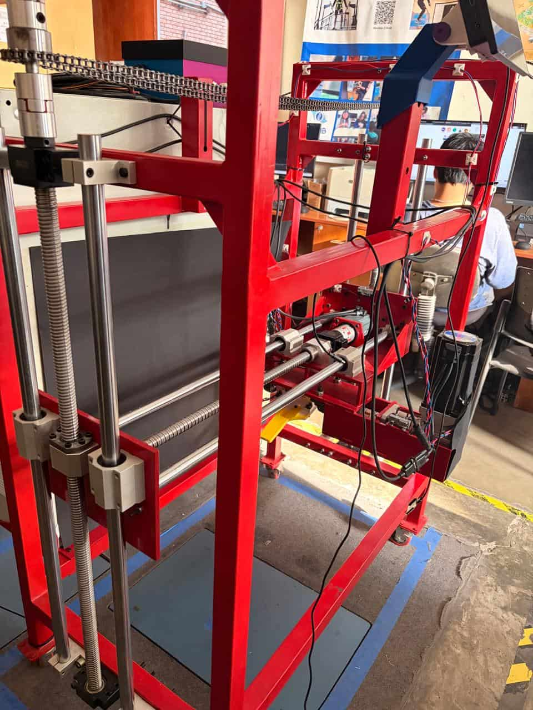
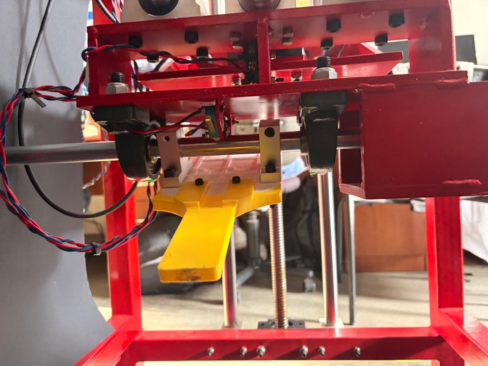
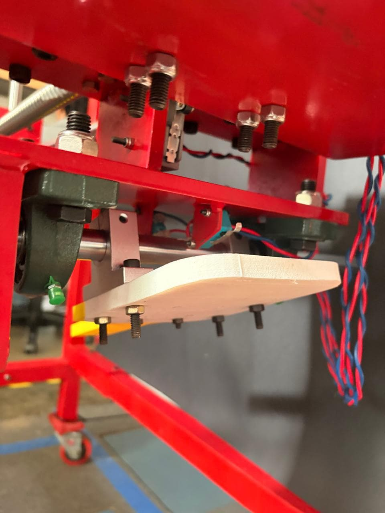
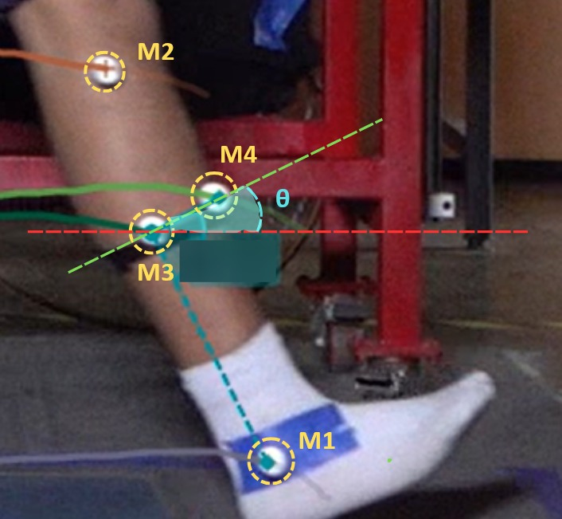
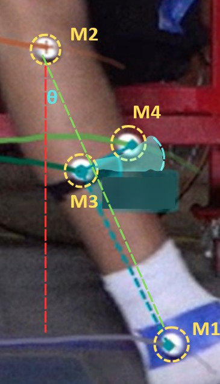

# Revisión Bibliográfica — Plataforma Móvil Instrumentada para Simulador de Marcha

**Proyecto:** Plataforma Móvil Instrumentada para Simulador de Marcha  
**Alumno:** Alessandro Jesus Felix Tello  
**Asesor:** Dante Angel Elias Giordano  
**Formato de citación:** IEEE   
**Estado:** Semana 1–2 — revisión del estado del arte y definición de requerimientos

> Nota general sobre citas: las entradas marcadas con (*) tienen información de autor incompleta o no verificada con certeza en la búsqueda. Deben confirmarse contra la fuente original antes de usarse en el informe final.

---

## 1. Simuladores de marcha con sensórica embebida

| Ref. | Tipo | Sensores | Variables medidas | Ventajas | Limitaciones |
|---|---|---|---|---|---|
| [1] | Tesis doctoral (EngD, Univ. of Bath) | Transductor de presión, encoder, sensor ATI de 6 ejes, sensor de fuerza, medición de GRF | Cinemática (ángulos, movimiento), cinética (momentos, potencia, trabajo), GRF, velocidad de marcha | Pruebas sin exponer pacientes en etapas tempranas, repetibles, controla GRF | Hardware especializado, control complejo (EILC + hidráulica) |
| [2] | Tesis de maestría | Encoders incrementales, interruptor de límite, celda de carga en el shank | Cinemática (ángulos cadera/muslo/rodilla/shank, desplazamiento vertical, velocidad), cinética (GRF aproximada, torque, corriente) | Elimina variabilidad de sujetos, repetible, simula compensación humana (BBO) | 2 DOF en plano sagital; celda de carga no mide GRF directa; prótesis pasiva no reproduce GRF real |
| [3] | Artículo científico | Dinamómetro Kistler 9129AA, dSPACE MicroLabBox, Plataforma Stewart 6 DOF | Cinemática (CoM, orientación tronco), cinética (GRF vertical/horizontal, torque cadera) | Combina ventajas de modelo y robot; primer ensayo HiL exitoso | Rendimiento limitado del actuador en antepié; modelo VPP simplificado |
| [4] | Artículo científico | Encoders UR10E (500 Hz), VICON 10+1 cámaras (100 Hz) | Cinemática (ángulos rodilla/tobillo/cadera, trayectoria muslo). Sin GRF | Mayor rango de movimiento que Stewart; ILC reduce error de seguimiento | Sin control de fuerza (límite 250 N); no replica fase de apoyo; discrepancia 5–10°; n=1 |
| [5] | Artículo científico | 2 IMU 9 ejes, sensor de ángulo rotativo, celda de carga en pilón, RealGait (17 IMU) | Cinemática (ángulos), cinética (GRF como umbral), simetría de marcha | Motor único, sensores de bajo costo, reconocimiento de fase ≥96.4% | Solo simetría de rodilla; no probado en amputados; n=1 sano |
| [6] | Artículo científico | 8 FSR (125 Hz) + acelerómetro LSM6DS3, Arduino Nano 33 IoT | GRF (3 componentes), centro de presión (2 componentes) vía LSTM | Alternativa portátil y de bajo costo a plataformas de fuerza | Componente medio-lateral sigue siendo un reto; solo sujetos sanos |

### 1.1. Síntesis: qué mide cada simulador en relación a fuerza *(bloque nuevo — hallazgos 11/08/2026)*

No todos miden lo mismo ni con el mismo nivel de confianza. Conviene separar variable medida de mecanismo de medición, porque dos simuladores pueden reportar "GRF" con niveles de fidelidad muy distintos:

| Ref. | Variable relacionada a fuerza | Mecanismo real de medición |
|---|---|---|
| [1] | GRF 2D (vertical + horizontal) | Sensor F/T ATI de 6 ejes montado físicamente en el punto de contacto pie-plataforma ("suelo" fijo del simulador); el pie protésico golpea directamente sobre el sensor. La fuerza medida realimenta un control iterativo (EILC) que ajusta los actuadores hidráulicos hasta converger al GRF objetivo |
| [2] | GRF aproximada, torque, corriente de motor | Celda de carga en el shank (no en el punto de contacto) + corriente eléctrica del motor como proxy indirecto de torque — explícitamente no mide GRF real |
| [3] | GRF vertical y horizontal, torque de cadera | Sensor F/T (dinamómetro Kistler, llamado FTS en el paper) entre el pie protésico y la plataforma Stewart móvil, que hace de "suelo". La fuerza medida alimenta en tiempo real un modelo matemático del cuerpo (Virtual Pivot Point) que calcula la siguiente posición de la plataforma — es un lazo hardware-in-the-loop, no una medición pasiva |
| [4] | Ninguna — "Sin GRF" | Solo cinemática (encoders + VICON) |
| [5] | GRF como umbral binario | Celda de carga en el pilón, usada solo para detectar fase de marcha, no como magnitud continua |
| [6] | GRF completo (3 componentes) + centro de presión | Arreglo de 8 FSR bajo el pie + red LSTM que reconstruye las fuerzas — es una estimación indirecta, no una medición directa de fuerza |

**Lectura para el proyecto:** solo [1] y [3] miden GRF real con un sensor de fuerza/torque físico exactamente en el punto de contacto pie-plataforma, pero ninguno de los dos reporta el componente medio-lateral (solo plano sagital). [6] es el único que reporta las 3 componentes completas, pero vía estimación con red neuronal a partir de presión, no con un sensor de fuerza directo. Este proyecto no mide GRF en ningún caso (ver Secc. 4.1) — mide la fuerza/momento transmitido en la interfaz pylon-plataforma, que es una variable relacionada pero distinta, en la misma familia que [13]/[37]/[38]/[40] (Secc. 4).

---

## 2. Concordancia entre IMU y sistemas ópticos de captura de movimiento

| Ref. | IMU | Referencia óptica | Variables | Métricas | Resultados |
|---|---|---|---|---|---|
| [7] | 3× Xsens DOT | Qualisys (10+2 cámaras, 100 Hz) | Ángulos de hombro (escapular/frontal) | RMSE, Pearson r | RMSE 6.7°/7.5°; r>0.9 |
| [8] | 17× HWT901B + Kalman | NOKOV (12 cámaras, 100 Hz) | Zancada, CoM, rodilla, codo | RMSE, correlación, prueba t | RMSE 0.01–0.03 m, 5–7°; r>0.91; p>0.05 (sin diferencia significativa) |
| [9] | MPU6050 + flex sensor | Goniómetro de alta precisión | Step/stride length, cadencia, flexión de rodilla | % exactitud, MAE | Exactitud 94.8%; MAE rodilla 2.1° |

---

## 3. Calibración y validación de IMU de bajo costo

| Ref. | IMU | Qué calibra | Método | Resultados |
|---|---|---|---|---|
| [10] | YIS106 (Yesense) | Alineación sensor-a-segmento | Algoritmo automático en tiempo real (frame estático + dinámico, cuaternión) | RMSE: No Align 19.1° → Manual 4.5° → Automático 2.1° (p<0.05) |
| [11] | 2 IMU sin magnetómetro | Centro articular de cadera | Optimización Levenberg-Marquardt sobre restricción geométrica | Convergencia ≤4 iteraciones; error ≈1.23°; error vs. óptico ≈2° |
| [9] | MPU6050 | Deriva del IMU y flex sensor | Filtro suplementario (no especificado) | Drift 0.7°/min; SD 2.4°→0.9° |

---

## 4. Celdas de carga y sensores fuerza-torque en prótesis y bancos de prueba

| Ref. | Tipo de sensor | Ubicación | Variables | Resultados | Relevancia |
|---|---|---|---|---|---|
| [12]* | Load cell | Interfaz socket–liner | Fuerza normal y cizalla | Cizalla 0.4–7.8 kPa; normal 2.7–61.9 kPa | Media — confort/riesgo cutáneo, no cinética de marcha |
| [13] | Sensor magnético (deflexión) | Adaptador piramidal (pylon) | Fuerza axial, momento sagital | Hasta 2500 N / 120 Nm; no linealidad 8.3%/2.1% | Alta — arquitectura de montaje estándar |
| [14] | Sensor magnético (deflexión) | Estructura de carga de prótesis robótica | Fuerza y momento estructural | Buena linealidad, validado en marcha real | Alta — compara sensado magnético vs. strain gauge |
| [15]* | Proximidad + FSR + inductivo | Inserto de socket CAD/CAM | Colocación, presión gradual, pistoning | 3/3 proximidad correctos; 3/4 FSR correctos | Media-alta — sensórica multimodal de bajo costo |
| [16] | Strain gauge (Wheatstone) | Banco de pruebas genérico | Fuerza axial | Sensibilidad ~15 mV/N; 300 N máx.; error 6%; 20 g | Alta — único proceso completo de diseño/fabricación propio |
| [17] | N/A (patente US20210247249A1) | Integrado en dispositivo protésico | Fuerza y torque | Documenta limitación de strain gauges (costo/volumen) | Media — fundamenta el problema |
| [18] | Capacitivo MEMS | Interfaz socket–muñón | 3 fuerzas + 2 torques | Linealidad >99%; sobrecarga segura >15N | Alta — diseño miniaturizado para prótesis |
| [19] | FlexiForce A201 | Modelo de esqueleto | Cargas en húmero/fémur/tibia | Lineal, exactitud ±5% | Media — sensor de bajo costo, no contexto protésico real |
| [20] | ATI Nano17 | Banco externo | Fuerzas de agarre/pinza | 15.5 N (agarre), 8.69 N (pinza) | Media — patrón de banco replicable |
| [37] | Load cell integrado a socket 3D impreso (sensórica de bajo costo) | Interfaz socket–muñón, simulador de roll-over | Presión de interfaz, fuerza normal | Valida modelo FEM de presión de interfaz contra medición experimental en un simulador de roll-over (mandril + mock limb) | Alta — mismo paradigma "simulador mecánico + sensor de fuerza" que este proyecto, aunque aplicado a socket, no a pylon |
| [38] | Smart Pyramid (adaptador piramidal instrumentado, galgas extensométricas en vigas AP y ML) | Base del socket transtibial, sujetos con pies ESR (Energy Storage and Return) | Momento de reacción del socket (sagital/coronal) bajo 25 condiciones de alineamiento (nominal + perturbaciones angulares de 2°/4°/6° y traslacionales de 5/10/15 mm) en 10 sujetos | Pieza: 3.22 cm alto, 0.14 kg; muestreo 100 Hz, transmisión inalámbrica Bluetooth; calibración R²=0.998 (sagital)/0.996 (coronal), RMSE 2.08%/2.80% | Alta — protocolo de referencia para validar la sensibilidad de un sensor de fuerza/momento ante desalineamientos controlados y trazables; especificaciones físicas del sensor directamente comparables con la celda de carga candidata de este proyecto |
| [39] | Sensor de tobillo 3-DOF (diseño FEM propio + galgas) | Prótesis transfemoral activa, banco de pruebas propio | GRF (fuerzas de reacción del suelo, 3 componentes) | Validado contra sensor comercial; documenta arquitectura electrónica completa (microcontrolador + ADC dedicado + IMU 9 ejes) con BOM de bajo costo | Alta — arquitectura electrónica de referencia (~$39 BOM) directamente aplicable a la plataforma |
| [40] | iPecs (celda de carga portátil de 6 ejes) | Prótesis transtibial/transfemoral | Fuerzas y momentos (6 componentes) | RMSE <5.2% de escala completa; validado contra plataforma de fuerza de laboratorio (r>0.86) | Media-alta — referencia de validación cruzada celda de carga vs. sistema de laboratorio, aplicable al protocolo del Objetivo 4 |

### 4.1. Arquitectura electrónica de referencia y ubicación del sensor de fuerza *(bloque nuevo — hallazgos 10/08/2026)*

**Ubicación del sensor de fuerza.** Se descartó instrumentar la prótesis (pylon wearable, tipo iPecs [40]) por costo, complejidad y por añadir masa a la prótesis bajo prueba. Se decidió instrumentar la interfaz pylon–sujeción fija de la plataforma (arriba, en el punto de anclaje del pylon al soporte), no la prótesis ni el suelo. Las prótesis de prueba de este proyecto no tienen socket — el pylon se articula directamente a la plataforma — por lo que los métodos derivados de interfaz socket–muñón ([12], [15], [37]) o la traducción a "momento articular" tipo iPecs (que asume centro articular biológico, [40]) no aplican directamente; sí aplica el dato crudo de fuerza/momento en el punto de anclaje del pylon, sin traducción a socket, que es exactamente lo que exige la validación normativa ISO 10328 (Secc. 6).

**Por qué [13] y [38] son la referencia de montaje más directa (aclaración 11/08/2026).** El "pyramid adapter" que instrumenta [13] es una pieza estándar de la prostética: un conector de 4 tornillos con forma de pirámide truncada que normalmente une el socket (arriba) con el pylon (abajo) y permite ajustar la alineación angular sin perder la unión mecánica. [38] (Smart Pyramid) mide en ese mismo punto. En una prótesis real ese punto queda entre socket y pylon; en este proyecto, al no existir socket, la plataforma ocupa exactamente ese lugar — por lo que el punto donde normalmente iría un pyramid adapter instrumentado coincide, sin adaptación conceptual adicional, con la interfaz pylon-plataforma ya decidida. No es solo una referencia "parecida": es el mismo punto de la cadena mecánica, con la plataforma en el rol que normalmente ocupa el socket.

**Validez del ensayo mecánico vs. sujeto humano.** Usar un simulador mecánico en vez de una persona no reduce la validez de la medición de fuerza en sí — la propia ISO 10328 es un ensayo puramente mecánico (mandril alineado, sin sujeto humano). Lo que sí se reduce es la validez biomecánica/ecológica del ensayo (no captura activación muscular, balance ni tejido blando), limitación que [37] reconoce explícitamente como "preliminar" para su propio simulador de roll-over; mencionar como limitación en la discusión del informe, sin que esto invalide el uso del simulador para la validación normativa del Objetivo 4.

**Arquitectura electrónica de referencia.** [39] documenta una arquitectura de bajo costo directamente aplicable: microcontrolador ESP32-WROOM + ADS1256 (ADC dedicado de 24 bits, 8 canales) + BNO055 (IMU de 9 ejes con fusión de sensores integrada) + celdas de carga, con un costo de materiales (BOM) reportado de ≈US$39. Responde directamente dos pendientes: usar un ADC dedicado de alta resolución para la celda de carga (en vez de un ADC genérico de microcontrolador), y evitar resolver el filtrado de deriva del IMU por software al preferir un sensor con fusión integrada tipo BNO055 en vez de un MPU6050 crudo.

**Celda de carga candidata.** TAL107F-10kg (34×34×1.5 mm, 10 kg, sensibilidad ≈1.0 mV/V) — celda comercial compacta de un solo eje; capacidad y dimensiones confirmadas contra especificación del fabricante. No se pudo confirmar contra el texto completo de [37] si esta celda específica es la usada en ese estudio (dato de notas de trabajo, pendiente de verificar — ver `Pendientes.md`). Como punto de partida de bajo costo, dimensionar con margen (~1.5–2×) sobre la carga máxima esperada del nivel P4/P5 de ISO 10328 (Secc. 6.1), con upgrade path a un sensor de 3 o 6 ejes (tipo Smart Pyramid [38] o iPecs [40]) si se necesita medir momento y no solo fuerza axial.

**Frecuencia de muestreo.** 50–100 Hz es suficiente para el tipo de ensayo cuasi-estático/cíclico accionado por motor de esta plataforma (no se requiere ≥1000 Hz como en una plataforma de fuerza de impacto real). Cifra de orden de magnitud tomada de notas de trabajo, no verificada contra texto completo de fuente primaria.

**Validación estructural de soportes/adaptadores.** Se decidió usar Fusion 360 (Static Stress Simulation) en vez de ANSYS para validar los soportes/placas de montaje del Objetivo 1, salvo que se necesite simular fatiga cíclica (relevante para los ensayos cíclicos de ISO 10328, Secc. 6.1 — evaluar más adelante si se requiere).

**Protocolo de alineamiento (referencia para Objetivo 4).** [38] (texto completo verificado 11/08/2026) documenta el protocolo exacto usado con el Smart Pyramid: 10 sujetos, 25 condiciones de alineamiento (nominal + perturbaciones angulares de 2°/4°/6° en flexión/extensión/abducción/aducción + perturbaciones traslacionales de 5/10/15 mm en anterior/posterior/lateral/medial), en prótesis con pies ESR. Estos cambios controlados de alineamiento producen efectos sistemáticos y medibles sobre el momento de reacción medido en la base del socket. Este protocolo — con esos valores exactos — es el que se toma como referencia directa para diseñar la secuencia de desalineamientos controlados y trazables del Objetivo 4; corrige una cifra aproximada de notas de trabajo (n=11, 3°/6°, 5/10 mm) que no coincidía con el detalle real del artículo.

### 4.2. Principios físicos de sensado de fuerza *(bloque nuevo — taxonomía, hallazgos 11/08/2026)*

Las referencias de la Secc. 4 (más [1], [3], [6] de la Secc. 1) usan tecnologías de sensado distintas. Separarlas por principio físico ayuda a decidir qué tipo de sensor bocetar/dibujar para cada punto de montaje, más allá de dónde se ubica cada uno:

| Principio de medición | Cómo funciona | Referencias |
|---|---|---|
| Galga extensométrica / puente de Wheatstone (strain gauge) | Lámina metálica pegada a una pieza estructural que cambia de resistencia eléctrica al deformarse bajo carga; 4 galgas en configuración de puente | [16], [39] |
| Sensor magnético por deflexión | Mide el desplazamiento de un imán/núcleo cuando la estructura se deflecta bajo carga, sin contacto ni deformación de una galga | [13], [14] |
| Capacitivo (MEMS) | La carga acerca dos placas paralelas y cambia la capacitancia entre ellas | [18] |
| FSR — Force Sensing Resistor (resistivo por presión) | Lámina polimérica que cambia de resistencia según la presión aplicada sobre su superficie; mide presión distribuida, no fuerza puntual | [6], [19], parte de [15] |
| Piezoeléctrico | El material genera un voltaje proporcional a la fuerza aplicada; mide bien fuerza dinámica, no carga estática sostenida | [3] |
| Proximidad / inductivo | Detecta posición o distancia, no fuerza directamente; se combina con FSR para detectar colocación/pistoning | [15] |
| Sensor F/T comercial de 6 ejes (ATI) | Internamente son galgas extensométricas, empaquetadas en una estructura rígida que separa mecánicamente las 3 fuerzas y 3 momentos | [1], [20] |
| Proxy indirecto: corriente de motor | No es un sensor de fuerza — se infiere torque/fuerza a partir de la corriente eléctrica que consume el motor | [2] |

**Relevancia para el proyecto:** la celda de carga candidata (TAL107F) y la mayoría de referencias directamente aplicables ([16], [39]) usan galga extensométrica — es el principio a bocetar con prioridad para el diseño del soporte/adaptador. Los sensores magnéticos ([13], [14]) son la alternativa de arquitectura de montaje estándar (Secc. 4.1); los demás principios (capacitivo, piezoeléctrico, FSR) quedan como referencia si el alcance se amplía a presión distribuida u otro punto de medición.

---

## 5. Protocolos de calibración/validación de instrumentación en sistemas robóticos y mecatrónicos *(bloque nuevo)*

| Ref. | Sistema | Qué calibra/valida | Método | Resultados |
|---|---|---|---|---|
| [21] | Robot 6-DOF (Stäubli TX 200) + tracking óptico, banco de ensayo de cadera | Precisión de posicionamiento robótico vs. movimiento manual de referencia | Comparación de TCP robótico vs. trayectorias manuales registradas ópticamente | SD del TCP: 0.3–0.9 mm por eje; desviación robot-manual: -0.36 a +3.44 mm |
| [22] | Sensores F/T 6 ejes, robot humanoide iCub3 | Modelo de calibración fuerza/torque (afín vs. polinomial no lineal + temperatura) | Optimización con regularización L1 (LASSO) sobre cargas conocidas (1–10 kg) | RMSE: 4.58 N (afín) → 2.09 N (polinomio grado 4); mejora ≈54% |
| [23] | Norma general | Calibración de sistemas de medición de fuerza en máquinas de ensayo estático | Verificación trazable a patrones; evalúa ganancia, offset, no linealidad, ruido | Norma de referencia (ISO 7500-1:2018), sin resultados experimentales propios |

Relevancia: fuentes deliberadamente no biomédicas — dan respaldo metodológico de calibración aplicable directamente a la celda de carga y el IMU de la plataforma, sin depender del contexto de marcha humana.

---

## 6. Normas ISO de ensayo estructural de prótesis *(bloque nuevo)*

Importante: [24] y [25] **no son normas de sensores ni de instrumentación** — son normas de ingeniería mecánica/seguridad que especifican cómo ensayar la resistencia estructural de la prótesis (cargas, ciclos, criterios de falla). Se incluyen aquí porque los niveles y perfiles de carga que definen sirven para dimensionar el rango que debe cubrir la celda de carga del proyecto, no porque califiquen o calibren sensores (eso lo cubre [23], ISO 7500-1, en la Sección 5).

| Norma | Qué certifica | Alcance | Uso en el proyecto |
|---|---|---|---|
| [24] | Resistencia estructural de la prótesis (que no se rompa/deforme bajo uso simulado) | Ensayos estáticos (carga máxima) y cíclicos (hasta 3 millones de ciclos) de prótesis de miembro inferior completas o por componente (pie-tobillo, rodilla) | Indirecto — sus niveles de carga (P3–P8 según peso/actividad del usuario) informan el rango a medir por la celda de carga, no un requisito del sensor en sí |
| [25] | Resistencia estructural cíclica de dispositivos tobillo-pie | Ensayo cíclico que reproduce la fase completa de apoyo (heel strike a toe-off) mediante perfiles estandarizados de GRF vertical/horizontal y ángulo de tibia | Indirecto — el perfil de carga que define es el que la plataforma debería reproducir mecánicamente; da trazabilidad normativa al protocolo de validación (objetivo 4), no calibra instrumentación |

### 6.1. Niveles de carga ISO 10328 (P3–P6)

La norma define 6 niveles de carga (P3–P8) según la masa corporal máxima del usuario simulado; aquí se listan P3–P6 por ser los más relevantes para un banco de pruebas de laboratorio de bajo costo. Condición I = contacto inicial de talón; Condición II = despegue de antepié.

**Nivel de carga por masa corporal:**

| Nivel | Masa corporal máx. |
|---|---|
| P3 | ≤ 60 kg |
| P4 | ≤ 80 kg |
| P5 | ≤ 100 kg |
| P6 | ≤ 125 kg |

**Ensayo cíclico (hasta 3×10⁶ ciclos, carga sinusoidal, retorno mínimo ≈50 N):**

| Nivel | Condición I (talón) | Condición II (antepié) |
|---|---|---|
| P3 | 905 N | 795 N |
| P4 | 1230 N | 1085 N |
| P5 | 1565 N | 1370 N |
| P6 | 2010 N | 1760 N |

**Ensayo estático — Condición I (carga de prueba 30 s / carga última = 2×prueba, límite de deformación plástica <5 mm):**

| Nivel | Fuerza de prueba ($F_{proof}$) | Fuerza última ($F_{ultimate}$) |
|---|---|---|
| P3 | 1540 N | 3080 N |
| P4 | 2065 N | 4130 N |
| P5 | 2240 N | 4480 N |
| P6 | 3375 N | 6750 N |

P4 confirmado por [33] (S. Lapapong *et al.*, reproduce Tabla 1 de ISO 10328:2006). P5 confirmado por [34] (Y. Bader *et al.*, reproduce Tabla 2 de ISO 10328:2016). P3 y P6 son valores de referencia sin confirmar con fuente primaria (ver `Pendientes.md`).

**Recomendación práctica:** dimensionar la celda de carga con margen sobre P5 (4480 N Condición I) — cubre hasta 100 kg de masa corporal simulada — salvo que el proyecto deba representar usuarios >100 kg.

---

## 7. Arquitecturas de software para adquisición sincronizada multi-sensor *(bloque nuevo — objetivo 3)*

| Ref. | Sistema | Qué resuelve | Método | Resultados |
|---|---|---|---|---|
| [26] | WiSSDA: exoesqueleto 3D impreso + encoders rotativos + plantillas de presión | Sincronización espacial/temporal de cinemática articular + fuerza de contacto + centro de presión, en tiempo real | Interfaz de código abierto que combina datos de encoder y FSR con biofeedback visual | Sistema portátil, ambulatorio, validado en marcha guiada |
| [27] | GRAIL (cinta + realidad virtual) + EEG/fNIRS + cinética | Sincronización de múltiples dispositivos multicanal independientes | Ecosistema Lab Streaming Layer (LSL) | Prueba de concepto exitosa de sincronización en tiempo real |
| [28] | Sensores biomédicos inalámbricos multicanal | Alineación temporal entre dispositivos BLE de distintos fabricantes | Método a nivel de capa de aplicación | Diferencia de tiempo absoluta: 69±71 µs (TI), 477±490 µs (Nordic) |
| [29] | Revisión general de arquitecturas embebidas para wearables multi-sensor | Sincronización de streams, RTOS, gestión de energía, protocolos inalámbricos | Revisión sistemática | Marco de referencia con escalabilidad modular |

Relevancia directa: [26] es conceptualmente el más cercano al objetivo 3 (cinemática + fuerza en un sistema portátil de bajo costo), aunque en exoesqueleto wearable, no en plataforma de simulador. [27] aporta el patrón de arquitectura de sincronización de streams heterogéneos.

---

## 8. Diseño mecánico de plataformas móviles y mecanismos de traslación en bancos de prueba *(bloque nuevo — objetivo 1)*

> **Contexto del simulador:** el simulador de marcha (estructura mecánica, traslación horizontal por riel + cadena, traslación vertical por husillo + motor paso a paso, y punto de flexo-extensión en el soporte de la prótesis) ya existe construido en el laboratorio, de un proyecto anterior. El diseño mecánico del Objetivo 1 parte de esta base construida para integrar los sensores (IMU, celda de carga), e incluye tanto adaptadores/soportes externos como, de ser necesario, modificaciones a la estructura existente según lo requiera la integración final.

<table>
<tr>
<td> Vista general — riel horizontal, husillo vertical y soporte de prótesis</td>
<td> Vista posterior — motores, husillos y cadena de traslación</td>
<td> Detalle del soporte donde se monta la prótesis</td>
</tr>
</table>

| Ref. | Mecanismo | DOF | Resultados / relevancia |
|---|---|---|---|
| [30] | Plataforma compacta y modular, traslación vertical y horizontal + flexo-extensión | 3 (plano sagital) | Determinaron que 3 DOF sagitales bastan para ensayar rodillas protésicas — validado con simulación hardware-in-the-loop. **Muy alta relevancia**: el simulador físico ya existente en el laboratorio usa el mismo principio de traslación vertical + horizontal + flexo-extensión que describe este paper, aunque con una disposición de ejes distinta. Sirve como respaldo bibliográfico de que la arquitectura ya construida (3 DOF sagitales) es una elección válida, no como referencia de diseño a implementar |
| [31] | Banco de ensayo con actuación para cargas realistas | No especificado | Documenta limitaciones prácticas (velocidad y longitud de paso limitadas) a anticipar en el diseño propio |
| [32] | Plataforma Gough-Stewart, 6 actuadores lineales Festo EPCO | 6 | Arquitectura de referencia de actuación lineal motorizada (guía + servomotor + husillo) aplicable a una versión simplificada de la plataforma |

**Qué más aporta [30] más allá de la arquitectura (relevante para Objetivo 4 — validación):**

- **Metodología para justificar el número de DOF, no solo el resultado.** No asumieron que 3 DOF bastan: partieron de un modelo "ideal" de 6 DOF y compararon sistemáticamente distintos casos de DOF "congelados" (arrestados) contra ese ideal, hasta encontrar el mínimo conjunto (flexo-extensión + traslación vertical + traslación horizontal, plano sagital) que reproduce el comportamiento relevante. Es un método replicable si en algún momento se quisiera re-justificar o cuestionar los 3 DOF del simulador ya construido, en vez de darlos por sentado.
- **Aplicación real de validación cruzada simulador–sujeto humano.** Usaron el simulador para validar una rodilla protésica policéntrica propia (IITM Polycentric Knee, IPK) — específicamente para confirmar que la rodilla se extiende sin necesidad de un resorte de asistencia a la extensión durante el balanceo (*swing phase*). Luego, con 3 sujetos que usan prótesis pasivas regularmente, compararon marcha real (con su prótesis habitual y con la IPK) contra las predicciones del simulador, encontrando correlación amplia entre ambos.
- **Por qué importa para este proyecto:** es el ejemplo más cercano encontrado de un protocolo de validación de dos niveles — (1) simulador vs. modelo/hipótesis de diseño, (2) simulador vs. sujetos humanos reales — que es exactamente el tipo de protocolo que el Objetivo 4 de este proyecto necesita definir para la plataforma instrumentada, sustituyendo la validación con sujetos humanos por una validación cruzada IMU/celda de carga vs. posición controlada del motor/encoder (ver Sección 10, Validación).

### 8.1. Alcance protésico del simulador existente

> **Contexto:** el simulador es transtibial únicamente, no multi-protésico. Sí permite ajustar el nivel de amputación simulado (longitud del segmento tibial residual: alto, medio o bajo). Confirmado informalmente por un compañero de laboratorio; pendiente confirmación formal del asesor (Dante Elias).

### 8.2. Método de referencia cinemática por marcadores

Método para obtener el ángulo de inclinación del segmento tibial (θ) como referencia visual independiente, usando 4 marcadores sobre fotos/video de la pierna montada en el simulador:

- **M1** — tobillo/pie (marcado con cinta).
- **M2** — muslo, marcador anatómico sobre la piel (segmento proximal).
- **M3, M4** — cerca de la rodilla, siguiendo la geometría propia del mecanismo del simulador (no son puntos anatómicos).
- **θ** — ángulo entre el segmento tibial (línea M1–rodilla) y una línea de referencia vertical u horizontal.

<table>
<tr>
<td> θ medido respecto a una línea de referencia horizontal</td>
<td> θ medido respecto a una línea de referencia vertical (mismo valor de ángulo, distinta referencia)</td>
</tr>
</table>

θ da el mismo valor numérico ya sea que se calcule con la referencia anatómica (M2) o con la geométrica del simulador (M3/M4), a lo largo de todo el ciclo de marcha — por lo que también puede obtenerse analíticamente a partir de la posición comandada del propio mecanismo, sin necesidad de marcadores ni cámara. Verificación puntual; no forma parte del protocolo formal de validación del Objetivo 4.

---

## 9. Síntesis: estado del arte vs. objetivos específicos del proyecto

| Objetivo específico | Qué aporta el estado del arte (sensores/arquitectura tentativos) | Brecha remanente | Fuentes clave |
|---|---|---|---|
| **1. Diseño mecánico** | Simuladores con prótesis móvil sobre plataforma fija; evidencia de que 3 DOF sagitales bastan | Ningún sistema documenta cómo integrar sensores a una plataforma ya existente sin alterar su cinemática | Secc. 1, [30]–[32] |
| **2. Sistema electrónico** | **Celda de carga** tipo TAL107F (galgas extensométricas, 1 eje), mismo principio de sensado que Smart Pyramid/iPecs, con upgrade a 3–6 ejes si se necesita momento; **IMU** tipo BNO055 (9 ejes, fusión integrada); **microcontrolador** ESP32-WROOM + **ADC dedicado** ADS1256 — arquitectura de referencia de bajo costo (BOM ≈US$39) | Ningún estudio combina IMU + celda de carga + presión; instrumentar pylon–plataforma no tiene precedente directo | Secc. 4, [13], [16], [38]–[40] |
| **3. Software** | Arquitecturas de sincronización multi-sensor (LSL, BLE) como referencia, aunque este proyecto no las necesita: sensores fijos en la plataforma, adquisición cableada y sincronizada por timestamp compartido | Ninguna fuente sincroniza IMU + celda de carga en plataforma fija | [26]–[29] |
| **4. Validación** | Calibración de IMU y celdas de carga con trazabilidad; protocolo de calibración robótica | Nadie ancla la validación a ISO 10328/22675 con calibración cruzada IMU-encoder | [21]–[25] |

**Brecha central que justifica el proyecto:** ningún sistema de los revisados integra plataforma móvil + IMU + celda de carga/presión + software sincronizado + protocolo de validación anclado a norma ISO, en una arquitectura de bajo costo y completamente documentada.

---

## 10. Requerimientos técnicos derivados (cierre de semana 2)

La plataforma sensa fuerza y cinemática de forma continua durante el uso de la prótesis en la simulación (registro/visualización). No implementa control en lazo cerrado en tiempo real — eso queda como trabajo futuro, fuera de alcance (última fila de la tabla). Por eso no se exige baja latencia de lazo cerrado, solo sensado sincronizado y confiable.

| Componente | Requerimiento |
|---|---|
| **Mecánica** | Parte de la estructura de 3 DOF en plano sagital ya construida (flexo-extensión, traslación vertical por husillo + motor, traslación horizontal por riel + cadena); [30] respalda que esta arquitectura basta para ensayar prótesis. Incluye, como mínimo: (a) diseñar soportes/adaptadores para montar la IMU y la celda de carga sobre la estructura existente, y (b) verificar que la posición de montaje capture las variables cinemáticas/cinéticas relevantes del ciclo de marcha. Según lo que exija la integración final de los sensores, podría extenderse a modificar o rediseñar partes de la estructura existente. Validación estructural de soportes/adaptadores mediante Fusion 360 (Static Stress Simulation); evaluar ANSYS solo si se requiere simular fatiga cíclica. |
| **IMU** | MEMS de bajo costo (MPU6050 / ICM-20948), muestreo ≥100 Hz, error objetivo <5° con calibración automática sensor-a-segmento tipo [10]. Preferir un IMU de 9 ejes con fusión de sensores integrada (tipo BNO055, ver [39]) para resolver el filtrado de deriva en hardware en vez de software. |
| **Celda de carga / presión** | Rango según ISO 10328 [24] (ver 6.1): P5 (≤100 kg) proof 2240 N / ultimate 4480 N [34]; P4 (≤80 kg) proof 2065 N / ultimate 4130 N / cíclico 1230 N [33]. La norma certifica la prótesis, no el sensor; se usa solo para dimensionar el rango a medir. Dimensionar sobre P5 con margen, salvo que se necesite cubrir usuarios >100 kg. No linealidad objetivo <8% [13], [16]. Ubicación: interfaz pylon–sujeción de la plataforma, no socket ni suelo (ver Secc. 4.1). Candidata inicial: 1 eje tipo TAL107F o similar, con upgrade path a 3–6 ejes tipo Smart Pyramid [38] / iPecs [40] si se necesita medir momento. Muestreo 50–100 Hz suficiente para el ensayo cuasi-estático/cíclico de esta plataforma. Opcional: arreglo FSR de bajo costo para presión distribuida si se amplía el alcance [6]. |
| **Software** | Adquisición continua y sincronizada por timestamp compartido, I2C/SPI para IMU y ADC dedicado para la celda de carga (p. ej. ADS1256 de 24 bits o HX711, ver [39]). No requiere protocolo inalámbrico complejo tipo LSL/BLE ([26]–[28]) porque los sensores están fijos en la plataforma. Registro, visualización y almacenamiento continuo. Arquitectura modular para agregar sensores sin rediseño [29]. |
| **Validación** | Protocolo de dos niveles: (1) calibración estática y dinámica de IMU y celda de carga con trazabilidad a pesos/ángulos conocidos (ISO 7500-1 [23]); (2) validación cruzada IMU vs. posición controlada del motor/encoder de la plataforma, como referencia de bajo costo en lugar de un sistema óptico. Perfil de carga referenciado a ISO 22675 [25]. Protocolo inspirado en [30] (ver Secc. 8). Protocolo de perturbaciones controladas de alineamiento (angular/traslacional) inspirado en [38] para validar la sensibilidad del sensor de fuerza ante desalineamientos conocidos (referencia de valores: 2°/4°/6° angular, 5/10/15 mm traslacional, ver Secc. 4.1). |
| **Trabajo futuro** (fuera de alcance actual) | Control en lazo cerrado en tiempo real (p. ej. PID) que use el sensado de esta plataforma para retroalimentar y autocorregir al simulador. Requeriría definir presupuesto de latencia end-to-end (sensor, procesamiento, actuador) y posiblemente rediseñar la capa de comunicación. |

---

## Referencias (formato IEEE)

[1] Z. Yang, "Development of a Gait Simulator for Testing Lower Limb Prostheses," Doctor of Engineering (EngD) thesis, Dept. of Mechanical Engineering, Univ. of Bath, Bath, U.K., Jul. 2020. [Online]. Available: https://researchportal.bath.ac.uk/files/205696121/Thesis_phD_Final_version.pdf — **verificado: autor, título exacto, institución y fecha confirmados vía Bath Research Portal (supervisores: P. Iravani, A. Plummer, M. Pan). Nota: el título real difiere del que se había reportado inicialmente ("...Hydraulic Gait Simulator..."); el título oficial de la tesis es el indicado arriba, y el grado es EngD (doctorado profesional), no PhD.**

[2] R. Davis, "Evolutionary ground reaction force control of a prosthetic leg testing robot," M.S. thesis, Cleveland State Univ., 2013. [Online]. Available: https://etd.ohiolink.edu/acprod/odb_etd/ws/send_file/send?accession=csu1396786747&disposition=inline — **parcialmente verificado: se confirmó por búsqueda cruzada que existe un artículo estrechamente relacionado, del mismo grupo (Cleveland State Univ.), con título casi idéntico: R. Davis, H. Richter, D. Simon, and A. van den Bogert, "Evolutionary ground reaction force optimization of a prosthetic leg testing robot," in *Proc. 2014 American Control Conf. (ACC)*, Portland, OR, USA, 2014 (nótese "optimization" en el artículo vs. "control" en la tesis). No se pudo acceder directamente a la página de OhioLINK para confirmar año/autor exactos de la tesis; se recomienda verificar antes de citar en el informe final.**

[3] C. Insam, L.-M. Ballat, F. Lorenz, and D. J. Rixen, "Hardware-in-the-Loop Test of a Prosthetic Foot," *Appl. Sci.*, vol. 11, no. 20, art. 9492, 2021. doi: 10.3390/app11209492. — **verificado: texto completo leído directamente (PDF proporcionado); autores completos, revista, volumen, número de artículo y DOI confirmados desde la fuente primaria.** Mecanismo confirmado: FTS = dinamómetro piezoeléctrico Kistler tipo 9129AA entre el pie protésico (Ottobock 1C40 C-Walk, tipo ESAR) y una plataforma Stewart de 6 DOF construida en el laboratorio; modelo del amputado = VPP (Virtual Pivot Point) modificado de Maus *et al.* (basado en SLIP, Spring-Loaded Inverted Pendulum), con masa/amortiguador añadidos en el punto de interfaz del tobillo y modelo de desplazamiento del centro de presión; tiempo real en dSPACE MicroLabBox dS1202 (MATLAB/Simulink), paso de integración 0.0002 s, sincronización 0.001 s. Limitación reportada por los propios autores: los parámetros del modelo VPP usados (masa 30 kg, longitud de pierna 1 m) no son biomecánicamente realistas, por limitaciones de rendimiento del actuador.

[4] Nie *et al.*, "Gait simulator for testing and evaluating lower limb prosthesis," in *Proc. IEEE Conf.* [Online]. Available: https://ieeexplore.ieee.org/abstract/document/11175829 — **aún sin verificar: no se encontró en búsqueda web (documento probablemente muy reciente); requiere acceso directo a IEEE Xplore para confirmar autores, nombre del congreso y año.**

[5] W. Cao, H. Yu, W. Chen, Q. Meng, and C. Chen, "Design and evaluation of a novel microprocessor-controlled prosthetic knee," *IEEE Access*, vol. 7, pp. 178553–178562, 2019. [Online]. Available: https://ieeexplore.ieee.org/document/8924708 — **verificado: autores, revista, volumen y páginas confirmados por búsqueda cruzada.**

[6] V. Civeriati, B. L. Pugliese, C. Carraro, *et al.*, "A sensorized insole to estimate ground reaction forces and center of pressure during gait," in *Proc. IEEE Int. Workshop on Sport, Technology and Research (STAR)*, 2024. [Online]. Available: https://ieeexplore.ieee.org/document/10636002 — **verificado y corregido: el apellido del primer autor es "Civeriati" (no "Cierviati" como se había reportado inicialmente); lista completa de autores aún por confirmar contra la fuente.**

[7] G. Carnevale *et al.*, "A M-IMU-to-segment alignment procedure for shoulder angles estimation," in *Proc. MetroInd4.0&IoT*, 2024.

[8] Zhang *et al.*, "Design and validation of an inertial motion capture system for human dynamic balance assessment," in *Proc. WRRC*, 2024.

[9] Lanso *et al.*, "A wearable knee brace system for real-time gait monitoring and abnormality detection," in *Proc. ICBMESH*, 2025.

[10] Fan *et al.*, "IMU-based real-time biofeedback wristband with automatic sensor-to-segment calibration," *IEEE Sensors J.*, 2025.

[11] Ju *et al.*, "Magnetometer-free IMU-based joint axis calibration and estimation," in *Proc. IEEE ROBIO*, 2021.

[12] "Evaluating shear and normal force with the use of an instrumented transtibial socket: A case study." — **(*) fuente sin autor/año identificados; completar antes de citar formalmente.**

[13] L. Gabert and T. Lenzi, "Instrumented pyramid adapter for amputee gait analysis and powered prosthesis control," *IEEE Sensors J.*, vol. 19, no. 18, pp. 8272–8282, Sep. 2019. [Online]. Available: https://ieeexplore.ieee.org/document/8727476 — **verificado: revista, volumen, número y páginas confirmados por búsqueda cruzada.**

[14] M. R. Haque, G. Berkeley, and X. Shen, "Force-moment sensor for prosthesis structural load measurement," *Sensors*, vol. 23, no. 2, art. 938, 2023. doi: 10.3390/s23020938.

[15] "Instrumented socket inserts for sensing interaction at the limb-socket interface." — **(*) fuente sin autor/año identificados; completar antes de citar formalmente.**

[16] O. Al-Dahiree, M. O. Tokhi, N. Hassan Hadi, N. Rasheid Hmoad, R. Ariffin Raja Ghazilla, H. Yap, and E. Abdullah Albaadani, "Design and shape optimization of strain gauge load cell for axial force measurement for test benches," *Sensors*, vol. 22, no. 19, art. 7508, 2022. doi: 10.3390/s22197508. — **verificado: autores, revista, volumen y DOI confirmados.**

[17] US Patent 20210247249A1, "Force and torque sensor for prosthetic and orthopedic devices."

[18] D. Alveringh *et al.*, "A large range multi-axis capacitive force/torque sensor," 2014.

[19] R. Lara-Padilla *et al.*, "Design and evaluation of a low-cost mechatronic system," 2017.

[20] Z. Xu *et al.*, "JTP hand — wrist-powered partial hand prosthesis," 2018.

[21] M. Rychlik, G. Wendland, M. Jackowski, R. Rennert, K.-D. Schaser, and J. Nowotny, "Calibration procedure and biomechanical validation of an universal six degree-of-freedom robotic system for hip joint testing," *J. Orthop. Surg. Res.*, vol. 18, art. 164, 2023. doi: 10.1186/s13018-023-03601-2.

[22] H. A. O. Mohamed, G. Nava, P. R. Vanteddu, F. Braghin, and D. Pucci, "Nonlinear in-situ calibration of strain-gauge force/torque sensors for humanoid robots," *arXiv:2312.09846*, 2023.

[23] ISO 7500-1:2018, *Metallic materials — Calibration and verification of static uniaxial testing machines — Part 1: Tension/compression testing machines — Calibration and verification of the force-measuring system*, Int. Org. Standardization, Geneva, Switzerland, 2018.

[24] ISO 10328:2016, *Prosthetics — Structural testing of lower-limb prostheses — Requirements and test methods*, Int. Org. Standardization, Geneva, Switzerland, 2016.

[25] ISO 22675:2016, *Prosthetics — Testing of ankle-foot devices and foot units — Requirements and test methods*, Int. Org. Standardization, Geneva, Switzerland, 2016 (rev. 2024).

[26] I. Sanz-Pena, J. Blanco, and J. H. Kim, "Computer interface for real-time gait biofeedback using a wearable integrated sensor system for data acquisition," *IEEE Trans. Human-Mach. Syst.*, vol. 51, no. 5, pp. 484–493, Oct. 2021. doi: 10.1109/THMS.2021.3097067.

[27] S. A. Maas, T. Göcking, R. Stojan, C. Voelcker-Rehage, and D. F. Kutz, "Synchronization of neurophysiological and biomechanical data in a real-time virtual gait analysis system (GRAIL): A proof-of-principle study," *Sensors*, vol. 24, no. 12, art. 3779, 2024. doi: 10.3390/s24123779.

[28] J. Li, E. Quintin, H. Wang, B. E. McDonald, T. R. Farrell, X. Huang, and E. A. Clancy, "Application-layer time synchronization and data alignment method for multichannel biosignal sensors using BLE protocol," *Sensors*, vol. 23, no. 8, art. 3954, 2023. doi: 10.3390/s23083954.

[29] M. Toptsis, N. Karkanis, A. Giannakoulas, and T. Kaifas, "A review of embedded software architectures for multi-sensor wearable devices: Sensor fusion techniques and future research directions," *Electronics*, vol. 15, no. 2, art. 295, 2026. doi: 10.3390/electronics15020295. — **verificado y corregido: al descargar el texto completo del PDF se encontró que la lista de autores tiene 4 nombres (Dept. of Electrical and Computer Engineering, Democritus Univ. of Thrace, Grecia); los metadatos web solo mostraban al autor de correspondencia (T. Kaifas), lo que había llevado a reportarlo erróneamente como autor único.**

[30] S. Sudeesh, M. S. Shunmugam, and S. Sujatha, "A compact and cost-effective gait simulator to advance prosthesis development with reduced reliance on human subject testing: Development, validation and application," *Medical Engineering & Physics*, vol. 134, art. 104254, 2024. doi: 10.1016/j.medengphy.2024.104254 — **corregido: la revista es Medical Engineering & Physics (grupo R2D2, IIT Madras), no Mechanism and Machine Theory como se había reportado inicialmente; verificado contra la página de publicaciones del laboratorio (r2d2.iitm.ac.in) y ScienceDirect (PII S1350453324001553, prefijo ISSN 1350-4533 = Med. Eng. Phys.).**

[31] J. Thiele, S. Gallinger, P. Seufert, and M. Kraft, "The gait simulator for lower limb exoprostheses — overview and first measurements for comparison of microprocessor controlled knee joints," *Facta Univ., Ser. Mech. Eng.*, 2015.

[32] S. M. Güttler, A. M. Poliakov, and V. I. Pakhaliuk, "Universal mechatronic test bench-gait simulator for testing lower limb prostheses," in *Proc. 2022 IEEE 23rd Int. Conf. of Young Professionals in Electron Devices and Materials (EDM)*, 2022. [Online]. Available: https://ieeexplore.ieee.org/document/9855100 — **verificado por búsqueda cruzada (autores y nombre del congreso); recomendable confirmar contra IEEE Xplore antes del informe final.**

[33] S. Lapapong, S. Sucharitpwatskul, N. Pitaksapsin, C. Srisurangkul, S. Lerspalungsanti, R. Naewngerndee, K. Sedchaicharn, W. Chonnaparamutt, and J. Pipitpukdee, "Finite element modeling and validation of a four-bar linkage prosthetic knee under static and cyclic strength tests," *J. Assist. Rehabil. Ther. Technol.*, vol. 2, art. 23211, 2014. doi: 10.3402/jartt.v2.23211. — **fuente primaria confirmada: reproduce Tabla 1 de ISO 10328:2006 para nivel P4.**

[34] Y. Bader, D. Langlois, N. Baddour, and E. D. Lemaire, "Development of an integrated powered hip and microprocessor-controlled knee for a hip–knee–ankle–foot prosthesis," *Bioengineering*, vol. 10, no. 5, art. 614, 2023. doi: 10.3390/bioengineering10050614. — **fuente primaria confirmada: reproduce Tabla 2 de ISO 10328:2016 para nivel P5 Condición I, con permiso de reproducción de SCC/ISO.**

[35] M. K. Owen and J. D. DesJardins, "Transtibial prosthetic socket strength: The use of ISO 10328 in the comparison of standard and 3D-printed sockets," *J. Prosthet. Orthot.*, vol. 32, no. 2, pp. 93–100, 2020. — citada como referencia adicional de ensayo P5 Condición II en sockets (valor histórico ≈4025 N, no directamente comparable por tratarse de otro componente y posible edición anterior de la norma). Nota adicional: el mismo artículo reporta también el valor superior de ultimate static test force para P7 (4840 N según el texto de discusión, aunque 5300 N según el texto de resultados — **discrepancia interna del propio artículo, no resuelta**; no usar como fuente de P7 sin aclarar esta inconsistencia con el autor o la norma original).

[36] D. Bonacini, B. Mangiante, L. Vergani, and C. Colombo, "Design of a new prosthetic foot which complies with ISO 10328 and allows high performance," presented at ETDCM9 — 9th Seminar on Experimental Techniques and Design in Composite Materials, Vicenza, Italy, Sep. 30–Oct. 2, 2009. [Online]. Available: https://www.roadrunnerfoot.com/wp-content/uploads/2021/03/8.ETDCM-2009.pdf — reporta prueba estática = 1610 N, última = 2415 N, cíclico = 1330 N × 2×10⁶ ciclos, torsión = 50 Nm; **posible candidato para nivel P3, pero no confirmado (ver Sección 6.1) — no usar aún para dimensionamiento.**

[37] M. Matray, X. Bonnet, P.-Y. Rohan, L. Calistri, and H. Pillet, "Evaluating interface pressure in a lower-limb prosthetic socket: Comparison of FEM and experimental measurements on a roll-over simulator," *J. Biomech.*, vol. 180, art. 112513, Feb. 2025. doi: 10.1016/j.jbiomech.2025.112513. — **verificado: autores, volumen, número de artículo y DOI confirmados vía Crossref.**

[38] T. Kobayashi, M. S. Orendurff, M. Zhang, and D. A. Boone, "Effect of transtibial prosthesis alignment changes on out-of-plane socket reaction moments during walking in amputees," *J. Biomech.*, vol. 45, no. 15, pp. 2603–2609, Oct. 2012. doi: 10.1016/j.jbiomech.2012.08.014. — **verificado: autores, volumen, páginas y DOI confirmados vía Crossref.** Nota: el detalle de protocolo (10 sujetos, 25 condiciones de alineamiento — perturbaciones angulares de 2°/4°/6° y traslacionales de 5/10/15 mm, sobre pies ESR) se tomó del texto completo de un artículo estrechamente relacionado del mismo grupo de investigación (mismo sensor Smart Pyramid), proporcionado por el usuario como PDF. Corrige una cifra imprecisa de notas de trabajo (n=11, 3°/6°, 5/10 mm).

[39] A. I. Bulbul, U. Mayetin, and S. Kucuk, "Development of an ankle sensor for ground reaction force measurement in intelligent prosthesis," *Eng. Technol. Appl. Sci. Res.*, vol. 14, no. 4, pp. 15161–15170, Aug. 2024. doi: 10.48084/etasr.7430. — **verificado: autores, revista, volumen, páginas y DOI confirmados directamente en la página del artículo (etasr.com); arquitectura electrónica (ESP32-WROOM + ADS1256 + BNO055) confirmada en el texto del artículo.**

[40] S. R. Koehler, Y. Y. Dhaher, and A. H. Hansen, "Cross-validation of a portable, six-degree-of-freedom load cell for use in lower-limb prosthetics research," *J. Biomech.*, vol. 47, no. 6, pp. 1542–1547, Apr. 2014. doi: 10.1016/j.jbiomech.2014.01.048. — **corregido: en las notas de trabajo se había registrado como "Fiedler et al. 2014"; verificado vía Crossref que los autores reales son Koehler, Dhaher y Hansen (celda de carga iPecs de 6 ejes).**

---

*Los pendientes de esta revisión bibliográfica (referencias por confirmar, verificación de P3/P6, decisiones de alcance) se llevan en el `Pendientes.md` de la semana en curso, dentro de `Reportes-Semanales/S<n>/`.*
