# Resumen de trabajo — Semana 3

**Período:** 17/08/2026 – 21/08/2026
**Responsable:** Alessandro Jesus Felix Tello

Resumen narrativo de la semana, complementario a `Reportes-Semanales/S3/Pendientes.md` (lista de trabajo activa) y a los resúmenes de semanas anteriores (`S2/Resumen-Semana2.md`).

El foco de la semana estuvo en dos frentes en paralelo: (1) definir los sensores de la plataforma, con una comparativa propia por cada variable sensada, y (2) la etapa de simulación estructural, donde las propiedades de material se definieron en una hoja de cálculo propia antes de correr el modelo en ANSYS.

---

## 1. Selección de sensores, por variable sensada

Comparativa completa en [`Estado-del-arte/Sensores-LIBRA-Presentacion.pptx`](../../Estado-del-arte/Sensores-LIBRA-Presentacion.pptx) y en [`Estado-del-arte/SENSORES DE FUERZA/PYLON/Comparativa-Sensores-Fuerza-Axial-Pylon.md`](<../../Estado-del-arte/SENSORES DE FUERZA/PYLON/Comparativa-Sensores-Fuerza-Axial-Pylon.md>).

### 1.1 Distancia (traslación horizontal y vertical) — definido

Descartados: ultrasónico (resolución ~cm, haz cónico) y magnetómetro simple (mide orientación, no distancia). Confirmado por el asesor: sensor láser de distancia (ToF).

| Opción | Rango | Frecuencia | Costo aprox. |
|---|---|---|---|
| VL53L1X (ToF breakout, I2C) | 30 mm – 4 m | 50 Hz | US$ 15 |
| **TF-Luna (mini LiDAR, UART/I2C)** ✅ | 0.2 – 8 m (±6 cm) | 100 Hz | US$ 25 |
| Baumer OM70 (láser industrial) | hasta 1.7 m | alta (industrial) | consultar |

**Elegido: TF-Luna.** Rango 0.2–8 m cubre con margen la carrera de la plataforma, 100 Hz de muestreo, interfaz UART/I2C directa al ESP32. VL53L1X queda como alternativa si la carrera fuera corta (<4 m) y se priorizara resolución milimétrica sobre alcance.

### 1.2 Rotación / ángulo (flexo-extensión) — definido

Sensor montado en el propio eje del pivote; mide el ángulo primario con mayor precisión que el IMU solo. Se prefiere salida digital (I2C/SPI) para no sumar canales al ADC.

| Opción | Resolución | Interfaz | Costo aprox. |
|---|---|---|---|
| **AS5600 (encoder magnético)** ✅ | 12 bit (0.088°) | I2C | US$ 3–8 |
| Omron E6B2-CWZ6C (óptico) | hasta 2000 ppr | salida digital | US$ 25–45 · ~US$670 (industrial) |
| Potenciómetro multivuelta | continua (según ADC) | analógica | US$ 40–50 |

**Elegido: AS5600.** Sin contacto (sin desgaste bajo ensayos cíclicos), resolución 0.088°, I2C directo, costo mínimo — mejor ajuste al presupuesto y a la arquitectura I2C/SPI ya definida.

### 1.3 IMU (orientación — validación cruzada) — probable

El IMU no es medición primaria (eso lo hace el encoder AS5600); su rol es validación cruzada, detectando holgura o desalineamiento del pivote que el encoder solo no puede ver. Por eso no se justifica una unidad de gama alta.

| Opción | Ejes | Fusión de sensores | Disponibilidad / costo aprox. |
|---|---|---|---|
| **MPU6050 / GY-521** ✅ | 6 (accel + giro) | no integrada (filtro propio) | ya disponible en inventario del laboratorio |
| MPU9250 + HMC5883L | 9 | no integrada (2 módulos) | disponible en inventario, requiere combinar módulos |
| BNO055 | 9 | integrada (fusión on-chip) | no disponible en inventario — habría que comprarlo, ~US$30–35 |

**Probable: MPU6050.** Es el más simple, ya está disponible en el laboratorio (sin costo ni tiempo de compra) y alcanza para un rol de validación cruzada — no se necesita la fusión de sensores de 9 ejes integrada de un BNO055. Falta solo confirmar contra el inventario si las unidades MPU6050/GY-521 registradas son físicamente distintas o duplicados del mismo ítem.

### 1.4 Fuerza (interfaz pylon–plataforma) — abierto

Requerimiento: ISO 10328 nivel P5 (prueba 2240 N, última 4480 N), 1 eje, salida mV/V compatible con el ADS1256 ya elegido. La candidata anterior (TAL107F-10kg, ~98 N) quedó descartada por subdimensionada.

| Opción | Rango | Salida | Costo aprox. |
|---|---|---|---|
| Celda propia (ref. [16] escalada) | 2500–5000 N (a medida) | mV/V + INA818 | US$ 30–60 |
| S-type / donut genérico | 200–1000 kg | mV/V | US$ 20–150 |
| Donut Transducer Techniques | 222–8896 N | mV/V | US$ 590–630 |
| FUTEK LCM300 (roscada en línea) | 102–4448 N (500/1000 lb) | mV/V · 0.25% no lin. | US$ 190–700 |
| Proveedor peruano | — | — | *en búsqueda esta semana* |

**Aún sin cerrar.** Como referencia (opciones internacionales ya evaluadas): la celda propia escalada es la más barata y reutiliza el método ya validado en el repo (FEM + galgas CEA + INA818); si no se fabrica, el FUTEK LCM300 es el que mejor coincide con los valores normativos de P5. Esta semana el foco pasó a buscar específicamente **marcas/proveedores peruanos**, para bajar costo de importación y tiempo de entrega frente a estas opciones internacionales — todavía sin candidato local cerrado.

### 1.5 Resumen por grado de libertad

| DOF | Sensor | Rango / resolución | Costo aprox. |
|---|---|---|---|
| GRF (ya resuelto) | AMTI BP400600 (en el laboratorio) | 6 ejes F/M | resuelto |
| Pylon — fuerza axial | *por cerrar* | 2240–4480 N | US$ 30–700 |
| Traslación — distancia | TF-Luna | 0.2–8 m, 100 Hz | US$ 25 |
| Rotación — ángulo | AS5600 | 0.088° (12 bit) | US$ 3–8 |
| Orientación — IMU | MPU6050 | 6 ejes, validación cruzada | disponible en lab |

---

## 2. Simulación estructural (ANSYS)

### 2.1 Flujo de trabajo

1. **Definición de materiales y propiedades** — se armó un documento Excel propio (`Estado-del-arte/SIMULADOR DE MARCHA/LIBRA_Config_Impresion_y_Calculo_Material.xlsx`) con la configuración de impresión y el cálculo de propiedades de material. Se evaluaron distintas combinaciones de espesor, patrón de relleno y material.
2. **Traslado a ANSYS** — esas propiedades alimentan el Engineering Data del modelo en ANSYS 2026 R1 (Workbench, proyecto `ANSYS/PLACA 20 mm.wbpj`) para correr la simulación estructural (Static Structural) de la placa.
3. **Resultado** — corrida de simulación sobre la geometría de la placa (t = 1 s), de la cual salen las imágenes de resultados.

### 2.2 Iteraciones de diseño

Se corrieron 15 simulaciones (A–O): siete geometrías de placa (línea de espesores sólida a 15/20/25 mm, vaciado central a 20 mm, refuerzo en cruz a 15 mm, elevación central a 20 mm, y la combinación vaciado central + elevación en cruz a 20 mm), cada una evaluada primero en PETG y después repetida en PA-CF sin cambiar nada más, para aislar el efecto del material del efecto de la geometría en cada caso; más una corrida funcional (holgura de -10 mm para alojar el IMU, corrida O) sobre la base sólida de 20 mm, evaluada directamente en PA-CF.

#### A, F. Línea de espesores — 15 mm

**Corrida A — 15 mm, PETG**

| Imagen | Descripción | Valor máximo |
|---|---|---|
|  | Deformación total | 0.733 mm |
|  | Deformación elástica equivalente | 0.0296 m/m |
|  | Esfuerzo equivalente (von Mises) | 21.27 MPa (mín. 16.3 kPa) |
|  | Factor de seguridad | 15 (**mín. 0.52** — punto crítico) |

**Corrida F — 15 mm, PA-CF** (misma geometría que A, cambiando el material)

| Imagen | Descripción | Valor máximo |
|---|---|---|
| 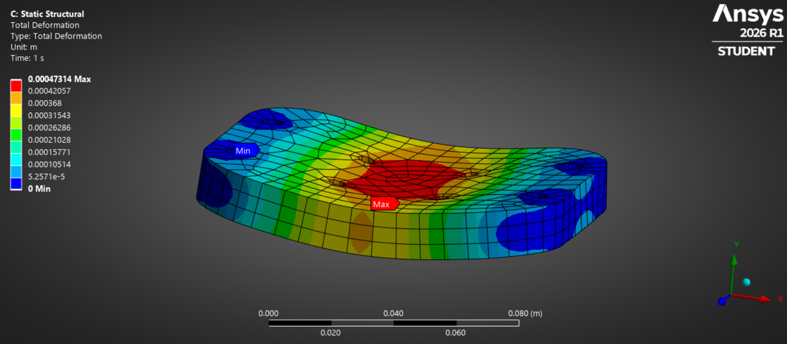 | Deformación total | 0.473 mm |
| 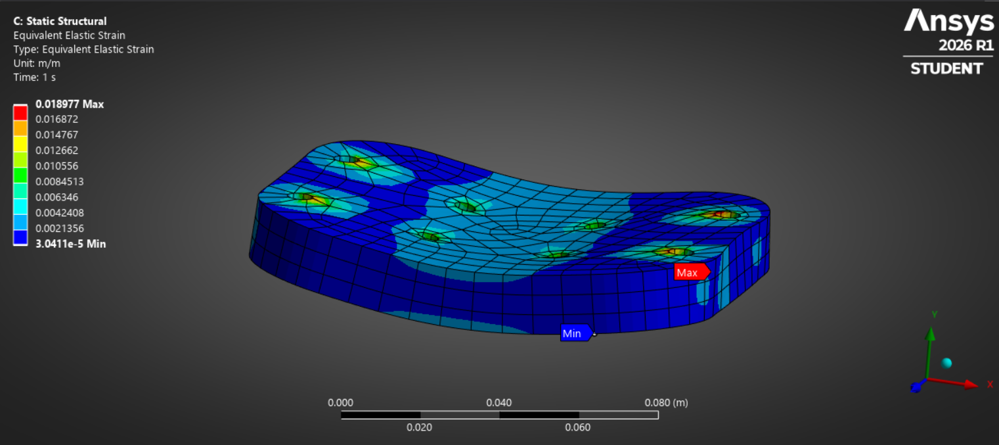 | Deformación elástica equivalente | 0.0190 m/m |
| 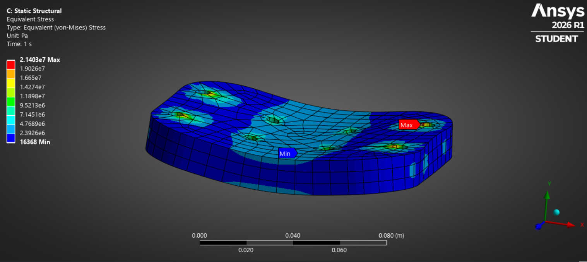 | Esfuerzo equivalente (von Mises) | 21.40 MPa (mín. 16.4 kPa) |
| 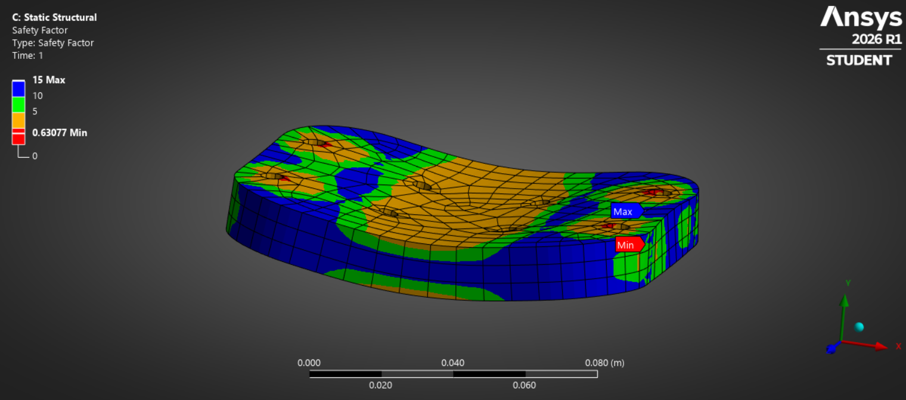 | Factor de seguridad | 15 (**mín. 0.63** — punto crítico) |

*El esfuerzo máximo es prácticamente igual entre A y F (21.27 vs 21.40 MPa, mismo punto crítico), pero el FS sube 0.52 → 0.63 (+21%) solo por el cambio de material — ninguna de las dos cumple FS>1 a 15 mm.*

#### B, G. Línea de espesores — 20 mm

**Corrida B — 20 mm, PETG**

| Imagen | Descripción | Valor máximo |
|---|---|---|
|  | Deformación total | 0.374 mm |
|  | Deformación elástica equivalente | 0.0180 m/m |
|  | Esfuerzo equivalente (von Mises) | 11.53 MPa (mín. 15.2 kPa) |
|  | Factor de seguridad | 15 (**mín. 0.85** — punto crítico) |

**Corrida G — 20 mm, PA-CF** (misma geometría que B, cambiando el material)

| Imagen | Descripción | Valor máximo |
|---|---|---|
| 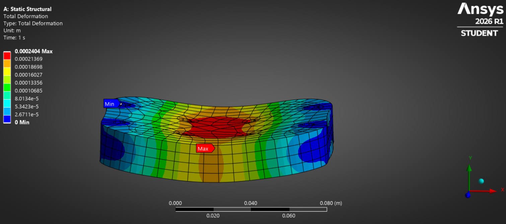 | Deformación total | 0.240 mm |
| 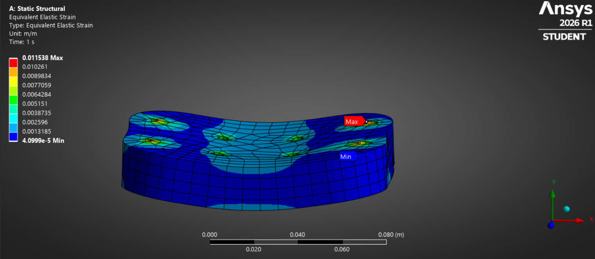 | Deformación elástica equivalente | 0.0115 m/m |
| 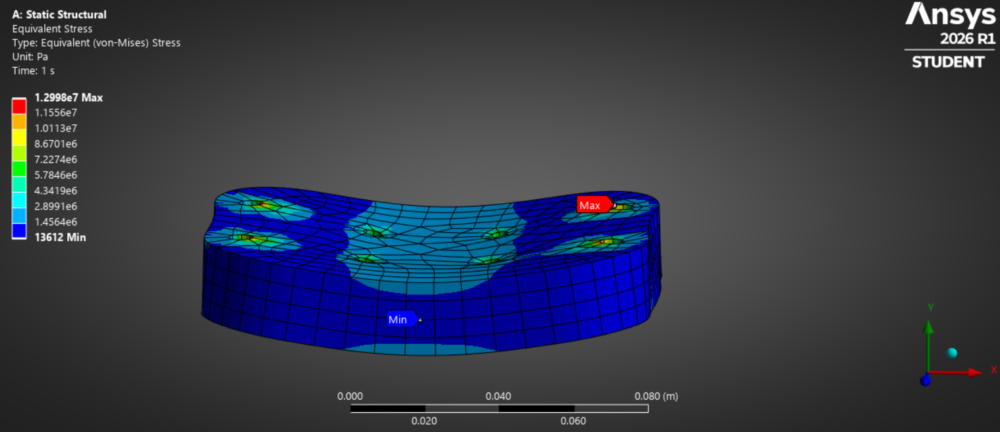 | Esfuerzo equivalente (von Mises) | 13.00 MPa (mín. 13.6 kPa) |
| 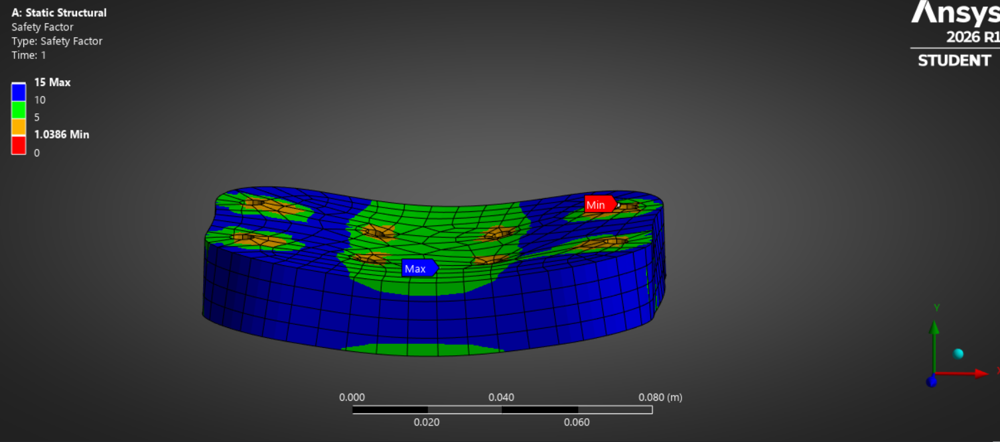 | Factor de seguridad | 15 (**mín. 1.04**) ✅ |

*El FS sube 0.85 → 1.04 (+22%): a 20 mm, cambiar a PA-CF ya es suficiente para cruzar el umbral de 1, sin tocar la geometría.*

#### C, I. Línea de espesores — 25 mm

**Corrida C — 25 mm, PETG**

| Imagen | Descripción | Valor máximo |
|---|---|---|
|  | Deformación total | 0.230 mm |
|  | Deformación elástica equivalente | 0.0134 m/m |
|  | Esfuerzo equivalente (von Mises) | 9.60 MPa (mín. 9.1 kPa) |
|  | Factor de seguridad | 15 (**mín. 1.15**) ✅ |

**Corrida I — 25 mm, PA-CF** (misma geometría que C, cambiando el material)

| Imagen | Descripción | Valor máximo |
|---|---|---|
| 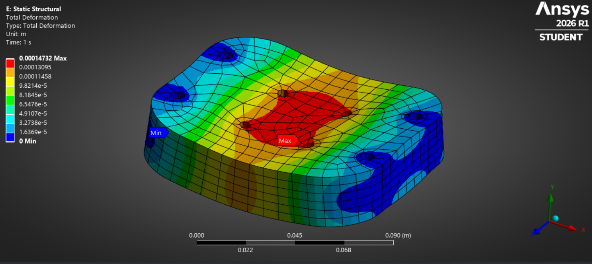 | Deformación total | 0.230 mm |
| 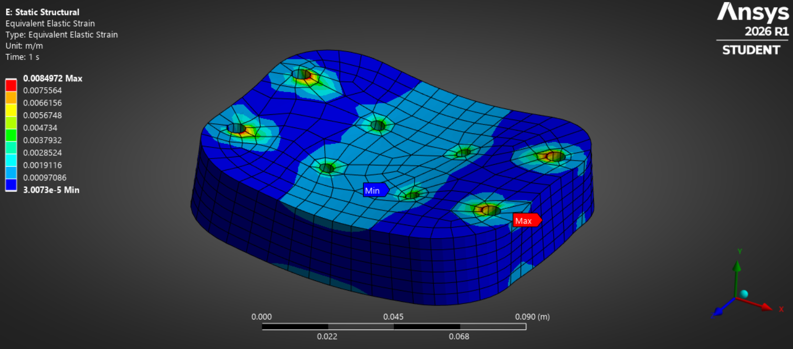 | Deformación elástica equivalente | 0.0085 m/m (mín. 3.0e-5 m/m) |
| 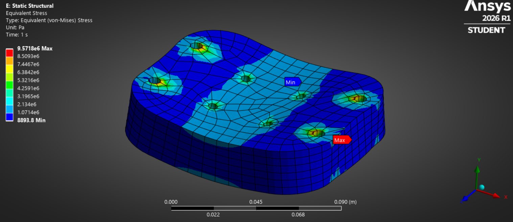 | Esfuerzo equivalente (von Mises) | 9.57 MPa (mín. 8.9 kPa) |
| 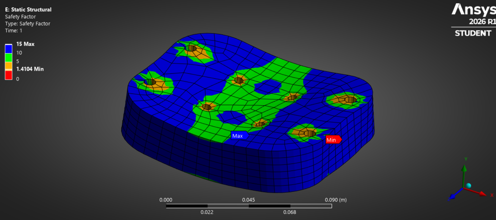 | Factor de seguridad | 15 (**mín. 1.41**) ✅ |

*El FS sube 1.15 → 1.41 (+23%): es el mejor resultado de las diez corridas, aunque también el que más material usa (25 mm sólido).*

#### D, H. Vaciado central — 20 mm

**Corrida D — 20 mm, vaciado central, PETG** (se retiró material del centro de la placa en vez de aumentar el espesor, para reducir peso)

| Imagen | Descripción | Valor máximo |
|---|---|---|
|  | Deformación total | 0.769 mm |
|  | Deformación elástica equivalente | 0.0167 m/m |
|  | Esfuerzo equivalente (von Mises) | 11.99 MPa (mín. 139 kPa) |
|  | Factor de seguridad | 15 (**mín. 0.92**) |

**Corrida H — 20 mm, vaciado central, PA-CF** (misma geometría que D, cambiando el material)

| Imagen | Descripción | Valor máximo |
|---|---|---|
| 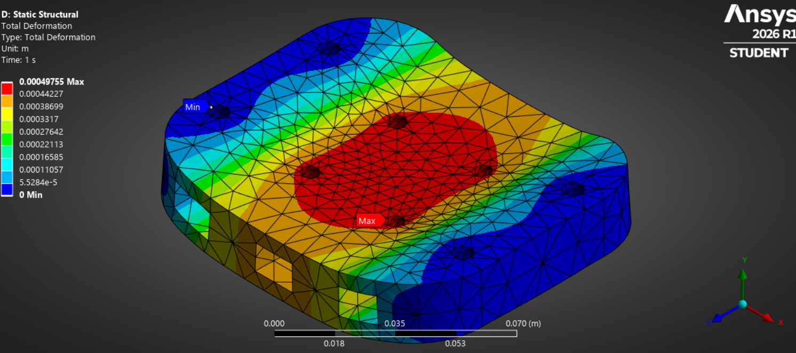 | Deformación total | 0.498 mm |
| 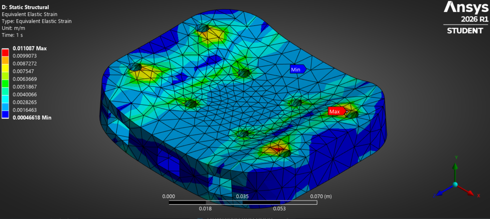 | Deformación elástica equivalente | 0.0111 m/m (mín. 4.66e-4 m/m) |
| 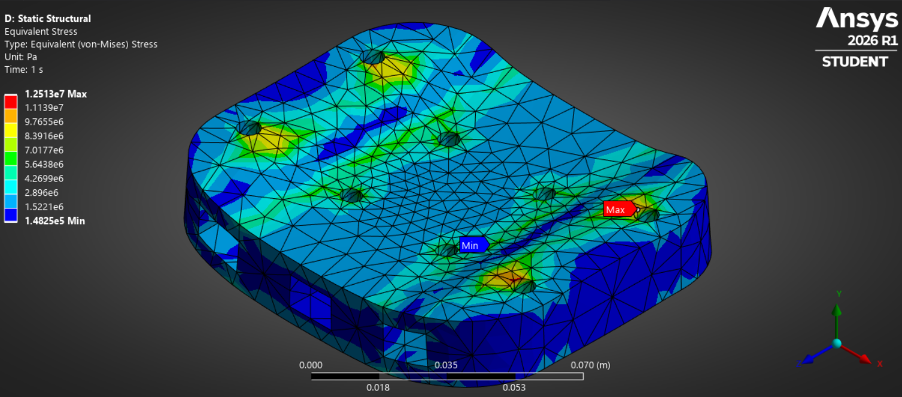 | Esfuerzo equivalente (von Mises) | 12.51 MPa (mín. 148 kPa) |
| 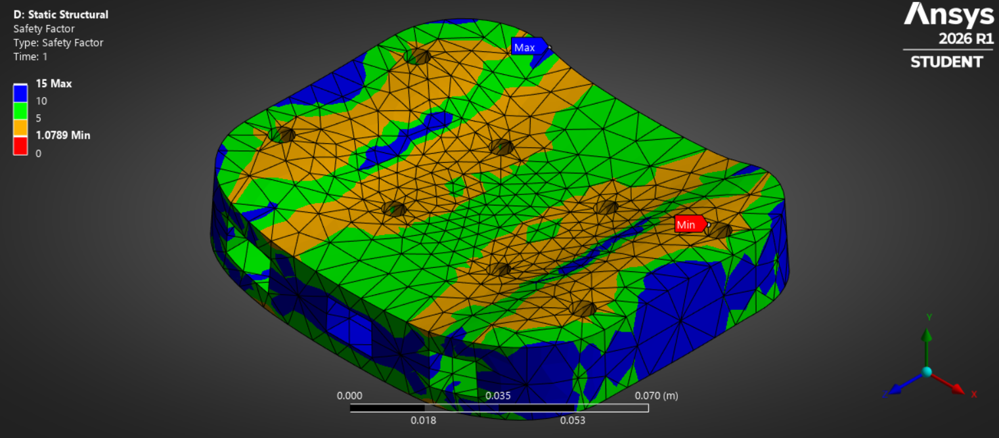 | Factor de seguridad | 15 (**mín. 1.08**) ✅ |

*El FS sube 0.92 → 1.08 (+17%): H combina las dos variables que por separado ya ayudaban (vaciado y PA-CF) y es la corrida con FS>1 que menos material sólido usa.*

#### E, J. Refuerzo en cruz — 15 mm

**Corrida E — 15 mm, refuerzo en cruz, PETG** (nervadura central en forma de cruz para rigidizar la zona central sin subir a 20 mm en toda la placa)

| Imagen | Descripción | Valor máximo |
|---|---|---|
|  | Deformación total | 0.644 mm |
|  | Deformación elástica equivalente | 0.0248 m/m |
|  | Esfuerzo equivalente (von Mises) | 17.60 MPa (mín. 96.3 kPa) |
|  | Factor de seguridad | 15 (**mín. 0.63**) |

**Corrida J — 15 mm, refuerzo en cruz, PA-CF** (misma geometría que E, cambiando el material)

| Imagen | Descripción | Valor máximo |
|---|---|---|
| 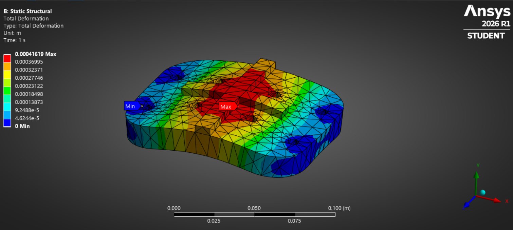 | Deformación total | 0.416 mm |
| 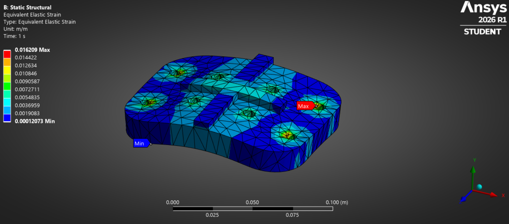 | Deformación elástica equivalente | 0.0162 m/m (mín. 1.21e-4 m/m) |
| 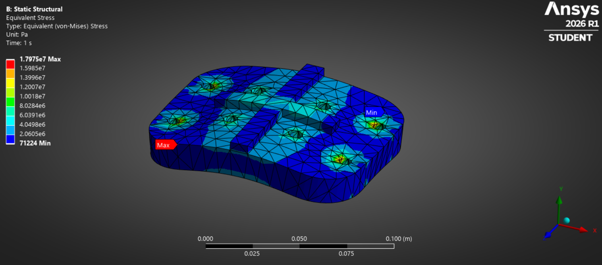 | Esfuerzo equivalente (von Mises) | 17.98 MPa (mín. 71.2 kPa) |
| 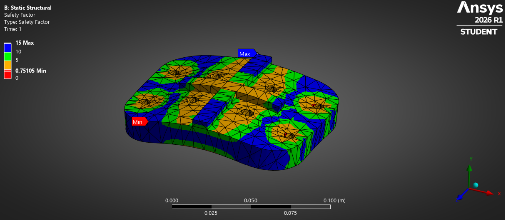 | Factor de seguridad | 15 (**mín. 0.75**) |

*El FS sube 0.63 → 0.75 (+19%): mejora frente a la cruz en PETG, pero sigue sin cruzar el umbral de 1 a 15 mm, incluso con el material más resistente.*

#### K, L. Elevación central — 20 mm

**Corrida L — 20 mm de espesor base, elevación central de 5 mm, PETG** (misma geometría que K: en vez de vaciar o reforzar en cruz, se agrega una zona elevada 5 mm en el centro de la placa, sobre la base de 20 mm)

| Imagen | Descripción | Valor máximo |
|---|---|---|
| 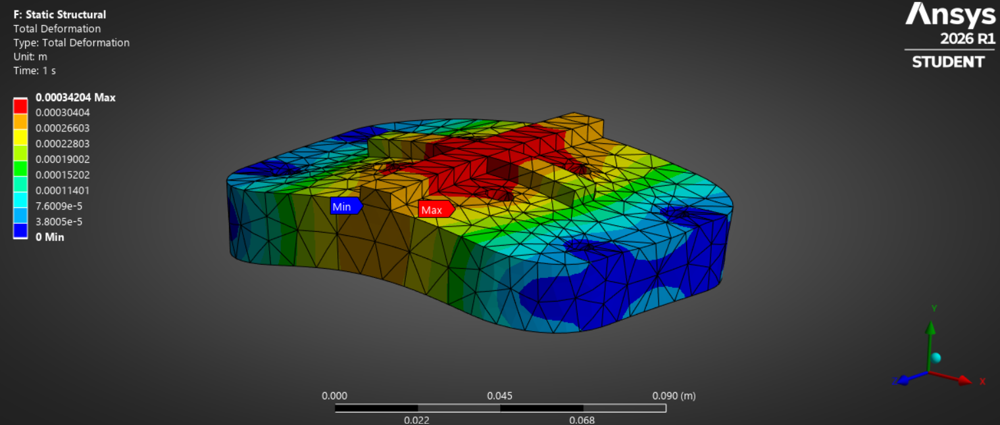 | Deformación total | 0.342 mm |
| 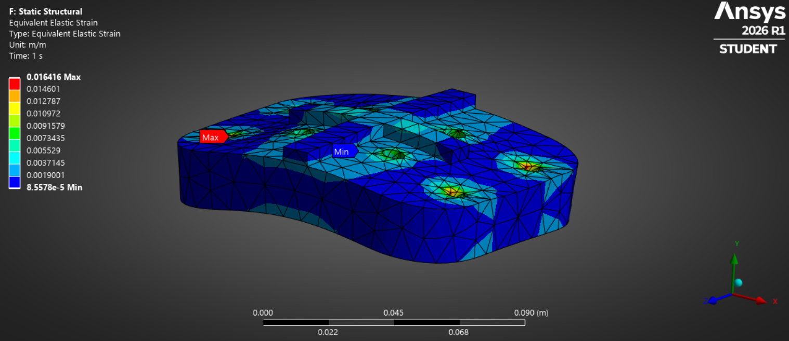 | Deformación elástica equivalente | 0.0164 m/m (mín. 8.56e-5 m/m) |
|  | Esfuerzo equivalente (von Mises) | 11.79 MPa (mín. 38.0 kPa) |
| 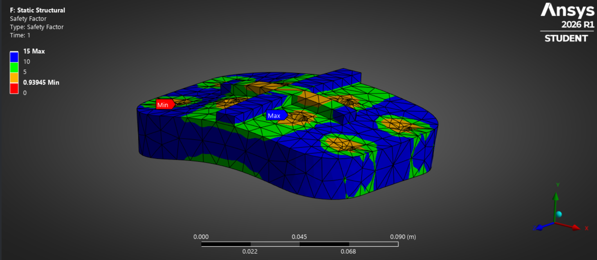 | Factor de seguridad | 15 (**mín. 0.94**) |

**Corrida K — 20 mm de espesor base, elevación central de 5 mm, PA-CF** (misma geometría que L, cambiando el material)

| Imagen | Descripción | Valor máximo |
|---|---|---|
| 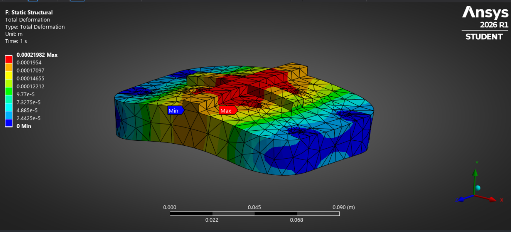 | Deformación total | 0.220 mm |
|  | Deformación elástica equivalente | 0.0107 m/m (mín. 6.59e-5 m/m) |
| 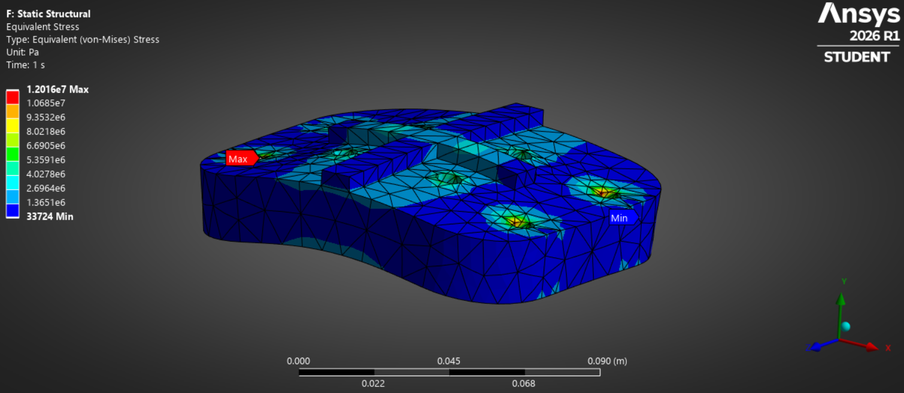 | Esfuerzo equivalente (von Mises) | 12.02 MPa (mín. 33.7 kPa) |
| 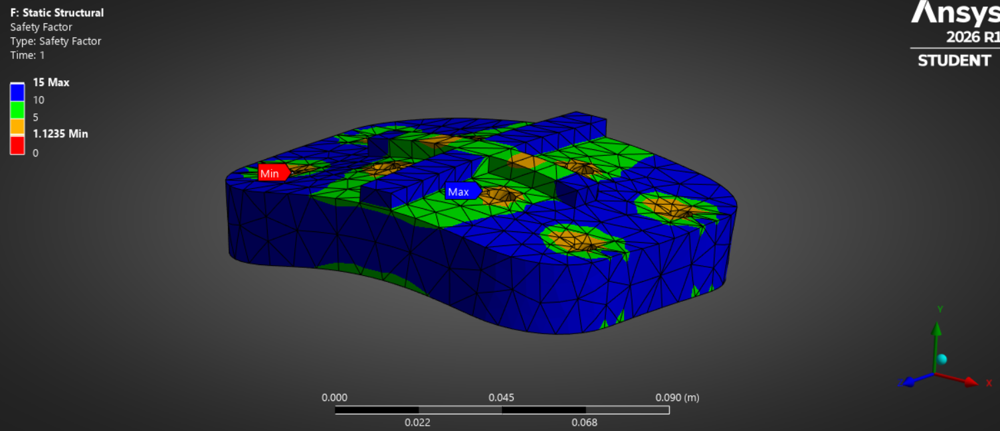 | Factor de seguridad | 15 (**mín. 1.12**) ✅ |

*El FS sube 0.94 → 1.12 (+19%), en línea con el resto de los pares PETG/PA-CF (17–23%) — mismo PA-CF que en el resto de corridas. A diferencia de A–J, en L y K el punto crítico de esfuerzo/deformación se concentra en la propia zona elevada (visible en rojo en las imágenes), no en los agujeros de perno.*

#### N, M. Combinación de geometrías — vaciado central + elevación en cruz

**Corrida N — 20 mm, vaciado central + elevación en cruz de 5 mm, PETG** (combina las dos geometrías de D/H y E/J/K/L en una sola placa: la zona central tiene la misma elevación en cruz de 5 mm que K/L, y alrededor de esa cruz se vació material como en D/H)

| Imagen | Descripción | Valor máximo |
|---|---|---|
| 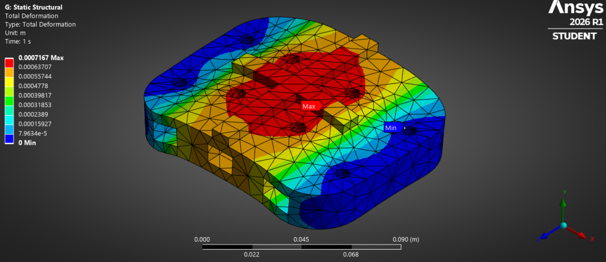 | Deformación total | 0.717 mm |
| 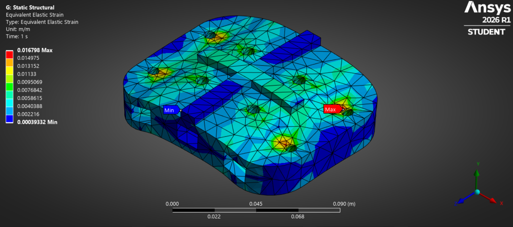 | Deformación elástica equivalente | 0.0168 m/m (mín. 3.93e-4 m/m) |
| 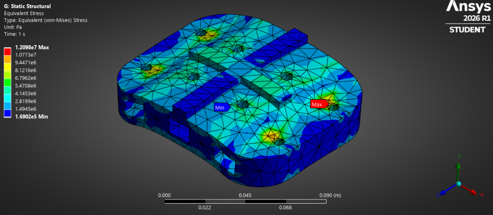 | Esfuerzo equivalente (von Mises) | 12.10 MPa (mín. 169 kPa) |
| 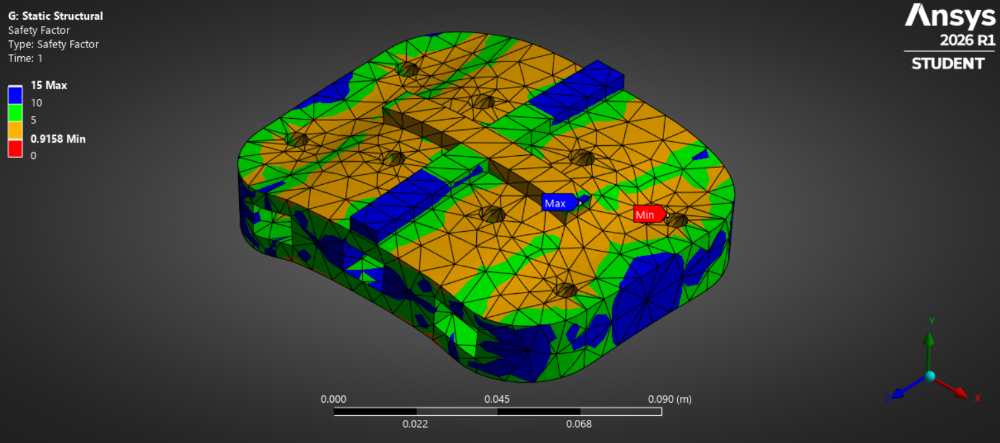 | Factor de seguridad | 15 (**mín. 0.92**) |

**Corrida M — 20 mm, vaciado central + elevación en cruz de 5 mm, PA-CF** (misma geometría que N, cambiando el material)

| Imagen | Descripción | Valor máximo |
|---|---|---|
| 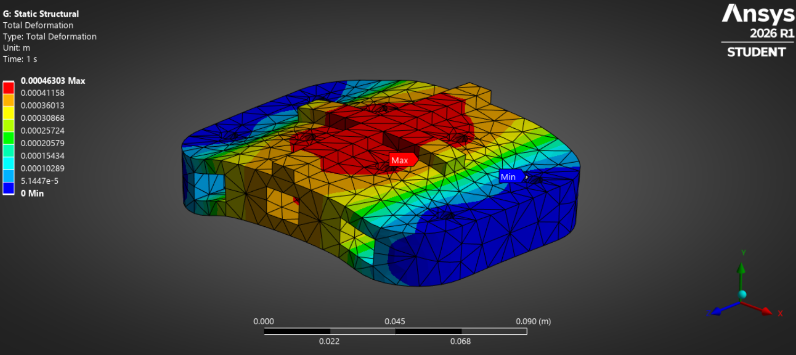 | Deformación total | 0.463 mm |
| 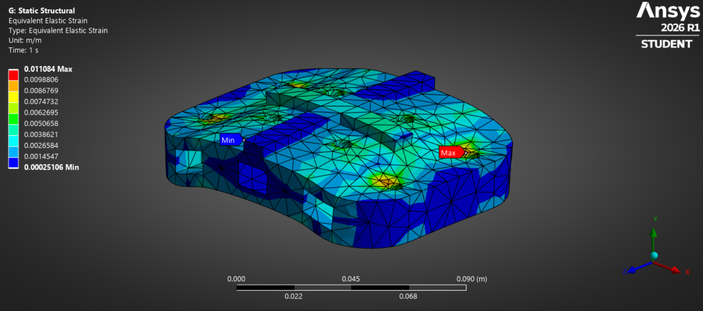 | Deformación elástica equivalente | 0.0111 m/m (mín. 2.51e-4 m/m) |
| 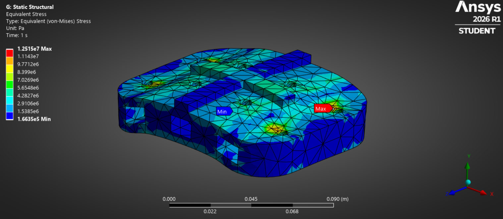 | Esfuerzo equivalente (von Mises) | 12.52 MPa (mín. 166 kPa) |
| 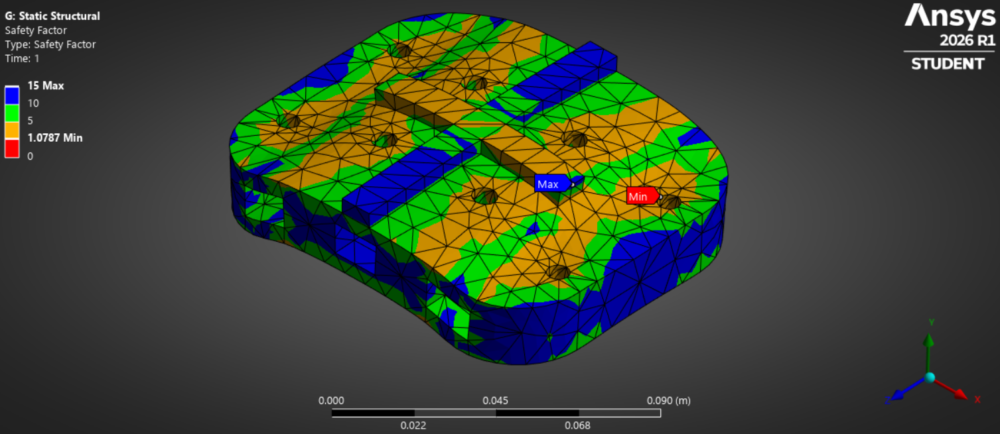 | Factor de seguridad | 15 (**mín. 1.08**) ✅ |

*El FS sube 0.92 → 1.08 (+18%), otra vez en línea con el resto de los pares PETG/PA-CF. Pero el hallazgo más importante es horizontal, no vertical: N (0.92) es prácticamente igual a D (vaciado solo, PETG, 0.92), y M (1.08) es prácticamente igual a H (vaciado solo, PA-CF, 1.08) — en ambos materiales, agregar la cruz sobre el vaciado no suma FS frente al vaciado solo, contra lo previsto en la línea de trabajo de la semana pasada.*

#### O. Holgura para IMU — 20 mm, PA-CF

**Corrida O — 20 mm sólida + holgura de -10 mm para alojar el IMU, PA-CF** (misma base que G, con un rebaje local de 10 mm de profundidad en una esquina para dejar espacio al sensor IMU; mismo PA-CF de F, G, H, I, J, K, M)

| Imagen | Descripción | Valor máximo |
|---|---|---|
| 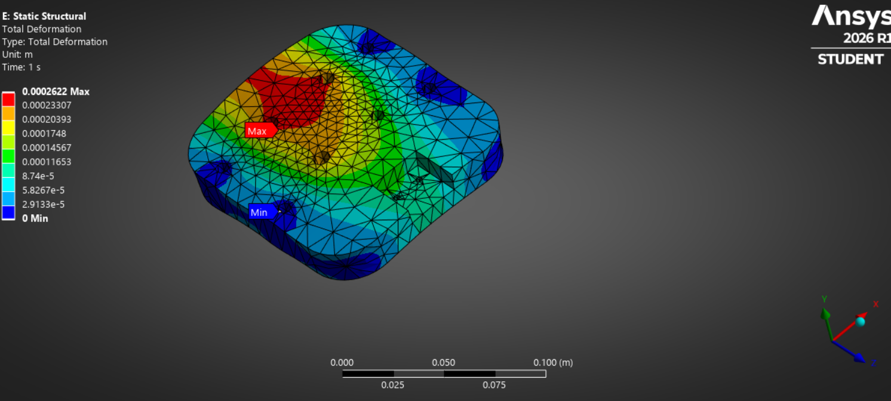 | Deformación total | 0.262 mm |
| 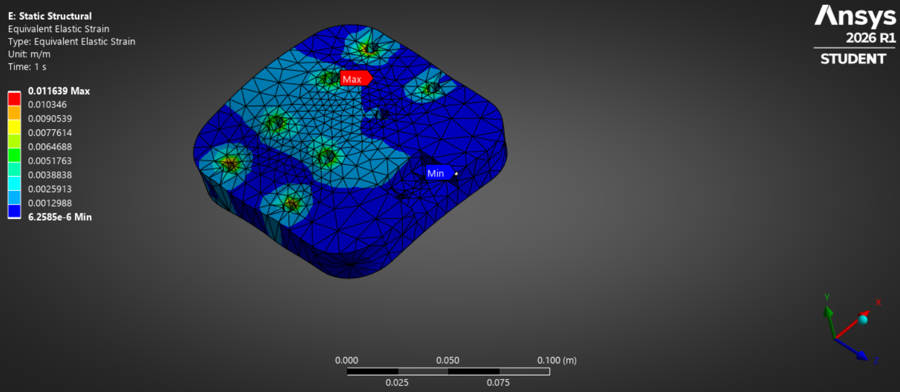 | Deformación elástica equivalente | 0.0116 m/m (mín. 6.3e-6 m/m) |
| 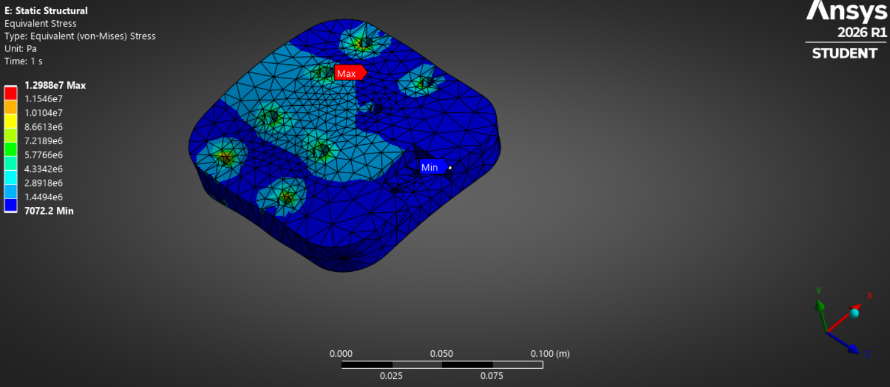 | Esfuerzo equivalente (von Mises) | 12.99 MPa (mín. 7.1 kPa) |
| 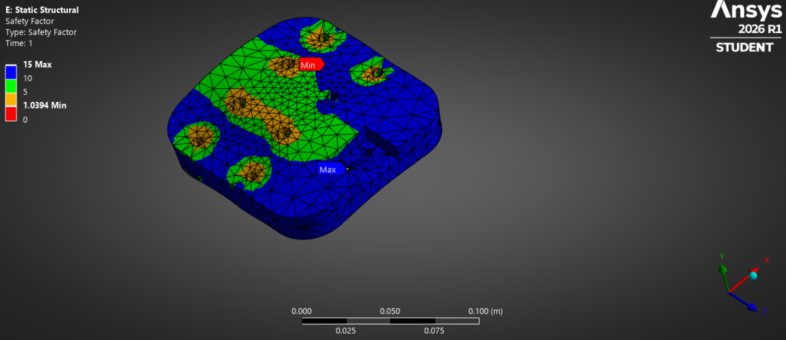 | Factor de seguridad | 15 (**mín. 1.04**) ✅ |

*O es prácticamente idéntica a G (FS 1.04 vs 1.04, esfuerzo 12.99 vs 13.00 MPa) — la holgura para el IMU no le quita factor de seguridad a la placa, porque el punto crítico (esquina superior izquierda en las imágenes) no coincide con la zona de los agujeros de perno que domina en el resto de corridas. En otras palabras: el hueco del IMU se puede agregar "gratis" sobre la base de 20 mm sólida sin perder margen estructural.*

### 2.3 Comparación consolidada (15 corridas)

| | A | F | B | G | O | C | I | D | H | E | J | L | K | N | M |
|---|---|---|---|---|---|---|---|---|---|---|---|---|---|---|---|
| Geometría | sólida | sólida | sólida | sólida | + holgura IMU | sólida | sólida | vaciado | vaciado | cruz | cruz | elevación central | elevación central | vaciado + cruz | vaciado + cruz |
| Espesor | 15 mm | 15 mm | 20 mm | 20 mm | 20 mm | 25 mm | 25 mm | 20 mm | 20 mm | 15 mm | 15 mm | 20 mm (+5 mm) | 20 mm (+5 mm) | 20 mm (+5 mm) | 20 mm (+5 mm) |
| Material | PETG | PA-CF | PETG | PA-CF | PA-CF | PETG | PA-CF | PETG | PA-CF | PETG | PA-CF | PETG | PA-CF | PETG | PA-CF |
| Deformación total máx. | 0.733 mm | 0.473 mm | 0.374 mm | 0.240 mm | 0.262 mm | 0.230 mm | 0.230 mm | 0.769 mm | 0.498 mm | 0.644 mm | 0.416 mm | 0.342 mm | 0.220 mm | 0.717 mm | 0.463 mm |
| Deformación elástica máx. | 0.0296 m/m | 0.0190 m/m | 0.0180 m/m | 0.0115 m/m | 0.0116 m/m | 0.0134 m/m | 0.0085 m/m | 0.0167 m/m | 0.0111 m/m | 0.0248 m/m | 0.0162 m/m | 0.0164 m/m | 0.0107 m/m | 0.0168 m/m | 0.0111 m/m |
| Esfuerzo máx. (von Mises) | 21.27 MPa | 21.40 MPa | 11.53 MPa | 13.00 MPa | 12.99 MPa | 9.60 MPa | 9.57 MPa | 11.99 MPa | 12.51 MPa | 17.60 MPa | 17.98 MPa | 11.79 MPa | 12.02 MPa | 12.10 MPa | 12.52 MPa |
| Factor de seguridad mín. | 0.52 | 0.63 | 0.85 | **1.04** ✅ | **1.04** ✅ | **1.15** ✅ | **1.41** ✅ | 0.92 | **1.08** ✅ | 0.63 | 0.75 | 0.94 | **1.12** ✅ | 0.92 | **1.08** ✅ |

**Conclusión general:** el patrón se repite en las siete geometrías con par PETG/PA-CF: pasar de PETG a PA-CF, sin tocar nada más, sube el factor de seguridad entre 17% y 23% (promedio ~20%). Esto es consistente con la teoría de elasticidad lineal — bajo carga fija, el campo de esfuerzos depende de la geometría, no del módulo elástico (los esfuerzos máximos de cada par A/F, B/G, C/I, D/H, E/J, L/K, N/M son prácticamente iguales) — es la resistencia del material, no el esfuerzo, la que mejora el FS.

De las quince corridas, siete cumplen factor de seguridad > 1: G (20 mm PA-CF sólida, 1.04), O (20 mm PA-CF sólida + holgura IMU, 1.04), H (20 mm PA-CF vaciado central, 1.08), M (20 mm PA-CF vaciado + cruz, 1.08), K (20 mm PA-CF elevación central, 1.12), C (25 mm PETG sólida, 1.15) e I (25 mm PA-CF sólida, 1.41 — la más alta de todas). Ninguna variante de 15 mm cruza el umbral, ni siquiera la cruz en PA-CF (J, 0.75); L y N (elevación central y vaciado+cruz en PETG, 0.94 y 0.92) tampoco. La hipótesis de combinar geometrías para acercarse al FS de I no se confirmó, y esta semana quedó confirmada en los dos materiales: N (0.92) empata con D (0.92) y M (1.08) empata con H (1.08) — agregar la cruz sobre el vaciado no suma FS frente al vaciado solo, ni en PETG ni en PA-CF. O muestra que sí hay margen "gratis" para features funcionales: la holgura del IMU no le costó nada de FS a la base sólida de 20 mm (O empata con G) porque cae fuera de la zona crítica de los agujeros de perno. I sigue siendo la de mayor margen, aunque también la que más material usa (25 mm sólido); entre las que usan menos material, H y M quedan prácticamente empatadas como mejor opción.

Línea de trabajo para la próxima semana: dado que combinar vaciado + cruz no superó al vaciado solo en ningún material, probar otras variables todavía no exploradas (p. ej. espesor intermedio entre 20 y 25 mm en PA-CF, o vaciado más profundo) en vez de seguir combinando las geometrías ya probadas. Confirmar que la holgura del IMU (O) sigue sin afectar el FS si se combina con las geometrías más livianas (H, K, M) en vez de con la base sólida.

---

## Próximos pasos

- Cerrar la búsqueda de sensor de fuerza en marcas/proveedores peruanos y comparar contra las opciones internacionales ya evaluadas.
- Confirmar el MPU6050 como candidato final de IMU contra el inventario del laboratorio (duplicados por verificar).
- Cotizar disponibilidad y envío a Perú (Mouser, DigiKey, AliExpress) de TF-Luna y AS5600.
- Definir el diseño final de la placa: la combinación vaciado + cruz (Corrida M) no superó al vaciado solo (H, mismo FS 1.08) — probar otras variables (espesor intermedio 20–25 mm, vaciado más profundo) en PA-CF para acercarse al FS 1.41 de la Corrida I con menos material que un sólido de 25 mm.
- Evaluar si vale la pena bajar de 20 mm en PA-CF: ninguna variante de 15 mm (F, J) cruzó FS>1 todavía, ni siquiera con el material más resistente.
- Imprimir una primera iteración física en PA-CF a partir de la Corrida O (20 mm sólida + holgura para IMU, FS 1.04) en vez de la línea sólida de 25 mm (I): es la misma geometría sólida simple que G a efectos de riesgo de impresión, pero ya incluye la holgura funcional que la placa va a necesitar, y valida directamente si el margen de 4% sobrevive al ensayo real (ISO 10328 P5) antes de invertir en las variantes más livianas (H, K, M).

---

## Fuentes

- [`Estado-del-arte/Sensores-LIBRA-Presentacion.pptx`](../../Estado-del-arte/Sensores-LIBRA-Presentacion.pptx) — comparativa de fuerza, distancia y ángulo (fuente de las tablas §1.1, §1.2 y §1.4).
- [`Estado-del-arte/SENSORES DE FUERZA/PYLON/Comparativa-Sensores-Fuerza-Axial-Pylon.md`](<../../Estado-del-arte/SENSORES DE FUERZA/PYLON/Comparativa-Sensores-Fuerza-Axial-Pylon.md>) — detalle y fuentes de la comparativa de fuerza.
- `Estado-del-arte/SIMULADOR DE MARCHA/LIBRA_Config_Impresion_y_Calculo_Material.xlsx` — configuración de impresión y propiedades de material usadas en ANSYS.
