# Resumen de trabajo — Semana 3

**Período:** 17/08/2026 – 21/08/2026
**Responsable:** Alessandro Jesus Felix Tello

Resumen narrativo de la semana, complementario a `Reportes-Semanales/S3/Pendientes.md` (lista de trabajo activa) y a los resúmenes de semanas anteriores (`S2/Resumen-Semana2.md`).

El foco de la semana estuvo en dos frentes en paralelo: (1) definir los sensores de la plataforma, con una comparativa propia por cada variable sensada, y (2) la etapa de simulación estructural, donde las propiedades de material se definieron en una hoja de cálculo propia antes de correr el modelo en ANSYS.

---

## 1. Selección de sensores, por variable sensada

Comparativa completa en [`Estado-del-arte/Sensores-LIBRA-Presentacion.pptx`](../../Estado-del-arte/Sensores-LIBRA-Presentacion.pptx) y en [`Estado-del-arte/SENSORES DE FUERZA/PYLON/Comparativa-Sensores-Fuerza-Axial-Pylon.md`](<../../Estado-del-arte/SENSORES DE FUERZA/PYLON/Comparativa-Sensores-Fuerza-Axial-Pylon.md>).

### 1.1 Distancia (traslación horizontal y vertical) — definido

Descartados: ultrasónico (resolución ~cm, haz cónico) y magnetómetro simple (mide orientación, no distancia). Confirmado por el asesor: sensor láser de distancia (ToF).

| Opción | Rango | Frecuencia | Costo aprox. |
|---|---|---|---|
| VL53L1X (ToF breakout, I2C) | 30 mm – 4 m | 50 Hz | US$ 15 |
| **TF-Luna (mini LiDAR, UART/I2C)** ✅ | 0.2 – 8 m (±6 cm) | 100 Hz | US$ 25 |
| Baumer OM70 (láser industrial) | hasta 1.7 m | alta (industrial) | consultar |

**Elegido: TF-Luna.** Rango 0.2–8 m cubre con margen la carrera de la plataforma, 100 Hz de muestreo, interfaz UART/I2C directa al ESP32. VL53L1X queda como alternativa si la carrera fuera corta (<4 m) y se priorizara resolución milimétrica sobre alcance.

### 1.2 Rotación / ángulo (flexo-extensión) — definido

Sensor montado en el propio eje del pivote; mide el ángulo primario con mayor precisión que el IMU solo. Se prefiere salida digital (I2C/SPI) para no sumar canales al ADC.

| Opción | Resolución | Interfaz | Costo aprox. |
|---|---|---|---|
| **AS5600 (encoder magnético)** ✅ | 12 bit (0.088°) | I2C | US$ 3–8 |
| Omron E6B2-CWZ6C (óptico) | hasta 2000 ppr | salida digital | US$ 25–45 · ~US$670 (industrial) |
| Potenciómetro multivuelta | continua (según ADC) | analógica | US$ 40–50 |

**Elegido: AS5600.** Sin contacto (sin desgaste bajo ensayos cíclicos), resolución 0.088°, I2C directo, costo mínimo — mejor ajuste al presupuesto y a la arquitectura I2C/SPI ya definida.

### 1.3 IMU (orientación — validación cruzada) — probable

El IMU no es medición primaria (eso lo hace el encoder AS5600); su rol es validación cruzada, detectando holgura o desalineamiento del pivote que el encoder solo no puede ver. Por eso no se justifica una unidad de gama alta.

| Opción | Ejes | Fusión de sensores | Disponibilidad / costo aprox. |
|---|---|---|---|
| **MPU6050 / GY-521** ✅ | 6 (accel + giro) | no integrada (filtro propio) | ya disponible en inventario del laboratorio |
| MPU9250 + HMC5883L | 9 | no integrada (2 módulos) | disponible en inventario, requiere combinar módulos |
| BNO055 | 9 | integrada (fusión on-chip) | no disponible en inventario — habría que comprarlo, ~US$30–35 |

**Probable: MPU6050.** Es el más simple, ya está disponible en el laboratorio (sin costo ni tiempo de compra) y alcanza para un rol de validación cruzada — no se necesita la fusión de sensores de 9 ejes integrada de un BNO055. Falta solo confirmar contra el inventario si las unidades MPU6050/GY-521 registradas son físicamente distintas o duplicados del mismo ítem.

### 1.4 Fuerza (interfaz pylon–plataforma) — abierto

Requerimiento: ISO 10328 nivel P5 (prueba 2240 N, última 4480 N), 1 eje, salida mV/V compatible con el ADS1256 ya elegido. La candidata anterior (TAL107F-10kg, ~98 N) quedó descartada por subdimensionada.

| Opción | Rango | Salida | Costo aprox. |
|---|---|---|---|
| Celda propia (ref. [16] escalada) | 2500–5000 N (a medida) | mV/V + INA818 | US$ 30–60 |
| S-type / donut genérico | 200–1000 kg | mV/V | US$ 20–150 |
| Donut Transducer Techniques | 222–8896 N | mV/V | US$ 590–630 |
| FUTEK LCM300 (roscada en línea) | 102–4448 N (500/1000 lb) | mV/V · 0.25% no lin. | US$ 190–700 |
| Proveedor peruano | — | — | *en búsqueda esta semana* |

**Aún sin cerrar.** Como referencia (opciones internacionales ya evaluadas): la celda propia escalada es la más barata y reutiliza el método ya validado en el repo (FEM + galgas CEA + INA818); si no se fabrica, el FUTEK LCM300 es el que mejor coincide con los valores normativos de P5. Esta semana el foco pasó a buscar específicamente **marcas/proveedores peruanos**, para bajar costo de importación y tiempo de entrega frente a estas opciones internacionales — todavía sin candidato local cerrado.

### 1.5 Resumen por grado de libertad

| DOF | Sensor | Rango / resolución | Costo aprox. |
|---|---|---|---|
| GRF (ya resuelto) | AMTI BP400600 (en el laboratorio) | 6 ejes F/M | resuelto |
| Pylon — fuerza axial | *por cerrar* | 2240–4480 N | US$ 30–700 |
| Traslación — distancia | TF-Luna | 0.2–8 m, 100 Hz | US$ 25 |
| Rotación — ángulo | AS5600 | 0.088° (12 bit) | US$ 3–8 |
| Orientación — IMU | MPU6050 | 6 ejes, validación cruzada | disponible en lab |

---

## 2. Simulación estructural (ANSYS)

Flujo de trabajo de esta etapa:

1. **Definición de materiales y propiedades** — se armó un documento Excel propio (`Estado-del-arte/SIMULADOR DE MARCHA/LIBRA_Config_Impresion_y_Calculo_Material.xlsx`) con la configuración de impresión y el cálculo de propiedades de material (PETG; se evaluaron distintas combinaciones de espesor y patrón de relleno — la corrida mostrada abajo usa 15 mm de espesor, patrón Grid/Rectilinear, 60% de relleno).
2. **Traslado a ANSYS** — esas propiedades alimentan el Engineering Data del modelo en ANSYS 2026 R1 (Workbench, proyecto `ANSYS/PLACA 20 mm.wbpj`) para correr la simulación estructural (Static Structural) de la placa.
3. **Resultado** — corrida de simulación sobre la geometría de la placa (t = 1 s), de la cual salen las imágenes de resultados.

### Cuadro de imágenes de la simulación

Se corrieron tres espesores de placa con el mismo material y patrón de impresión (PETG, Grid/Rectilinear, relleno 60%), para comparar su efecto sobre el factor de seguridad.

**Corrida A — 15 mm de espesor**

| Imagen | Descripción | Valor máximo |
|---|---|---|
| 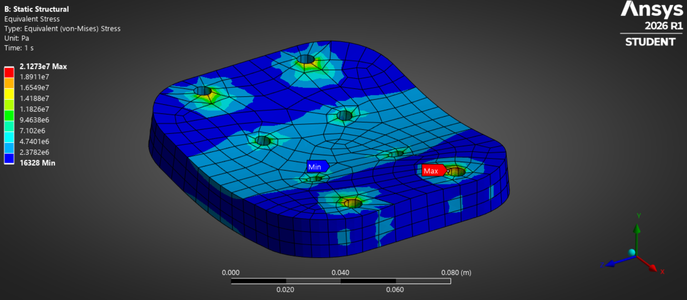 | Esfuerzo equivalente (von Mises) | 21.27 MPa (mín. 16.3 kPa) |
| 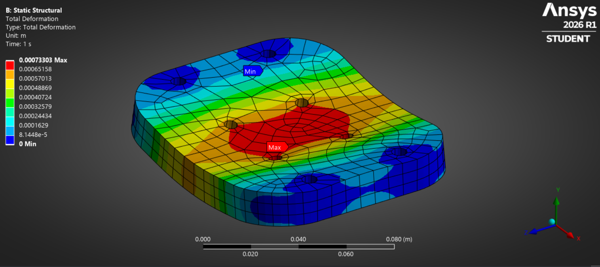 | Deformación total | 0.733 mm |
| 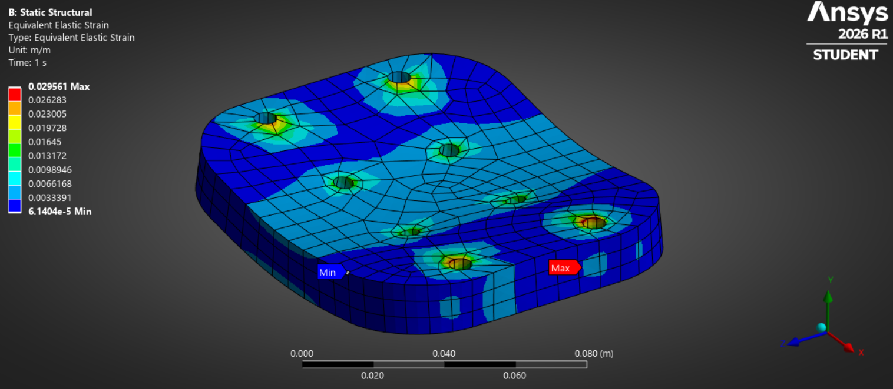 | Deformación elástica equivalente | 0.0296 m/m |
| 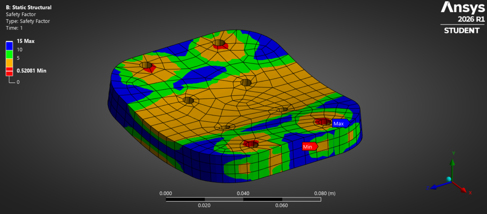 | Factor de seguridad | 15 (**mín. 0.52** — punto crítico) |

**Corrida B — 20 mm de espesor (mismo material)**

| Imagen | Descripción | Valor máximo |
|---|---|---|
| 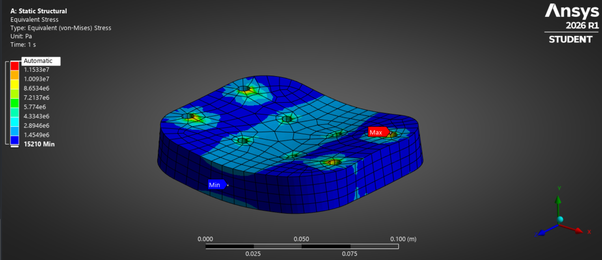 | Esfuerzo equivalente (von Mises) | 11.53 MPa (mín. 15.2 kPa) |
| 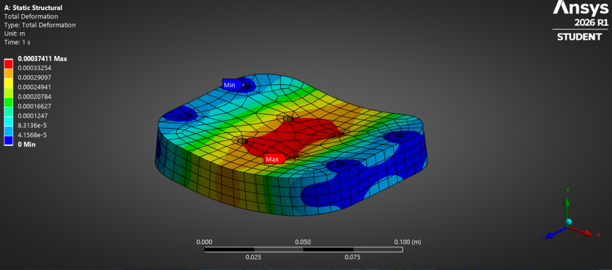 | Deformación total | 0.374 mm |
| 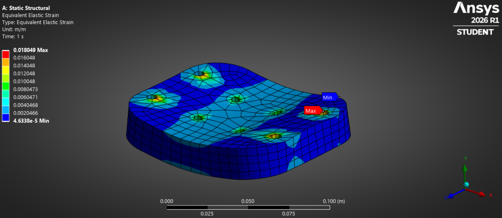 | Deformación elástica equivalente | 0.0180 m/m |
| 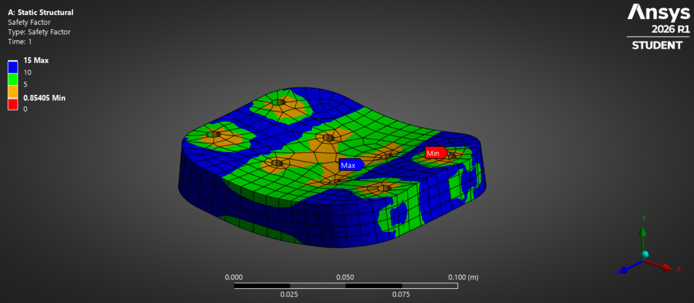 | Factor de seguridad | 15 (**mín. 0.85** — punto crítico) |

**Corrida C — 25 mm de espesor (mismo material)**

| Imagen | Descripción | Valor máximo |
|---|---|---|
| 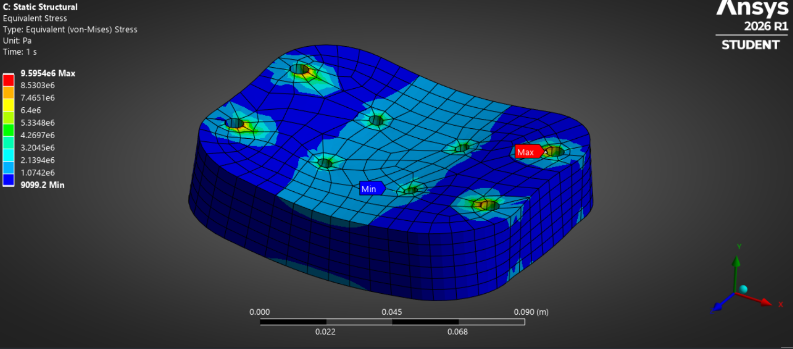 | Esfuerzo equivalente (von Mises) | 9.60 MPa (mín. 9.1 kPa) |
| 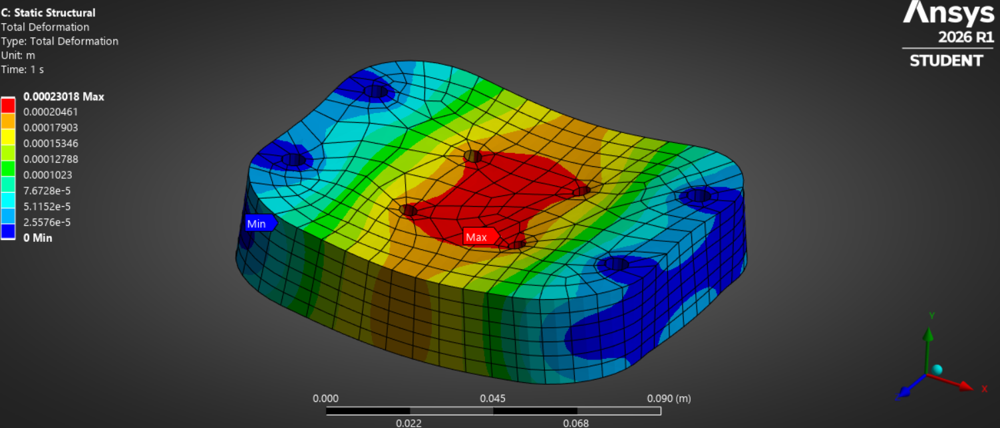 | Deformación total | 0.230 mm |
| 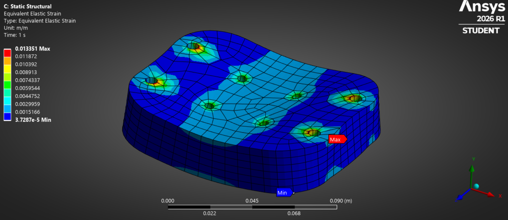 | Deformación elástica equivalente | 0.0134 m/m |
| 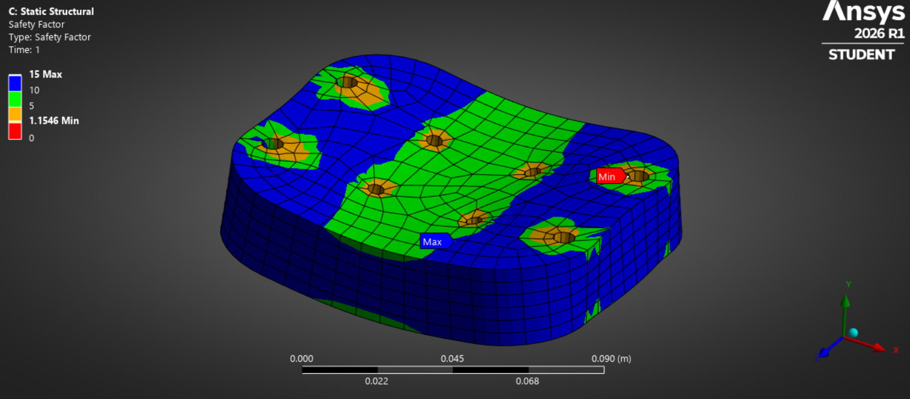 | Factor de seguridad | 15 (**mín. 1.15**) ✅ |

**Comparación 15 mm vs. 20 mm vs. 25 mm**

| | 15 mm | 20 mm | 25 mm |
|---|---|---|---|
| Esfuerzo máx. (von Mises) | 21.27 MPa | 11.53 MPa | 9.60 MPa |
| Deformación total máx. | 0.733 mm | 0.374 mm | 0.230 mm |
| Deformación elástica máx. | 0.0296 m/m | 0.0180 m/m | 0.0134 m/m |
| Factor de seguridad mín. | 0.52 | 0.85 | **1.15** |

**Conclusión (línea de espesores):** con 25 mm de espesor el factor de seguridad mínimo cruza el umbral de 1 (1.15), en la misma zona crítica (agujero de perno) que en las corridas de 15 y 20 mm — es la primera corrida que no muestra riesgo de falla según el criterio de factor de seguridad.

**Corrida D — 20 mm con vaciado central (mismo material, se quitó material del centro de la placa)**

Variante distinta a la línea de espesores anterior: se mantiene el espesor de 20 mm, pero se retiró material del centro de la placa (reducción de peso) en vez de aumentar el espesor.

| Imagen | Descripción | Valor máximo |
|---|---|---|
| 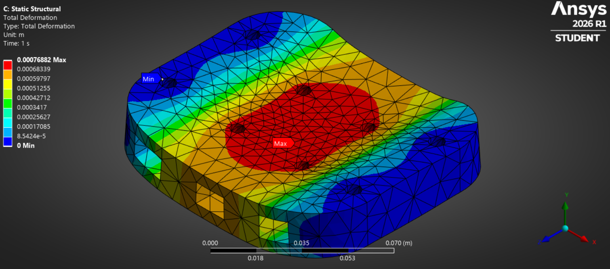 | Deformación total | 0.769 mm |
| 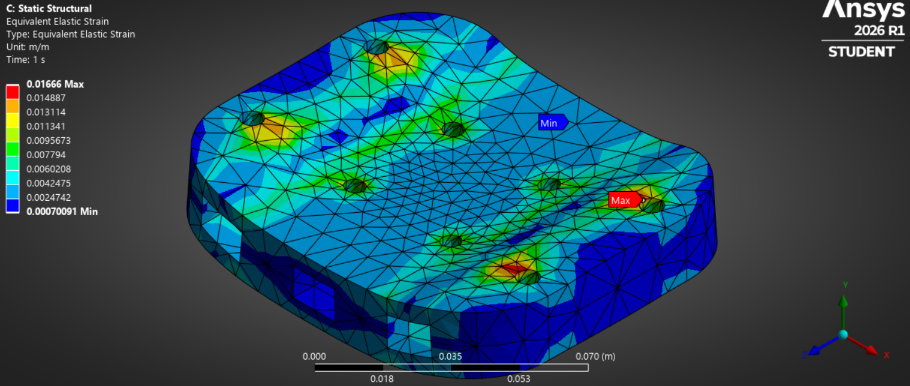 | Deformación elástica equivalente | 0.0167 m/m |
| 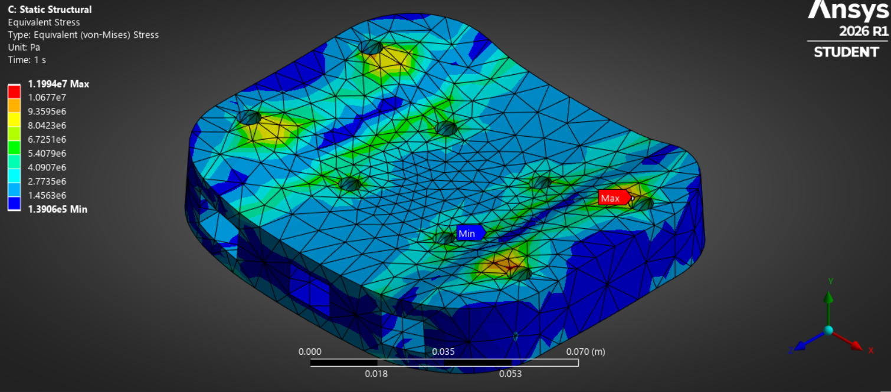 | Esfuerzo equivalente (von Mises) | 11.99 MPa (mín. 139 kPa) |
| 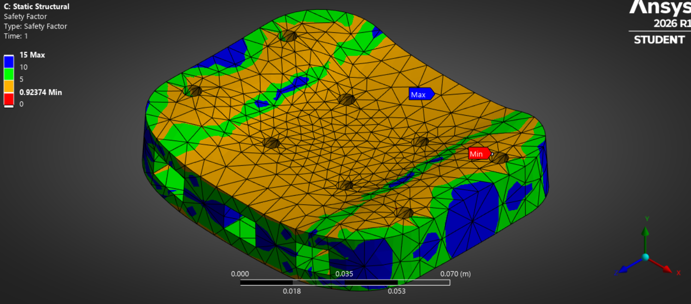 | Factor de seguridad | 15 (**mín. 0.92**) |

**Corrida E — 15 mm con refuerzo en cruz (mismo material, nervadura central en forma de cruz)**

Variante sobre la línea de 15 mm: en vez de vaciar el centro, se agregó una nervadura/refuerzo en forma de cruz para rigidizar la zona central sin llegar a 20 mm de espesor en toda la placa.

| Imagen | Descripción | Valor máximo |
|---|---|---|
| 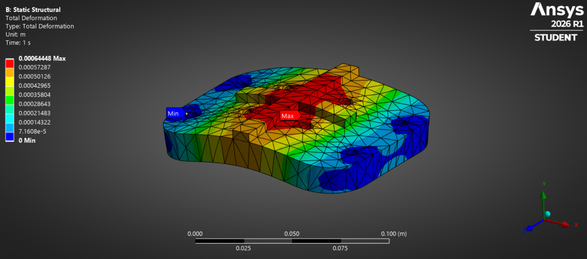 | Deformación total | 0.644 mm |
| 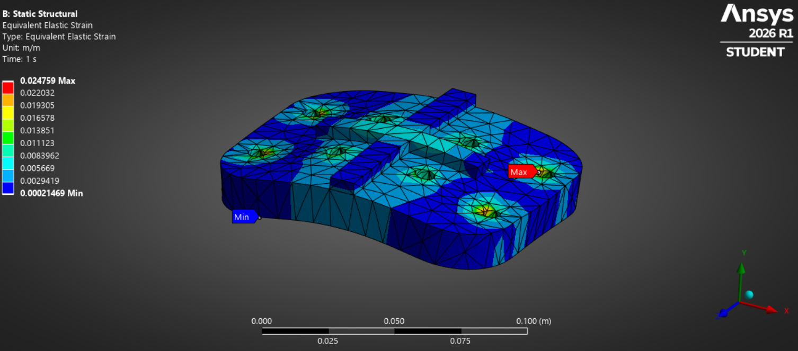 | Deformación elástica equivalente | 0.0248 m/m |
| 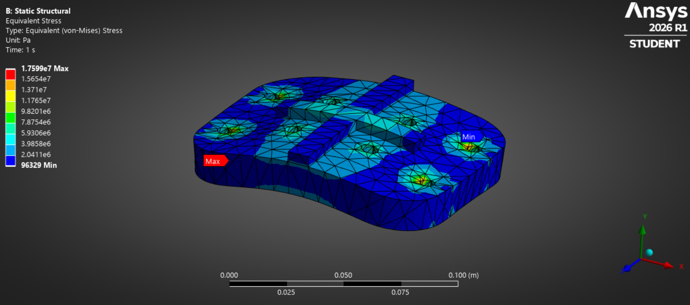 | Esfuerzo equivalente (von Mises) | 17.60 MPa (mín. 96.3 kPa) |
| 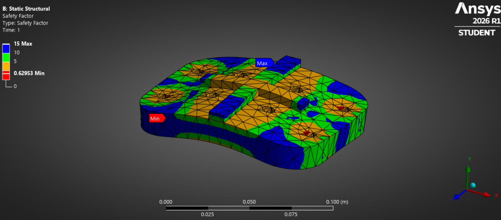 | Factor de seguridad | 15 (**mín. 0.63**) |

**Comparación de las cinco corridas**

| | 15 mm (sólida) | 20 mm (sólida) | 25 mm (sólida) | 20 mm vaciado central | 15 mm con cruz |
|---|---|---|---|---|---|
| Esfuerzo máx. (von Mises) | 21.27 MPa | 11.53 MPa | 9.60 MPa | 11.99 MPa | 17.60 MPa |
| Deformación total máx. | 0.733 mm | 0.374 mm | 0.230 mm | 0.769 mm | 0.644 mm |
| Deformación elástica máx. | 0.0296 m/m | 0.0180 m/m | 0.0134 m/m | 0.0167 m/m | 0.0248 m/m |
| Factor de seguridad mín. | 0.52 | 0.85 | **1.15** ✅ | 0.92 | 0.63 |

**Conclusión general:** de las cinco corridas, solo la de 25 mm sólida cumple factor de seguridad >1. Entre las variantes de 15 mm, agregar el refuerzo en cruz mejora el factor de seguridad frente a la placa lisa (0.52 → 0.63) sin subir a 20 mm, pero rinde menos que vaciar el centro de una placa de 20 mm (0.92) — es decir, para esta placa el vaciado central de la corrida de 20 mm sigue siendo la variante más eficiente en peso/rigidez de las probadas hasta ahora. Ninguna de las variantes con menos material que 25 mm sólida cruza el umbral de 1 todavía. Línea de trabajo para la próxima semana: combinar refuerzo/vaciado con un espesor algo mayor a 20 mm, en vez de ir directo a 25 mm sólido.

---

## Próximos pasos

- Cerrar la búsqueda de sensor de fuerza en marcas/proveedores peruanos y comparar contra las opciones internacionales ya evaluadas.
- Confirmar el MPU6050 como candidato final de IMU contra el inventario del laboratorio (duplicados por verificar).
- Cotizar disponibilidad y envío a Perú (Mouser, DigiKey, AliExpress) de TF-Luna y AS5600.
- Definir el diseño final de la placa: probar combinar refuerzo/vaciado central + un espesor algo mayor a 20 mm (en vez de 25 mm sólido), buscando factor de seguridad >1 con menos peso de material que la opción sólida.

---

## Fuentes

- [`Estado-del-arte/Sensores-LIBRA-Presentacion.pptx`](../../Estado-del-arte/Sensores-LIBRA-Presentacion.pptx) — comparativa de fuerza, distancia y ángulo (fuente de las tablas §1.1, §1.2 y §1.4).
- [`Estado-del-arte/SENSORES DE FUERZA/PYLON/Comparativa-Sensores-Fuerza-Axial-Pylon.md`](<../../Estado-del-arte/SENSORES DE FUERZA/PYLON/Comparativa-Sensores-Fuerza-Axial-Pylon.md>) — detalle y fuentes de la comparativa de fuerza.
- `Estado-del-arte/SIMULADOR DE MARCHA/LIBRA_Config_Impresion_y_Calculo_Material.xlsx` — configuración de impresión y propiedades de material usadas en ANSYS.
