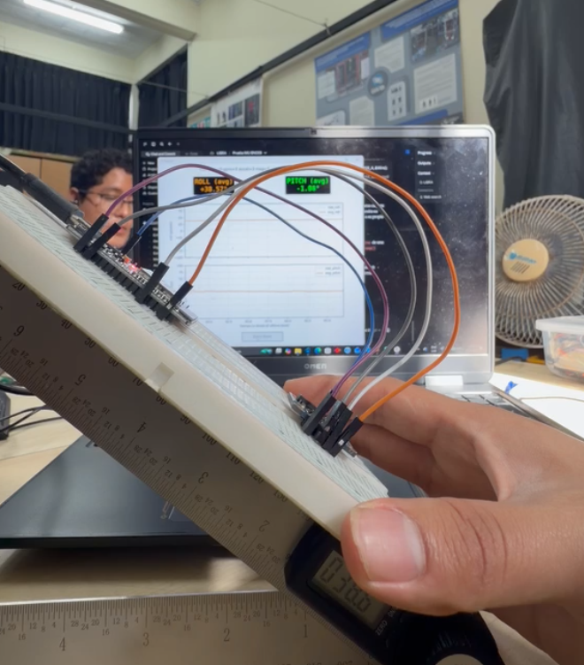
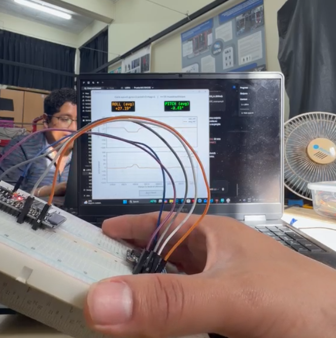
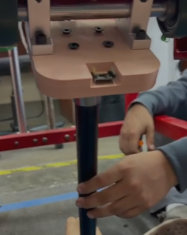
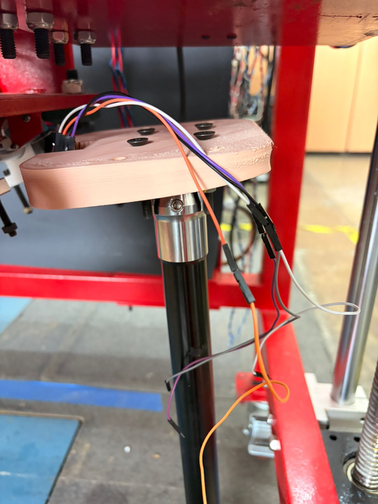

# Resumen de trabajo — Semana 4

**Período:** 22/08/2026 – 28/08/2026
**Responsable:** Alessandro Jesus Felix Tello

Resumen narrativo de la semana, complementario a `Reportes-Semanales/S4/Pendientes.md` (lista de trabajo activa) y al resumen de la semana anterior (`S3/Resumen-Semana3.md`).

El foco de la semana estuvo en dos frentes de firmware, ambos en `Firmware/`: (1) pruebas de los dos candidatos de IMU (BNO055 y MPU6050) para confirmar que entregan orientación coherente antes de decidir cuál integrar, y (2) dos prototipos de referencia de posición absoluta para la plataforma (pivote de rotación con el propio IMU, y eje del husillo con sensor Hall), a partir del problema de falta de cero absoluto detectado la semana pasada.

---

## 1. Pruebas de IMU (BNO055 y MPU6050)

### 1.1 BNO055 — prueba base y sobremuestreo

`Firmware/test_bno055/test_bno055.ino` confirma comunicación I2C con el BNO055 (ESP32, SDA/SCL en GPIO21/22) y reporta orientación (Euler heading/roll/pitch), estado de calibración por eje (giroscopio/acelerómetro/magnetómetro/sistema, 0–3) y aceleración lineal.

A partir de esa base se armó `Firmware/test_bno055_oversampling/test_bno055_oversampling.ino`, que promedia N lecturas crudas antes de reportar cada dato para reducir el ruido aleatorio de la señal sin agregar hardware — el mismo principio estadístico de promediar varios IMU físicos, pero solo ataca ruido aleatorio, no corrige bias/deriva sistemático (eso requiere calibración). Un detalle importante: los ángulos se promedian como vector (seno/coseno), no como número directo, porque el heading da la vuelta en 0/360 y un promedio ingenuo daría resultados incorrectos cerca de ese punto. Con los valores por defecto (`N_SAMPLES=10`, intervalo de muestra 10 ms) la tasa de salida es de 10 Hz.

Prueba manual de verificación (banco de pruebas en protoboard, evidencia abajo): se inclinó el sensor a mano contra una regla como referencia angular gruesa, mientras el visor en tiempo real (`visor_oversampling.py`) mostraba roll/pitch promediados. El ángulo reportado siguió la inclinación física de forma consistente (ejemplos capturados: ROLL +39.57° / PITCH −1.08° en una posición, ROLL +27.19° / PITCH −2.83° en otra), sin saltos ni ruido visible en el promedio.

|  |  |
|---|---|
| Regla como referencia angular gruesa; visor mostrando ROLL/PITCH promediados (+39.57° / −1.08°) | Segunda posición de la prueba manual (+27.19° / −2.83°) |

Queda pendiente el paso de validación cuantitativa: registrar ~30 s con el dato crudo (`test_bno055.ino`) y ~30 s con el promediado, calcular la desviación estándar de cada columna y confirmar que la del promedio baja cerca de `std_crudo / sqrt(N_SAMPLES)` — por ahora la verificación fue solo cualitativa (a ojo, contra la regla).

### 1.2 MPU6050 — filtro complementario y demostración de deriva

`Firmware/test_mpu6050/test_mpu6050.ino` prueba el MPU6050/GY-521 ya disponible en el laboratorio (candidato probable de IMU desde la S3). A diferencia del BNO055, este sensor no trae fusión de sensores integrada, así que el sketch programa un filtro complementario propio (acelerómetro + giroscopio, peso configurable `GYRO_WEIGHT`, por defecto 0.98) para obtener roll/pitch.

El sketch también reporta a propósito un `yaw_solo_giro` sin corregir — integración pura del giroscopio en Z, sin magnetómetro que lo ancle — para mostrar en vivo el problema de deriva: con el sensor quieto, ese valor se aleja de 0 progresivamente, mientras roll/pitch se mantienen estables gracias a la corrección del acelerómetro. Es una demostración deliberada del motivo por el que el MPU6050 no puede dar un heading absoluto (sin magnetómetro) y por el que su rol en la arquitectura de sensores es de validación cruzada, no medición primaria (ver `S3/Resumen-Semana3.md`, tabla de IMU).

El visor correspondiente (`visor_mpu6050.py`) grafica roll/pitch filtrados junto con el yaw sin corregir (en rojo punteado, marcado como deriva) y los datos crudos de acelerómetro/giroscopio, para poder comparar en paralelo contra el visor del BNO055 corriendo en otro puerto/ESP32.

### 1.3 Comparación entre ambos IMU

No se hizo todavía una prueba lado a lado con ambos sensores midiendo el mismo movimiento simultáneamente (los dos visores corriendo en paralelo, comparando roll/pitch de uno contra el otro) — queda como siguiente paso antes de cerrar la decisión de la S3 de usar el MPU6050.

---

## 2. Referencia de posición absoluta de la plataforma (homing)

Punto de partida: la observación de la S3 (`S3/Pendientes.md`, 26/08) de que la plataforma no tiene una referencia de posición inicial absoluta — cualquier sensor incremental (encoder relativo, conteo de pasos) solo conoce su posición *relativa* a dónde estaba al encender el sistema, no una posición física real y repetible.

### 2.1 Estado del arte — cómo lo resuelven otros sistemas

`Estado-del-arte/REFERENCIA DE POSICION ABSOLUTA/Arquitecturas-Referencia-Absoluta-sin-Goniometro.md` revisa cómo sistemas fuera de los IMU MEMS resuelven este mismo problema sin un goniómetro manual: homing por switch/pulso de índice (CNC, impresoras 3D), "mastering" de robots industriales (FANUC/KUKA/ABB), referencia láser-gravedad en alineación protésica (Ottobock L.A.S.A.R. Posture) y prueba estática de calibración en laboratorios de marcha (Vicon Plug-in Gait). El patrón común en los cuatro: todos usan un evento o referencia física fija (switch, marca mecánica, línea de fuerza, o postura estática promediada) que define el cero por construcción, y miden el ángulo después en relación a ese evento — no dependen de que una persona mida el cero con un instrumento externo cada vez.

Conclusión aplicada a LIBRA: para el eje de rotación, el homing por acelerómetro ya prototipado (`homing_absoluto.ino`) es válido y barato, con opción de reforzarlo con una marca/pin mecánico si el nivelado de la plataforma resulta problemático en la práctica. Para el eje de traslación (que el acelerómetro no puede resolver, porque no hay componente de gravedad que cambie con la posición lineal), la recomendación es sensor Hall + imán fijo (o switch mecánico) — la opción más barata y robusta, coherente con el stack I2C/ESP32 ya usado en el proyecto.

### 2.2 Prototipo — homing del pivote con el IMU (referencia de gravedad)

`Firmware/homing_absoluto/homing_absoluto.ino` usa el acelerómetro del MPU6050 como referencia de gravedad para fijar un cero absoluto del pivote de flexo-extensión, persistente en la memoria flash del ESP32 (no en RAM, así que sobrevive a apagar y encender). Comando `z` (mantener el pivote quieto en la posición de referencia ~1 s, promedia las lecturas y guarda el cero); comando `c` para borrarlo. El visor `visor_homing.py` agrega botones que mandan esos comandos por Serial directamente, sin escribirlos a mano en el Monitor Serie, y muestra en paralelo el ángulo relativo al cero guardado (`roll_abs`/`pitch_abs`) contra el ángulo crudo del filtro.

Limitación explícita (documentada en el propio sketch): es una rutina de homing puntual al iniciar sesión, no una medición continua — durante el movimiento real el acelerómetro mezcla gravedad con aceleración dinámica y no sirve para fijar el cero en ese momento.

Esta semana se montó físicamente el sensor, con un soporte impreso en 3D, directamente sobre el pylon real de la plataforma (evidencia abajo) — primer paso hacia la validación en hardware real que quedaba pendiente desde que se escribió el sketch, más allá del banco de pruebas en protoboard.

|  |  |
|---|---|
| Soporte impreso en 3D con el IMU, montado en el extremo superior del pylon | Cableado del IMU bajando por el pylon hacia el resto de la electrónica |

Falta todavía: registrar datos cuantitativos del homing en esta posición real (no solo el montaje físico), y confirmar que la posición mecánica de "cero" del pylon corresponde a una orientación reconocible respecto a la gravedad (p. ej. pylon perfectamente vertical), como pide el propio sketch antes de considerarlo validado.

### 2.3 Prototipo — homing del husillo con sensor Hall

`Firmware/homing_husillo_hall/homing_husillo_hall.ino` resuelve el cero del eje del motor paso a paso del husillo (no el recorrido completo del riel) con un imán montado en un collarín impreso más un sensor Hall fijo al chasis, inspirado directamente en el patrón de índice magnético de la sección 2.1. Homing en dos etapas, igual que una CNC o impresora 3D: aproximación rápida hasta el primer disparo del sensor, retroceso, y aproximación lenta al mismo punto para un disparo más repetible y preciso que con una sola pasada. A diferencia del homing por acelerómetro, este no necesita guardarse en flash — se re-homea en cada encendido, porque el evento físico (encontrar el imán) siempre está disponible.

Da un cero repetible del eje del motor por vuelta, pero no resuelve por sí solo en qué vuelta está el carro dentro de todo el recorrido del riel — para eso falta combinarlo con un límite físico en un extremo del riel (switch), quedando pendiente diseñar/imprimir la pieza física (con el diámetro real del eje medido con calibre) y validar en el motor real. Por ahora el sketch está probado solo a nivel de firmware, sin la pieza física impresa ni montado en el motor.

---

## Próximos pasos

- Correr la validación cuantitativa del sobremuestreo del BNO055 (desviación estándar crudo vs. promediado) en vez de solo la verificación cualitativa contra la regla.
- Hacer la prueba lado a lado BNO055 vs. MPU6050 sobre el mismo movimiento, para informar la decisión de la S3 de usar el MPU6050 como IMU final.
- Registrar datos cuantitativos del homing por acelerómetro con el IMU ya montado en el pylon real, y confirmar que el cero mecánico corresponde a una orientación reconocible respecto a la gravedad.
- Medir el diámetro real del eje del motor del husillo (calibre) y diseñar/imprimir el collarín con el imán para el homing Hall, luego validarlo en el motor real (por ahora solo probado en firmware).
- Definir el límite físico de fin de carrera del riel (switch) para combinar con el índice magnético del husillo y tener el cero absoluto de todo el recorrido, no solo por vuelta.
- Seguir con los pendientes heredados de la S3 (prioridad GRF vs. pylon sin resolver formalmente, sensor de fuerza del pylon sin cerrar) — ver `Pendientes.md`.

---

## Fuentes

- `Firmware/test_bno055/INSTRUCCIONES.md`, `Firmware/test_bno055_oversampling/test_bno055_oversampling.ino` — prueba base y sobremuestreo del BNO055.
- `Firmware/test_mpu6050/INSTRUCCIONES.md`, `Firmware/test_mpu6050/test_mpu6050.ino` — prueba y filtro complementario del MPU6050.
- `Firmware/homing_absoluto/INSTRUCCIONES.md`, `Firmware/homing_absoluto/homing_absoluto.ino` — homing del pivote por acelerómetro.
- `Firmware/homing_husillo_hall/INSTRUCCIONES.md`, `Firmware/homing_husillo_hall/homing_husillo_hall.ino` — homing del eje del motor por sensor Hall.
- `Estado-del-arte/REFERENCIA DE POSICION ABSOLUTA/Arquitecturas-Referencia-Absoluta-sin-Goniometro.md` — estado del arte de referencias absolutas sin goniómetro.
- `Reportes-Semanales/S3/Pendientes.md` — observación original del problema de referencia absoluta (26/08).
