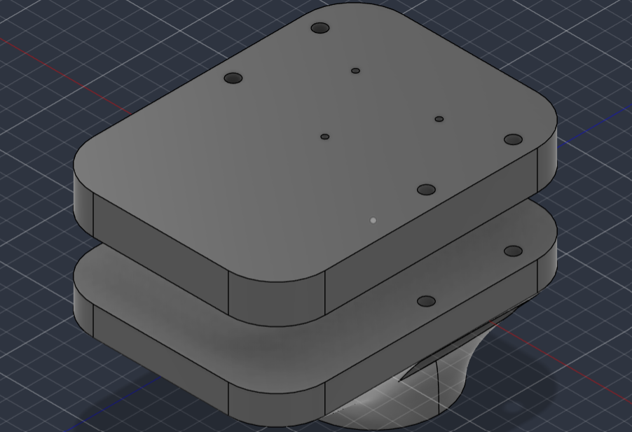
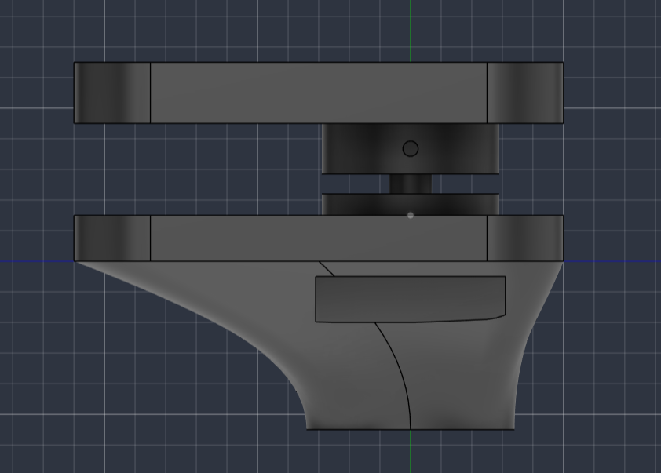
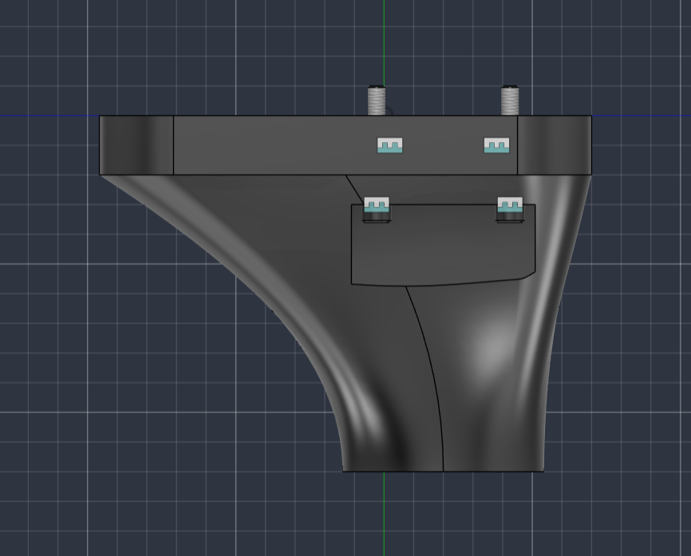
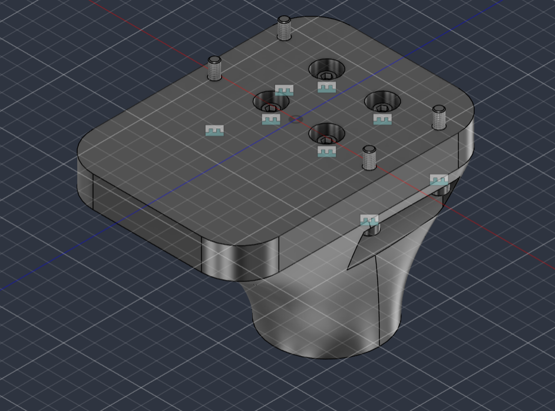

# Resumen de trabajo — Semana 5

**Período:** 29/08/2026 – 04/09/2026
**Responsable:** Alessandro Jesus Felix Tello

Resumen narrativo de la semana, complementario a `Comparativa-LoadCells-S5.md` (mismo directorio) y al resumen de la semana anterior (`S4/Resumen-Semana4.md`).

El foco de la semana estuvo en cerrar el pendiente heredado de la S4 de selección de sensor de fuerza del pylon (comparativa de celdas de carga disponibles en Amazon y compra de la elegida), en evaluar alternativas de IMU de menor drift a partir del problema de repetibilidad del homing detectado al usar `homing_absoluto.ino`, y en avanzar el diseño mecánico del bloque superior del pylon en dos versiones paralelas: una dimensionada para el sensor de fuerza ya comprado, y una versión simplificada e imprimible de inmediato para no bloquear las pruebas de ajuste en el simulador mientras se espera la pieza física.

---

## 1. Selección y compra del sensor de fuerza del pylon

`Comparativa-LoadCells-S5.md` compara 4 celdas de carga y 2 módulos de electrónica de lectura encontrados en Amazon contra los requisitos ya fijados en la comparativa de la S4 (`Estado-del-arte/SENSORES DE FUERZA/PYLON/Comparativa-Sensores-Fuerza-Axial-Pylon.md`): fuerza de prueba P5 = 2240 N, fuerza última P5 = 4480 N, margen objetivo ~1.5–2× sobre la última, e interfaz mecánica de placa plana atornillada (no adaptador tipo pyramid).

De las cuatro celdas comparadas, la candidata **#4** (tipo fuelle, Ø2.283 in, con patrón de pernos 3×M4 documentado en la ficha) fue la que se terminó comprando — es la única opción con el patrón de pernos confirmado explícitamente, lo que evita depender de una interfaz no verificada. La variante de capacidad elegida fue **220 lb** (~978 N), menor que la de 2200 lb que la comparativa señalaba como la que cumple el margen objetivo sobre la carga última P5 (4480 N) — esto es intencional: la celda se dimensionó para el caso de carga puntual de **~1200 N** (observación de la S3, 26/08, sección "Diseño mecánico del pylon" de `S4/Pendientes.md`), no para el ensayo P5 completo, que sigue siendo un caso de carga distinto y no priorizado por ahora.

También quedó confirmada la disponibilidad del ADS1256 (Teyleten Robot, ~US$27 con envío) como electrónica de lectura, cerrando la parte de "verificar disponibilidad" del pendiente heredado de la S4 — ver detalle completo en `Comparativa-LoadCells-S5.md`, secciones 3 y 4.

---

## 2. Comparativa de IMU de bajo drift para el homing del pivote

Al usar el homing por acelerómetro (`Firmware/homing_absoluto/homing_absoluto.ino`, prototipado en la S4) se observó que, al fijar el cero del pivote y volver físicamente a esa misma posición más tarde, el ángulo reportado por el MPU6050 no coincide exactamente con el cero guardado. `Estado-del-arte/REFERENCIA DE POSICION ABSOLUTA/Comparativa-IMU-Bajo-Drift.md` documenta el diagnóstico y la comparativa de alternativas, incluyendo IMU de grado "espacial/aeroespacial" a pedido explícito, para calibrar expectativas de costo.

**Diagnóstico:** el problema tiene tres causas posibles y no todas se resuelven comprando mejor IMU — (1) bias sistemático de fábrica del acelerómetro del MPU6050, que el sobremuestreo de la S4 no corrige (solo reduce ruido aleatorio, no bias); (2) deriva del giroscopio si hay integración entre eventos; (3) holgura mecánica real del pivote, que ningún sensor corrige. La causa 1 se identifica como la más probable en este caso puntual, porque el homing es una lectura estática de inclinación, no una integración continua.

**Comparativa por nivel:**
- **Nivel A (reemplazo directo, mismo bus I2C, unos pocos dólares):** LSM6DSR o ICM-45686 — según datos de la comunidad SlimeVR, el MPU6050 actual es el peor de la lista para este problema (drift perceptible en 1–5 min), mientras que ICM-45686 tarda 45–60 min.
- **Nivel B (industrial/táctico, US$300–600):** VectorNav VN-100, Xsens MTi-3 o Analog ADIS16470 — calibración de fábrica multi-temperatura y EKF integrado; el VN-100 publica 0.5° RMS de exactitud estática de roll/pitch, directamente relevante para el homing.
- **Nivel C (grado espacial/navegación, FOG/RLG, US$10 000–200 000+):** mencionado solo como referencia a pedido — resuelve un problema distinto (navegación autónoma sin referencia externa) y es sobre-ingeniería para este caso.

**Recomendación aplicada a LIBRA:** cambiar el MPU6050 por un LSM6DSR o ICM-45686 (Nivel A) como mejora inmediata de bajo costo, y combinarlo con una marca/tope mecánico físico de referencia en el pivote — la solución más barata y coherente con el patrón ya identificado en la S4 (`Arquitecturas-Referencia-Absoluta-sin-Goniometro.md`: todo sistema repetible usa un evento físico fijo, no solo un sensor). El Nivel B queda como opción si el presupuesto lo permite más adelante; el Nivel C se descarta explícitamente por costo y por resolver un problema que LIBRA no tiene.

---

## 3. Diseño mecánico del bloque superior del pylon — dos versiones en paralelo

Se avanzó el diseño del bloque que aloja el sensor de fuerza sobre el cono de transición del pylon, en dos versiones que comparten la misma huella general (placa superior redondeada + placa intermedia, ambas con esquinas redondeadas, apoyadas sobre la transición cónica hacia el resto del pylon):

**Versión A — con el sensor de fuerza ya comprado:**

|  |  |
|---|---|
| Vista isométrica del bloque superior con el patrón de agujeros dimensionado para el sensor comprado | Segunda vista isométrica del mismo diseño |

La placa superior tiene el patrón de agujeros dimensionado para la celda #4 comprada (agujeros grandes para los pernos 3×M4 de montaje del sensor, agujeros pequeños adicionales para paso de cableado/alineación). Es la versión que corresponde a la interfaz mecánica final una vez que el sensor esté integrado.

**Versión B — imprimible ahora, para pruebas del simulador:**

|  |  |
|---|---|
| Vista superior con los insertos roscados y tornillos visibles | Vista lateral sobre la transición cónica hacia el pylon |

Mismo volumen general que la versión A, pero con insertos roscados (heat-set) y tornillos como referencia mecánica temporal, sin el cuerpo del sensor real. Esta es la pieza que se va a imprimir de inmediato, para poder avanzar con las pruebas de ajuste/ensamblaje en el simulador sin quedar bloqueados esperando la llegada física de la celda de carga comprada.

Esta doble vía (versión final dimensionada al sensor + versión imprimible simplificada) responde directamente a dos pendientes heredados de la S4 en `Diseño mecánico del pylon`: el bracket/adaptador para montar la celda elegida, y el boceto físico de la ubicación real de la celda — ambos seguían "sin avance" hasta esta semana. Quedan todavía sin correr la validación estructural en Fusion 360 (Static Stress Simulation) de esta geometría específica y el caso de carga puntual ~1200 N observado en la S3.

---

## Próximos pasos

- Escribir al vendedor (QILICHUANGAN / QL Sensor) para confirmar el tipo de salida real (mV/V crudo vs. amplificado) de la celda comprada, compatibilidad con el ADS1256 ya decidido — señal de alerta pendiente de la propia comparativa ("Push-Pull").
- Guardar las 4 imágenes de las dos versiones del diseño del pylon en `Evidencias/diseno-pylon-S5/` con los nombres usados en la Sección 3, para activar los enlaces del resumen.
- Imprimir la versión B (imprimible, con insertos + tornillos) y correr las pruebas de ajuste/ensamblaje pendientes en el simulador.
- Correr la validación estructural en Fusion 360 (Static Stress Simulation) de la versión A una vez confirmada la capacidad final del sensor, incluyendo el caso de carga puntual ~1200 N heredado de la S3.
- Evaluar el cambio de IMU (MPU6050 → LSM6DSR o ICM-45686) y, en paralelo, diseñar una marca/tope mecánico de referencia para el pivote, antes de repetir la validación cuantitativa del homing que quedó pendiente desde la S4.

---

## Fuentes

- `Reportes-Semanales/S5/Comparativa-LoadCells-S5.md` — comparativa y recomendación de celdas de carga y electrónica de lectura (31/08/2026).
- `Estado-del-arte/REFERENCIA DE POSICION ABSOLUTA/Comparativa-IMU-Bajo-Drift.md` — diagnóstico y comparativa de IMU de bajo drift (31/08/2026).
- `Estado-del-arte/SENSORES DE FUERZA/PYLON/Comparativa-Sensores-Fuerza-Axial-Pylon.md` — requisitos P5 y comparativa previa de sensores (19/08/2026).
- `Firmware/homing_absoluto/homing_absoluto.ino` — prototipo de homing donde se observó el problema de repetibilidad que motivó la comparativa de IMU.
- `Reportes-Semanales/S4/Pendientes.md` — pendientes heredados de selección de sensor de fuerza y diseño mecánico del pylon.
