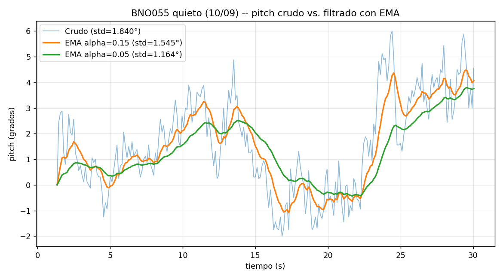
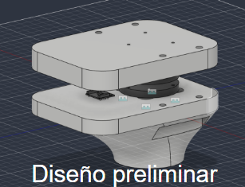
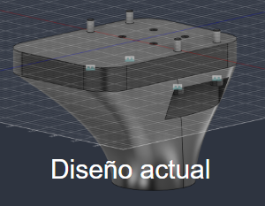
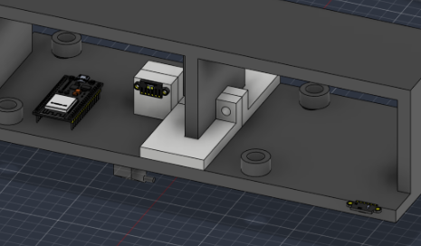

# Resumen de trabajo — Semana 6

**Período:** 05/09/2026 – 11/09/2026
**Responsable:** Alessandro Jesus Felix Tello

Resumen narrativo de la semana, complementario a `Pendientes.md` (mismo directorio, heredado de la S5) y al resumen de la semana anterior (`S5/Resumen-Semana5.md`).

El foco de la semana estuvo en dejar funcionando la transmisión inalámbrica del BNO055 (DFRobot) por WiFi en modo Access Point propio del ESP32, en encontrar y corregir un bug crítico dentro de la librería `DFRobot_BNO055` que impedía leer el sensor de forma sostenida, y en construir las herramientas de validación y calibración necesarias para que la captura del "0°" de referencia (usada por el homing del pivote) sea confiable: registro a CSV con estadística de ruido, y calibración de acelerómetro de 6 posiciones.

---

## 1. Transmisión WiFi del BNO055 en modo Access Point propio

Se armaron dos sketches (`Firmware/test_wifi_udp_bno055/` y `Firmware/test_wifi_ap_bno055/`) que envían las lecturas del BNO055 por UDP en vez de por cable, usando la librería **DFRobot_BNO055** (no Adafruit_BNO055) por corresponder al módulo Fermion SEN0374 que se está usando. La versión AP hace que el ESP32 cree su propia red WiFi (`LIBRA_ESP32`, IP fija `192.168.4.1`) en vez de unirse a una red existente — evitando el problema de que la red de la universidad usa autenticación WPA2-Enterprise, incompatible con el código simple de conexión WiFi, y evitando también el riesgo de aislamiento cliente/AP típico de redes institucionales.

**Bug crítico encontrado y corregido:** al probar la transmisión, el sensor reportaba `Euler[...]=0.00,0.00,0.00` de forma permanente después de los primeros segundos. La causa, encontrada leyendo el código fuente de la librería, es que la función interna que lee cualquier dato por I2C (`readReg`) llama a `Wire.begin()` en **cada lectura** (decenas de veces por segundo), y reinicializar el bus I2C del ESP32 con esa frecuencia termina rompiendo la comunicación de forma silenciosa — sin ningún mensaje de error. Se corrigió eliminando esa llamada redundante de `DFRobot_BNO055.cpp` (queda comentado en el código el motivo del cambio, para quien revise la librería más adelante).

---

## 2. Validación de ruido del sensor — pruebas "sensor quieto"

Se construyó `log_csv_bno055.py`, que registra a CSV las lecturas del sensor por cable (sirve como respaldo de depuración independiente del WiFi) y calcula automáticamente el promedio y la desviación estándar de heading/roll/pitch y aceleración lineal — la métrica que hacía falta para la validación de ruido pendiente desde la S4/S5 (`Comparativa-IMU-Bajo-Drift.md`).

Antes de corregir el bug de la librería, las dos primeras pruebas (10/09) no fueron utilizables: la primera mostró `calib=0,0,0,0` durante toda la captura (sensor sin calibrar) y un heading con salto 0°/360° que invalida el cálculo lineal de desviación estándar; la segunda salió enteramente en `0.000` — el síntoma que llevó a encontrar el bug de arriba. Ver el diagnóstico completo en `Evidencias/pruebas-imu-S5/Analisis-Prueba-Quieto-S5.md`.

Con la librería ya corregida, cinco repeticiones de 30 s dieron:

| repetición | roll std | pitch std | calib (sys,gyro,acc,mag) |
|---|---|---|---|
| 1 | 0.060° | 0.407° | 0,3,0,0 |
| 2 | 0.474° | 0.505° | 0,3,0,0 |
| 3 | 0.369° | 0.333° | 0,3,0,0 |
| 4 | 0.315° | 0.539° | 0,3,0,0 |
| 5 | 0.495° | 0.291° | 0,3,0,0 |

El giroscopio calibra solo (3/3) pero el acelerómetro y el magnetómetro se quedaron en 0/3 en las cinco pruebas — de ahí que roll/pitch (que dependen del acelerómetro) fueran razonablemente estables pero no tan precisos como deberían, y que heading (que depende casi por completo del magnetómetro) resultara inutilizable (llegó a variar más de 150° en una sola prueba de 30 s estando quieto).

**Filtro de suavizado — EMA, no Kalman ni ML:** se investigó qué tipo de filtro correspondía para las micro-variaciones y se decidió por un promedio móvil exponencial (matemáticamente el mismo filtro que un pasabajos IIR de un polo), en vez de un filtro de Kalman o un modelo de machine learning. Razón: el BNO055 ya hace fusión sensorial interna equivalente a un Kalman/complementario (modo NDOF); filtrar de nuevo con Kalman la salida ya fusionada sería redundante. Con los datos de la primera prueba, un EMA con alpha=0.05 bajó la desviación estándar de pitch de 1.84° a 1.16°:

|  |
|---|
| Pitch crudo vs. filtrado con EMA (alpha=0.15 y alpha=0.05), datos de la prueba "sensor quieto" del 10/09 |

---

## 3. Precisión del "cero absoluto": captura mejorada + calibración de acelerómetro de 6 posiciones

Dado que el objetivo final es que el sistema pueda fijar el 0° de referencia del pivote con confianza (mismo problema de fondo que motivó `homing_absoluto.ino` en la S4), se hicieron dos mejoras concretas sobre los sketches de BNO055:

- **Captura de cero más robusta:** la función que fija el cero absoluto (comando `'z'`) ahora promedia el doble de muestras (200 en vez de 100), reporta la desviación estándar lograda en esa captura específica, y **rechaza** guardar el cero si el sensor se movió más de 0.5° durante la toma — antes se guardaba sin avisar aunque la captura fuera mala.
- **Calibración de acelerómetro de 6 posiciones (`calibrar_acelerometro.py`):** dado que el acelerómetro se quedaba sin calibrar (0/3) en todas las pruebas, se construyó una calibración alternativa a la auto-calibración por movimiento continuo del propio chip (poco práctica): el script guía por 6 posturas estáticas (una por cada cara de un cubo imaginario), detecta solo qué eje quedó apuntando a la gravedad en cada una, calcula el sesgo (offset) de cada eje, y lo escribe directo en los registros internos del BNO055 (`setAxisOffset`, requiere modo CONFIG) — la única forma de que la mejora impacte realmente los ángulos Euler, ya que esos los calcula el propio chip con su acelerómetro interno. La calibración queda guardada en la flash del ESP32 y se reaplica sola en cada arranque, así que no hace falta repetirla en cada sesión de prueba.

Nota importante confirmada durante esta investigación: no existe ningún atajo de software/IA para saltarse la calibración física del acelerómetro — separar el sesgo del sensor de la dirección de la gravedad requiere, matemáticamente, verlo quieto en más de una orientación; con el sensor en una sola posición esa información no está en los datos. Lo que sí se logró fue reemplazar la calibración "en movimiento" (poco controlable) por una calibración de posturas estáticas, más fácil de ejecutar de forma repetible.

---

## 4. Avance en el diseño mecánico del pylon y montaje de electrónica

En paralelo al trabajo de firmware, se actualizó el diseño en Fusion 360 del bloque superior del pylon (el mismo de la Sección 3 de `S5/Resumen-Semana5.md`), y se registró una vista del montaje de la electrónica (ESP32 y un módulo adicional) en la parte inferior de la plataforma, junto al bloque del pylon:

|  |  |
|---|---|
| Diseño preliminar — placas superior e inferior con el sensor visible entre ambas | Diseño actual — bloque más integrado con la transición cónica hacia el pylon |

|  |
|---|
| Vista de la parte inferior de la plataforma: ESP32 y un módulo adicional montados junto al bloque del pylon |

Quedan pendientes de precisar en el próximo reporte: qué cambió específicamente entre el diseño preliminar y el actual (dimensiones, forma de la transición cónica, fijación), y qué módulo es el que aparece junto al ESP32 en la vista de montaje — se documentan aquí las tres imágenes para no perder el avance visual mientras se completa esa descripción.

---

## Próximos pasos

- Correr `calibrar_acelerometro.py` y repetir las pruebas de `log_csv_bno055.py` para confirmar que la calibración de acelerómetro efectivamente baja la desviación estándar de roll/pitch por debajo de los valores de esta semana.
- Repetir la prueba "sensor quieto" con el magnetómetro también calibrado (o evaluar si heading realmente hace falta para el caso de uso del pivote, que es principalmente roll/pitch por gravedad).
- Retomar la decisión pendiente de la S5 sobre el reemplazo de IMU (LSM6DSR/ICM-45686) — ahora con el BNO055 funcionando de forma confiable por WiFi, evaluar si sigue conviniendo migrar o si el BNO055 calibrado ya cubre el caso de uso.
- Aplicar el mismo criterio de "referencia física fija" (Hall + imán en el punto de 0°) evaluado para el pivote en `Pendientes.md`, una vez que la precisión del cero por IMU esté confirmada con el acelerómetro ya calibrado.

---

## Fuentes

- `Evidencias/pruebas-imu-S5/Analisis-Prueba-Quieto-S5.md` — análisis detallado de las pruebas "sensor quieto" (10/09/2026), incluyendo los dos archivos CSV crudos y el hallazgo del bug de la librería.
- `Firmware/test_wifi_ap_bno055/test_wifi_ap_bno055.ino` y `Firmware/test_wifi_udp_bno055/test_wifi_udp_bno055.ino` — sketches con la corrección de la librería, la captura de cero mejorada, y la calibración de acelerómetro.
- `Firmware/test_wifi_ap_bno055/visor_python/log_csv_bno055.py` y `calibrar_acelerometro.py` — herramientas de registro y calibración construidas esta semana.
- [Filter-IMU (comparación moving average / low-pass / Kalman en datos reales de IMU)](https://github.com/keatinl1/Filter-IMU/blob/main/README.md)
- [Noise Removal in The IMU Sensor Using Exponential Moving Average with Parameter Selection (ROV)](https://www.researchgate.net/publication/362050644_Noise_Removal_in_The_IMU_Sensor_Using_Exponential_Moving_Average_with_Parameter_Selection_in_Remotely_Operated_Vehicle_ROV)
- [Kalman filter vs Complementary filter](https://robottini.altervista.org/kalman-filter-vs-complementary-filter)
- `Reportes-Semanales/S5/Pendientes.md` — pendientes heredados donde se registraron los hallazgos del 10/09 en detalle.
- `Evidencias/diseno-pylon-S6/` — imágenes del diseño preliminar/actual del bloque del pylon y del montaje de electrónica bajo la plataforma (12/09/2026).
