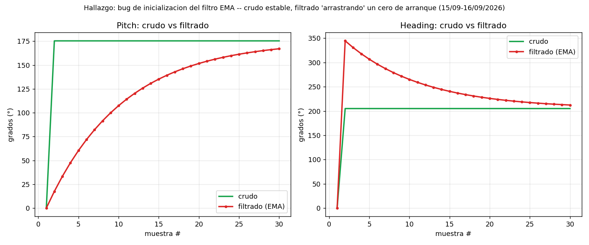
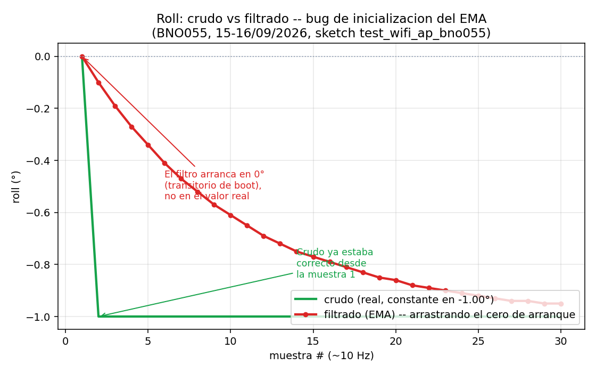
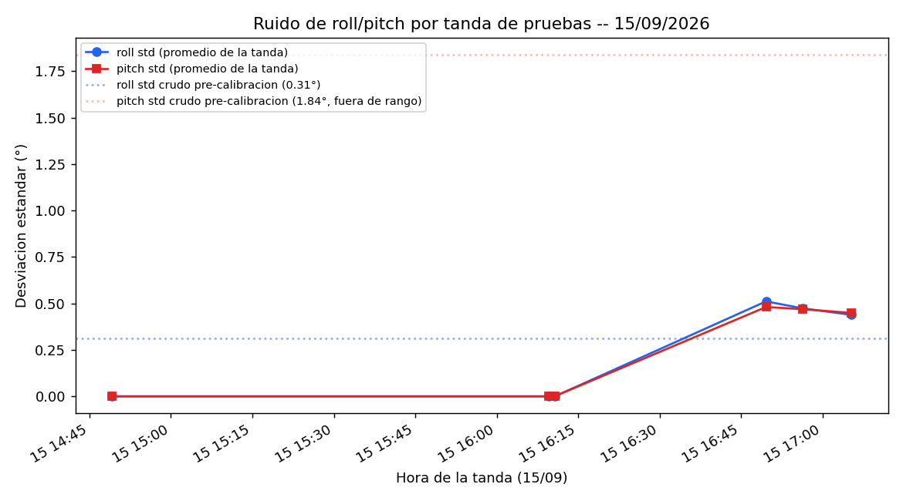
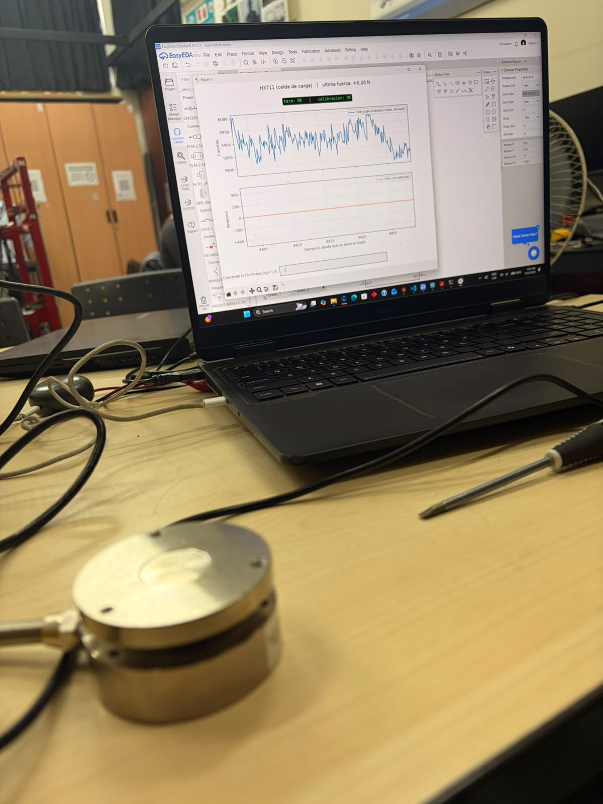
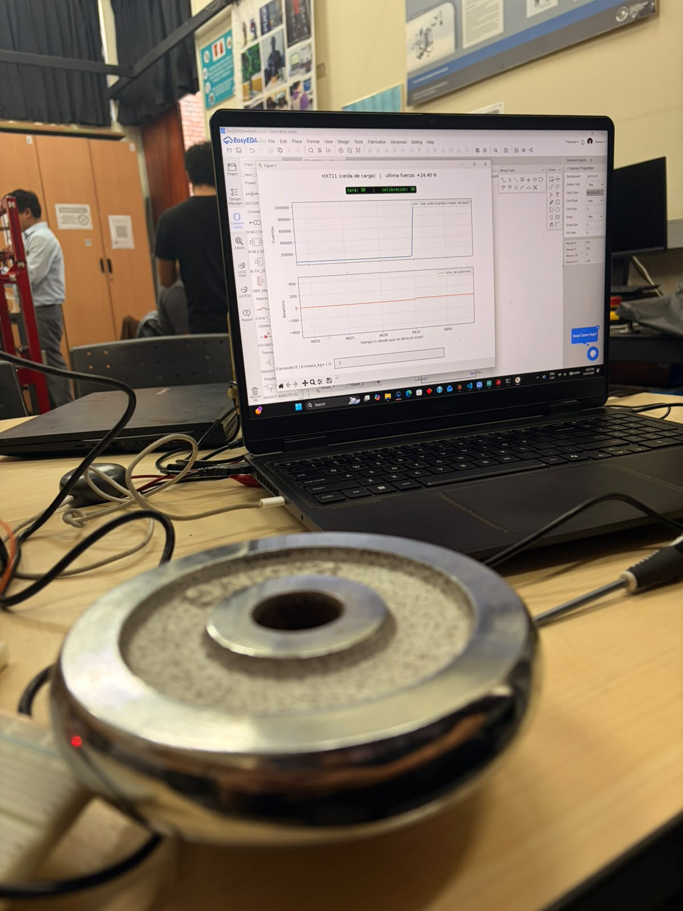

# Resumen de trabajo — Semana 7

**Período:** 12/09/2026 – 18/09/2026
**Responsable:** Alessandro Jesus Felix Tello

Foco de la semana: (1) IMU (BNO055) — calibración de acelerómetro, filtro embebido en firmware y dos bugs nuevos; (2) sensor de fuerza del pylon — primera prueba física con HX711, en paralelo al diagnóstico de un ruido tipo "diente de sierra" en el ADS1256, y primer documento de pinout de PCB.

**Nota:** los CSV e imágenes de esta semana estaban sueltos en `Firmware/test_wifi_ap_bno055/visor_python/` y en `Claude outputs/` (sin commitear). Se copiaron a `Evidencias/pruebas-imu-S7/` y `Evidencias/pruebas-fuerza-S7/` — falta decidir si reemplazan a los originales y comitear.

---

## 1. Sensado del IMU (BNO055)

Tandas de captura del 15/09 (14:49–17:05, ver `bno055_20260915_*.csv`) que llevaron a dos hallazgos nuevos.

### 1.1 Calibración de acelerómetro (offset + radius)

`DFRobot_BNO055` solo expone `setAxisOffset()`; el datasheet de Bosch pide también el registro `ACC_RADIUS` (0x67/0x68). Se agregó `escribirAccRadiusCrudo()` en `test_wifi_ap_bno055.ino` (~1000 mg, aproximado). **Experimental** — falta repetir las 5 pruebas de ruido de la S6 para confirmar si `calib_accel` sube a 3/3.

### 1.2 Filtro EMA embebido en firmware + chequeo de salud de conexión

El filtro EMA (antes solo en Python) ahora corre en el ESP32 (`actualizarFiltroEMA()`, alpha=0.10, corrección circular 0°/360°). Se agregó `chequearSaludConexion()`: cada ~5 s calcula std de roll/pitch crudos y alerta por Serial/UDP si supera 0.10° (umbral fijado con datos reales, ver 1.4).

### 1.3 Bug: el EMA arranca en cero

Con `comparar_filtro_ema.py` (crudo y filtrado de la misma línea del ESP32) se encontró que el EMA se siembra en 0° al arrancar, aunque el crudo ya esté estable desde la muestra 1 — el filtrado tarda ~30 muestras en converger.

|  |
|---|
| Pitch (izq.) y heading (der.): crudo estable desde la muestra 1, filtrado arrancando en 0° — `comparacion1.csv`, 15-16/09/2026 |

|  |
|---|
| Mismo efecto en roll, a menor escala |

Fix anotado en el código (calentamiento tras `bno.begin()`), pendiente de confirmar con una nueva tanda de capturas.

### 1.4 Hallazgo: ruido alto por conector flojo

Comparando el std promedio de roll/pitch por tanda del 15/09, las últimas dos (16:50 y 17:05) salieron con std ≈0.44–0.52°, muy por encima de las anteriores y de la referencia S5/S6 (roll ≈0.31°, pitch ≈1.84° sin calibrar):

|  |
|---|
| Std promedio de roll/pitch por tanda — salto de ruido en las últimas dos tandas (~16:50–17:05) |

Con conector bien puesto, std = 0.0000–0.0007°; con conector flojo, 0.35–0.63° (~500x). **Pendiente:** identificar el conector/cable exacto detrás del salto.

### 1.5 Registro a CSV: pausas automáticas

`log_csv_bno055.py` ahora acepta `--pausa <segundos>` para encadenar repeticiones sin presionar Enter (así se corrieron las tandas de 5 y 10 del 15/09), y detecta si la primera repetición salió enteramente en 0.0 (BNO055 no detectado), preguntando si continuar.

---

## 2. Sensor de fuerza del pylon: HX711 vs. ADS1256

El ADS1256 (elegido a largo plazo, 8 canales) mostraba un ruido tipo "diente de sierra" sin aislar. Se armó un sketch de prueba en paralelo con el **HX711** (`Firmware/test_hx711/`) para verificar si el problema está en la celda/cableado o en el ADS1256/alimentación.

### 2.1 Primera prueba física con masa patrón

Con el HX711 a 3.3V (evita el level shifter que sí requiere el ADS1256, de 5V fijos):

| paso | evento | raw_code | resultado |
|---|---|---|---|
| 1 | celda vacía, sin tarar | ~-22.86k (ruido ±100 cuentas) | referencia antes de tarar |
| 2 | comando `t` | — | tara guardada: -22864.8 |
| 3-4 | masa patrón 2.000 kg, `k2.0` | ~-5001.8 | factor 0.00109798 N/cuenta → **19.61 N** (≈2.000 kg) |
| 5 | celda vacía de nuevo | ~-22850 | **0.016 N** (≈0.002 kg, ~cero) |
| 5 | masa distinta (sin calibrar) | ~-13900 | **9.84 N** (≈1.004 kg, consistente) |

Detalle en `entendiendo-cuentas-hx711-S7.csv`. La masa de verificación dio un valor razonable sin recalibrar — señal de que la celda/cableado responden linealmente con el HX711. **Falta** la misma prueba con el ADS1256 para aislar si el diente de sierra es del ADC/alimentación o de la celda.

|  |  |
|---|---|
| Celda botón — ~0.20 N sin carga | Celda arandela/anillo — salto a +24.40 N al aplicar carga |

Ambas celdas se probaron con el mismo montaje para comparar antes de decidir cuál usar en el pylon (ver `S5/Comparativa-LoadCells-S5.md`) — falta precisar cuál corresponde a cuál opción.

### 2.2 Pinout del chip HX711 (para PCB propia)

Se documentó el pinout completo del chip pelado (SOP-16L) contra el datasheet de Avia Semiconductor: regulador interno opcional, un solo pin de tierra (AGND, sin DGND), y excitación ratiométrica (EXC+ a AVDD) para cancelar ruido de alimentación.

---

## 3. Diseño de la placa superior (PCB)

Se escribió `Firmware/PCB_placa_superior_PINOUT.md`: ESP32-WROOM-32U + 2× VL53L1X + entrada HX711 arriba, BNO055 en placa aparte abajo.

- **Un solo cerebro:** todo (HX711, 2 ToF, BNO055) va al mismo ESP32.
- **Bus I2C dedicado para el BNO055** (GPIO17/SDA2, GPIO16/SCL2) — separado del bus de los ToF, que ya maneja la secuencia SHUT + reasignación de direcciones (ambos VL53L1X comparten dirección de fábrica 0x29).
- **Pines finales** evitando strapping pins y pines de solo-entrada: I2C ToF en GPIO21/22, SHUT en GPIO25/26, HX711 DT/SCK en GPIO32/33 (sin cambios de firmware).
- Pendiente: datasheet específico del módulo ToF (`MYTOF400C-VL53L1X`) y sketch de prueba de los dos VL53L1X con reasignación de dirección I2C.

---

## Próximos pasos

- Confirmar el fix del "arranque en cero" del EMA (Secc. 1.3) y repetir una tanda de capturas.
- Repetir las 5 pruebas de "sensor quieto" con `ACC_RADIUS` activo, para confirmar si `calib_accel` sube a 3/3.
- Investigar el conector/cable detrás del salto de ruido del 15/09 (Secc. 1.4).
- Correr la calibración de la Secc. 2.1 con el ADS1256 (misma celda, mismo cableado) para aislar el diente de sierra.
- Escribir el sketch de los dos VL53L1X con reasignación de dirección I2C.
- Decidir si las copias en `Evidencias/` reemplazan los archivos sueltos, y comitear.

---

## Fuentes

- `Firmware/test_wifi_ap_bno055/test_wifi_ap_bno055.ino` — filtro EMA embebido, chequeo de salud de conexión, `ACC_RADIUS`.
- `Firmware/test_wifi_ap_bno055/visor_python/comparar_filtro_ema.py` y `Evidencias/pruebas-imu-S7/comparacion1.csv` — bug de inicialización del EMA.
- `Firmware/test_wifi_ap_bno055/visor_python/bno055_20260915_*.csv` — tandas del 15/09 (Secc. 1.4).
- `Firmware/test_hx711/INSTRUCCIONES.md` y `test_hx711.ino` — driver HX711, pinout del módulo y del chip.
- `Firmware/test_ads1256/INSTRUCCIONES.md` — driver ADS1256 y contexto del diente de sierra.
- `Evidencias/pruebas-fuerza-S7/entendiendo-cuentas-hx711-S7.csv` — detalle de la calibración con masa patrón.
- `Evidencias/pruebas-fuerza-S7/prueba-hx711-visor-celda-boton-S7.jpg` y `-arandela-S7.jpg` — fotos del montaje con las dos celdas candidatas.
- `Firmware/PCB_placa_superior_PINOUT.md` — pinout completo de la placa superior.
- `Estado-del-arte/SENSORES DE FUERZA/PYLON/Comparativa-Sensores-Fuerza-Axial-Pylon.md` — comparativa que motivó el ADS1256 a largo plazo.
