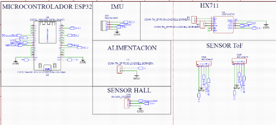
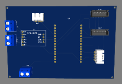
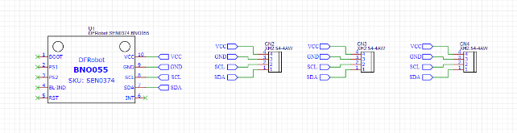
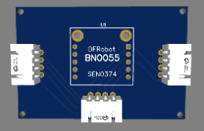
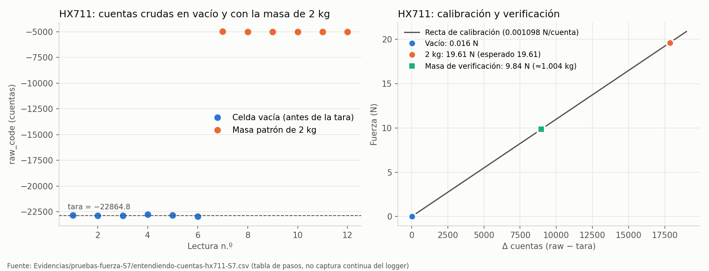
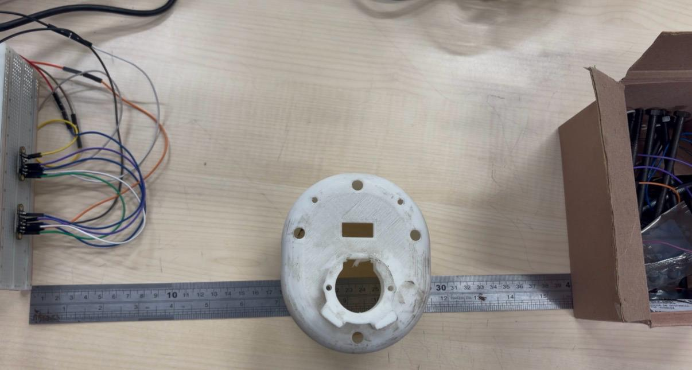
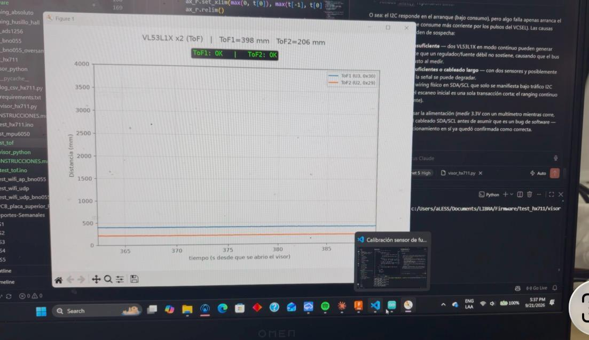

# Resumen de trabajo — Semana 8

**Período:** 19/09/2026 – 25/09/2026
**Responsable:** Alessandro Jesus Felix Tello

Foco de la semana: (1) diseño de la PCB de la placa superior y del breakout del BNO055; (2) sensor de fuerza, con buenos resultados en la calibración del HX711; (3) prueba de los 2 sensores ToF VL53L1X, pendiente desde la S7; (4) dos documentos de estado del arte (IMU de bajo drift y control de fuerza con celda + IMU usando el AMTI como referencia).

> **Nota sobre las observaciones de la S7:** esta semana no se atendieron las observaciones del Dr. Dante Elías sobre el informe de la S7 (EMA y falso contacto del BNO055, comparación HX711 vs. ADS1256, reprogramación de actividades, definición de la "estructura del pylon", trazabilidad de pruebas y migración del repositorio al Drive de LIBRA). Fue por una mala organización de mi parte. **Estas observaciones serán lo primero que se trabaje en la S9** (ver "Plan para la S9").

---

## 1. Diseño de PCB

### 1.1 Placa superior (ESP32)

El esquemático se organizó por bloques funcionales: **microcontrolador ESP32**, **IMU** (conector hacia el breakout del BNO055), **HX711** (entrada de la celda de carga por bornera), **alimentación** (bornera de 2 pines), **sensor Hall** (homing del husillo) y **2 sensores ToF VL53L1X**. El pinout está en `Firmware/PCB_placa_superior_PINOUT.md`.

|  |
|---|
| Esquemático de la placa superior: ESP32, IMU, HX711, alimentación, sensor Hall y ToF |

|  |
|---|
| Vista 3D de la placa superior: borneras (alimentación y celda), módulo HX711, zócalo del ESP32 y conectores de IMU/ToF |

### 1.2 Breakout del BNO055 (DFRobot SEN0374)

Placa aparte para el BNO055. Lleva **3 conectores XH 2.54 de 4 pines** (VCC, GND, SCL, SDA) en paralelo, así el bus I2C entra por uno y se puede encadenar a otros módulos. Los pines BOOT, PS1, PS0, BL_IND, RST e INT quedan sin conectar. Usar conectores XH con traba, en vez de cables sueltos, también apunta al **falso contacto** que se detectó en la S7.

|  |
|---|
| Esquemático del breakout: BNO055 con 3 conectores XH de 4 pines en paralelo |

|  |
|---|
| Vista 3D del breakout del BNO055 |

**Pendiente:** revisión del diseño antes de fabricar (DRC, anchos de pista de alimentación, ubicación de agujeros de montaje).

---

## 2. Sensor de fuerza: HX711

Se graficaron los resultados de la prueba con masa patrón (datos de `Evidencias/pruebas-fuerza-S7/entendiendo-cuentas-hx711-S7.csv`):

- En vacío, las cuentas crudas son estables alrededor de la tara (−22864.8 cuentas).
- Con la masa patrón de 2 kg se obtiene un factor de **0.001098 N/cuenta**, que da **19.61 N** (esperado: 19.61 N).
- Al quitar la carga vuelve a **0.016 N** (≈0).
- Una masa de verificación, **sin recalibrar**, da **9.84 N (≈1.004 kg)** y cae sobre la recta de calibración.

La celda y el cableado responden de forma lineal y repetible con el HX711.

|  |
|---|
| Izq.: cuentas crudas en vacío y con 2 kg. Der.: recta de calibración con los puntos de vacío, 2 kg y masa de verificación |

---

## 3. Sensores de distancia ToF (2x VL53L1X)

Se escribió `Firmware/test_tof/test_tof.ino` (+ `INSTRUCCIONES.md` y visores en `visor_python/`) con la librería VL53L1X de Pololu. Pinout: I2C compartido en GPIO21/22 y SHUT individual en GPIO25 (ToF1/U3) y GPIO26 (ToF2/U2).

|  |
|---|
| Montaje físico de la prueba de los 2 sensores ToF VL53L1X a distancias conocidas |

### 3.1 Reasignación de dirección I2C, confirmada en hardware

Los dos VL53L1X salen de fábrica con la misma dirección (0x29). El sketch saca primero a ToF1 del reset y le asigna 0x30; después saca a ToF2, que se queda en 0x29. En el ESP32 real, el escaneo I2C mostró **ambas direcciones (0x29 y 0x30)**.

### 3.2 Primera medición a distancia conocida

~20 s de captura, `status=0` (lectura válida) en toda la prueba:

| Sensor | Distancia esperada | Promedio medido | Desv. estándar | Rango | Error |
|---|---|---|---|---|---|
| ToF1 (0x30) | 400 mm | **408.4 mm** | 11.8 mm | 399–444 mm | +8.4 mm (+2.1 %) |
| ToF2 (0x29) | 200 mm | **219.5 mm** | 4.8 mm | 211–229 mm | +19.5 mm (+9.75 %) |

n = 213 muestras válidas por sensor (~10.8 Hz). Datos: `Evidencias/pruebas-tof-S8/tof_20cm_40cm_prueba1.csv`.

|  |
|---|
| Visor en vivo (`visor_python/`) durante la captura, con ToF1=398 mm y ToF2=206 mm |

Los dos sensores distinguen bien las distancias. El sesgo relativo más alto a 20 cm coincide con el offset fijo de fábrica del VL53L1X, que pesa más a corta distancia. Se puede corregir con `calibrateOffset()`.

**Nota metodológica:** la primera pasada incluía ~1740 filas viejas del buffer serial. Se filtraron por el ritmo de muestreo real y se agregó `reset_input_buffer()` a los visores. También se corrigió un `UnicodeEncodeError` que detenía el hilo de lectura del visor.

---

## 4. Estado del arte

### 4.1 IMU de bajo drift: corrección (21/09)

Se agregó la Sección 7 a `Estado-del-arte/REFERENCIA DE POSICION ABSOLUTA/Comparativa-IMU-Bajo-Drift.md`. Aclara que el sensor en uso **desde la S6 es el BNO055** (DFRobot SEN0374) y no el MPU6050 de las secciones anteriores. La decisión de migrar a LSM6DSR/ICM-45686 sigue abierta y se evaluará contra el BNO055 ya calibrado.

### 4.2 Control de fuerza con celda + IMU usando el AMTI como referencia (24/09)

Nuevo documento: `Estado-del-arte/CONTROL DE FUERZA/Control-GRF-celda-IMU-vs-AMTI.md`. Es un análisis de factibilidad para que la fuerza sobre el AMTI tenga una forma parecida a la GRF de marcha:

- La celda del pylon mide solo la fuerza axial. El IMU da la inclinación θ necesaria para estimar Fz.
- Hay precedentes (Aubin 2008/2012, Yang 2020) de control iterativo (ILC) ciclo a ciclo con placa de fuerza.
- **Conclusión:** es factible para la fuerza vertical. Los experimentos E0–E1 (sensado sincronizado celda + IMU + AMTI) entran en el alcance actual. E2–E5 (control) quedan por **decidir con el Dr. Elías** si entran al proyecto o quedan como trabajo futuro.

---

## Plan para la S9

**Prioridad 1: observaciones de la S7**

1. **BNO055:** aplicar el fix de inicialización del EMA, identificar y corregir el falso contacto (ya con los conectores XH del breakout) y repetir las pruebas en condiciones controladas.
2. **"Estructura del pylon":** precisar a qué componente se refiere el término y cuál es su función en el diseño.
3. **Reprogramación:** actualizar el cronograma con las actividades no ejecutadas en la S7 y la S8.
4. **Trazabilidad:** crear un registro que asocie cada cambio de hardware, firmware, filtrado o calibración con su prueba y sus archivos de datos.
5. **Repositorio:** coordinar con el Ing. Máximo León la migración de todo el proyecto al Drive de LIBRA.

**Prioridad 2: continuación**

- Revisar la PCB antes de fabricarla.
- Calibrar el offset de los ToF y definir su montaje en la plataforma.
- Integrar ToF + HX711 (+ BNO055) en un firmware único para la placa superior.

---

## Fuentes

- `Evidencias/pcb-S8/`: capturas del esquemático y la vista 3D de ambas placas.
- `Firmware/PCB_placa_superior_PINOUT.md`: pinout de la placa superior.
- `Evidencias/graficos-fuerza-S8/`: gráficos de calibración del HX711.
- `Evidencias/pruebas-fuerza-S7/entendiendo-cuentas-hx711-S7.csv`: datos de la prueba con masa patrón.
- `Firmware/test_tof/` y `Evidencias/pruebas-tof-S8/`: sketch, datos y fotos (montaje y visor en vivo) de los ToF.
- `Estado-del-arte/REFERENCIA DE POSICION ABSOLUTA/Comparativa-IMU-Bajo-Drift.md` (Secc. 7).
- `Estado-del-arte/CONTROL DE FUERZA/Control-GRF-celda-IMU-vs-AMTI.md`.
