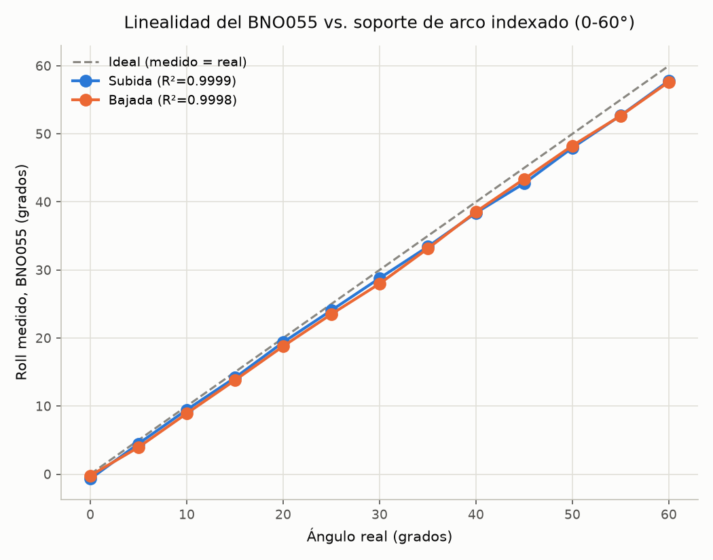
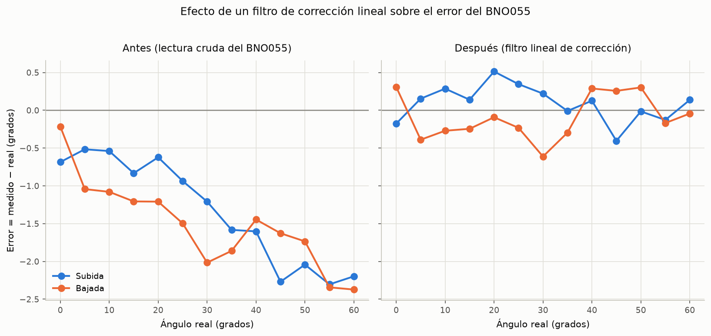
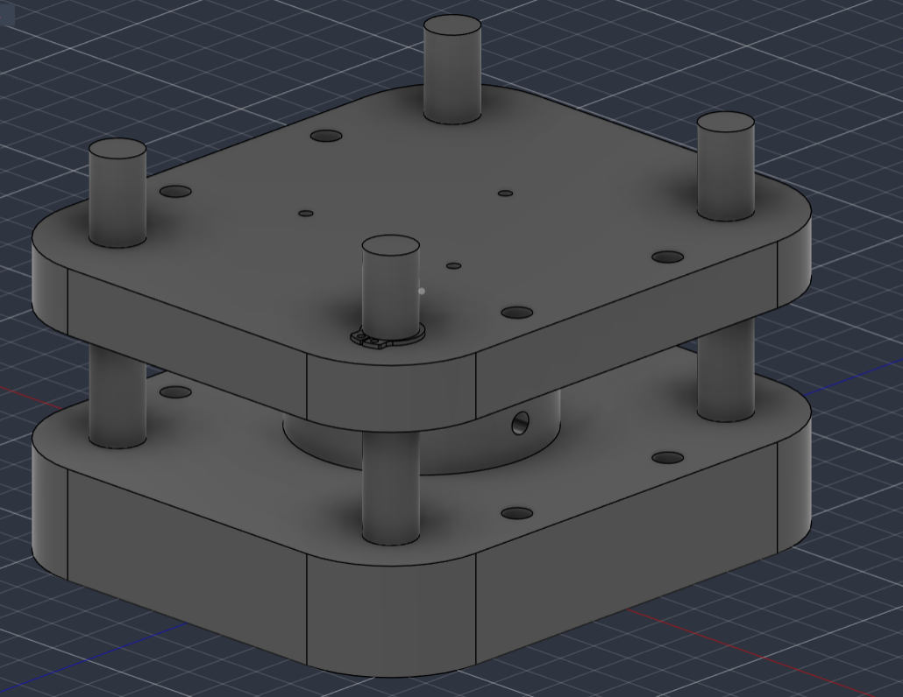
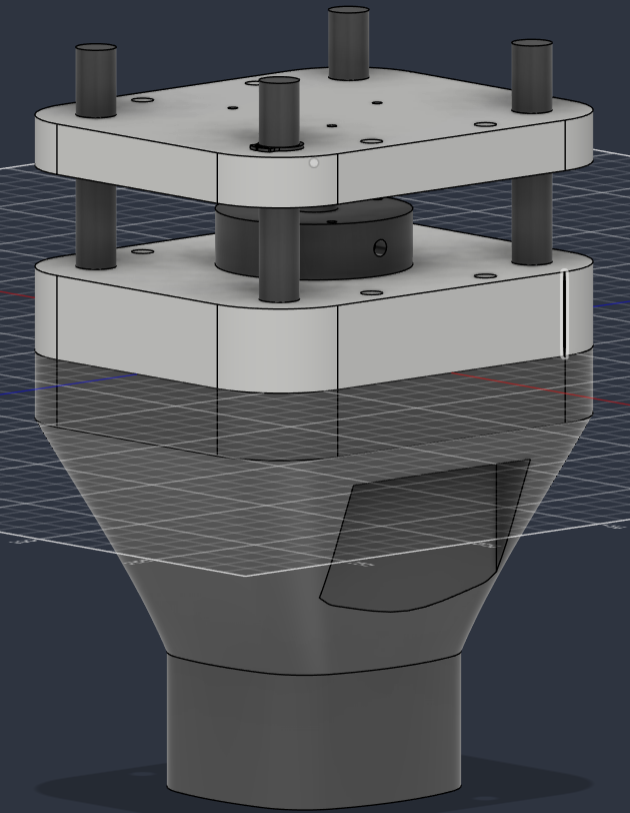

# Resumen de trabajo — Semana 9

**Período:** 26/09/2026 – 02/10/2026
**Responsable:** Alessandro Jesus Felix Tello

Foco de la semana: diagnóstico y reparación de la conexión del BNO055 tras el cambio de pinout de la S9 (bus I2C dedicado GPIO17/16), calibración del acelerómetro, y una caracterización completa de linealidad/exactitud/histéresis del sensor en todo su rango de interés (0-60°) usando el soporte de arco indexado construido para esto. Se cierra con una simulación de un filtro de corrección lineal y cuánto reduciría el error.

---

## 1. Diagnóstico y reparación de la conexión del BNO055

Al retomar las pruebas sobre el nuevo pinout (`SDA→GPIO17`, `SCL→GPIO16`, bus `Wire1` dedicado — ver `Firmware/PCB_placa_superior_PINOUT.md`), el sensor dejó de responder. El diagnóstico se hizo leyendo el puerto serial directamente y forzando reseteos controlados, en vez de asumir la causa:

1. **Primer síntoma: cero datos por serial**, ni siquiera el mensaje de arranque del sketch. Se descartó un problema de software leyendo el puerto crudo.
2. **Con reset manual (botón físico):** apareció un bucle de **brownout** (`E BOD: Brownout detector was triggered`) — el ESP32 se reseteaba solo por voltaje insuficiente, antes de terminar el `setup()`. Resuelto cambiando de cable/puerto USB (el reset automático por DTR/RTS tampoco funcionaba en esta placa — hay que usar el botón físico).
3. **Con el ESP32 ya estable:** `ERROR: no se detectó el BNO055`. Se verificó el pinout contra el sketch y se aisló el problema desconectando el sensor por completo (arranque limpio sin él, confirmando que no era un problema general de la placa).
4. **Causa raíz encontrada:** un cable había quedado conectado al pin **INT** del BNO055 en vez de a uno de los 4 pines que usa el diseño (VCC, GND, SDA, SCL) — el diseño de LIBRA deja INT, BOOT, PS1, PS0, BL_IND y RST sin conectar a propósito. Corregido el cableado, el sensor volvió a dar datos limpios y estables.

**Lectura:** la mayoría de las "desconexiones" a lo largo de la semana durante las pruebas de ángulos (ver Secc. 3) fueron reincidencias del mismo tipo de problema (cable flojo por el manipuleo constante del soporte), no un problema del sensor o del firmware.

---

## 2. Calibración del acelerómetro (6 posiciones)

Con la conexión ya estable, se corrió `calibrar_acelerometro.py` (apoyar el sensor quieto en 6 orientaciones — las 6 caras de un cubo imaginario). Resultado: `Calib[sys,gyro,accel,mag]` pasó de **0,3,0,0** a **2,3,3,3** — acelerómetro y magnetómetro quedaron en calibración completa (antes sin calibrar). El offset queda guardado en la flash del ESP32, no hace falta repetirlo en cada encendido.

---

## 3. Prueba de linealidad, exactitud e histéresis (0-60°)

### 3.1 Metodología

Usando el soporte de arco indexado (`Firmware/test_wifi_ap_bno055/soporte_angulos_imu/`, 13 posiciones de 0 a 60° cada 5°), se construyó `prueba_angulos_conocidos.py` para automatizar la toma de datos:

- **Disparo automático:** en vez de adivinar cuándo el sensor ya está quieto en la nueva posición, el script exige ver primero que el sensor **se movió** (std > 1.5°) y recién después que **volvió a quedar quieto** (std < 0.05°) antes de arrancar a grabar 30 s. Esto corrigió un bug de la primera versión, que podía disparar la grabación con el sensor todavía en la posición anterior si ya estaba quieto desde antes.
- **Eje usado:** `roll`, no `pitch` — confirmado con datos reales que, con el montaje actual del IMU sobre la plataforma, pitch se queda prácticamente plano (174-176°) sin importar el ángulo aplicado, mientras que roll sí responde.
- **Diseño del experimento:** los 13 ángulos (0° a 60°, cada 5°), con 3 repeticiones cada uno, en **ambas direcciones** (subida 0→60° y bajada 60→0°) — 78 mediciones en total. Repetir en ambas direcciones permite medir histéresis (holgura mecánica del soporte); repetir 3 veces por ángulo permite separar ruido de una captura puntual del error real, y habilita un test de falta de ajuste para la linealidad.
- Varias posiciones se tuvieron que repetir por los cortes de conexión de la Secc. 1 — los archivos descartados (incompletos o con ruido alto) están documentados en el propio script de procesamiento (`Firmware/test_wifi_ap_bno055/visor_python/analizar_linealidad.py`, diccionario `MAPA`).

### 3.2 Resultados

|  |
|---|
| Roll medido vs. ángulo real, subida y bajada, con la recta ideal (medido = real) de referencia |

- **Linealidad: excelente.** R² = 0.9999 (subida) y 0.9998 (bajada) — la relación entre el ángulo real y la lectura del BNO055 es prácticamente una recta en todo el rango, sin curvatura visible.
- **Pero hay un error sistemático de escala (~3%):** la pendiente de ambas rectas es 0.966-0.973 en vez de 1.0. El error no es un offset fijo — crece proporcional al ángulo: de -0.2 a -0.7° cerca de 0°, hasta -2.2 a -2.4° cerca de 60°.
- **Histéresis: pequeña y sin dirección dominante.** Diferencia media subida-bajada = +0.18° (std 0.44°) — el signo cambia según el ángulo, no hay un patrón de backlash sistemático claro. Queda dentro del rango de ruido entre repeticiones.
- **Un punto con ruido alto para anotar:** a 45° en bajada, la desviación estándar entre repeticiones fue 0.47° (vs. 0.03-0.2° en el resto de los puntos) — no se descartó, pero vale la pena repetirlo si se vuelve a tomar data.

### 3.3 Simulación: filtro de corrección lineal

Como el error crece de forma lineal con el ángulo (no es ruido aleatorio), se simuló corregirlo con la propia recta de calibración obtenida (pool subida+bajada, 26 puntos): `ángulo_corregido = (roll_medido − (−0.514)) / 0.9697`.

|  |
|---|
| Error antes (lectura cruda) y después (filtro lineal) de aplicar la corrección, subida y bajada |

**Resultado de la simulación:** el error máximo baja de **~2.4°** (lectura cruda, en 55-60°) a **~0.5°** (corregido) — una reducción de más de 4×, y el error corregido ya no crece con el ángulo (queda disperso alrededor de 0, reflejo del ruido/histéresis de ±0.4° medido en la Secc. 3.2, no de un sesgo sistemático restante).

**Pendiente:** este filtro todavía es un cálculo en post-procesamiento (Python), no está aplicado en el firmware del ESP32. Si se confirma que sigue siendo válido con más datos, se puede escribir directo en el sketch (una resta y una división sobre `roll` antes de usarlo en el resto del sistema).

---

## 4. Diseño CAD preliminar del adaptador del sensor de fuerza

Primer diseño del adaptador que monta la celda de carga del pylon entre las dos placas (4 parantes + mordaza central para la celda), pensado junto con la sugerencia de protección contra cizalla de la Secc. 5.

|  |
|---|
| Vista isométrica: placas superior e inferior, 4 parantes y mordaza central de la celda de carga |

|  |
|---|
| Ensamble preliminar del adaptador sobre la estructura cónica del pylon |

**Pendiente:** es un diseño preliminar — falta definir el patrón de pernos contra la celda de carga real, verificar holguras de los parantes, y evaluar ahí mismo si conviene integrar las barras guía de cizalla de la Secc. 5.

---

## 5. Otras notas

Se recibió una sugerencia (30/09) sobre proteger la celda de carga del pylon contra esfuerzos de cizalla con barras guía laterales — quedó documentada como pendiente de evaluar en `Reportes-Semanales/S9/Pendientes.md`, sin trabajo activo esta semana.

---

## Fuentes

- `Firmware/test_wifi_ap_bno055/test_wifi_ap_bno055.ino` — sketch con el pinout corregido (`Wire1`, GPIO17/16).
- `Firmware/test_wifi_ap_bno055/soporte_angulos_imu/` — diseño CAD del soporte de arco indexado (CadQuery).
- `Firmware/test_wifi_ap_bno055/visor_python/prueba_angulos_conocidos.py` — script de captura con disparo automático por movimiento+quietud.
- `Firmware/test_wifi_ap_bno055/visor_python/calibrar_acelerometro.py` — calibración de 6 posiciones.
- `Firmware/test_wifi_ap_bno055/visor_python/analizar_linealidad.py` — procesamiento: regresión, R², histéresis, simulación del filtro, generación de gráficos.
- `Firmware/test_wifi_ap_bno055/visor_python/resumen_linealidad_S9.csv` — tabla completa (dirección, ángulo, promedio, error, std, repeticiones).
- `Evidencias/pruebas-imu-S9/` — gráficos de linealidad y del efecto del filtro de corrección.
- `Evidencias/diseno-cad-preliminar-S9/` — vistas del diseño preliminar del adaptador del sensor de fuerza.
